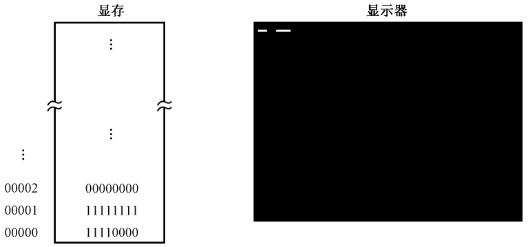
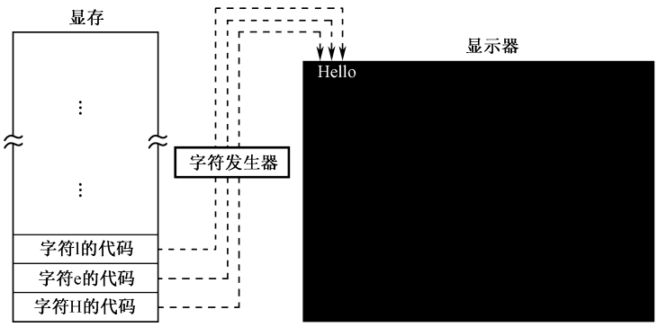
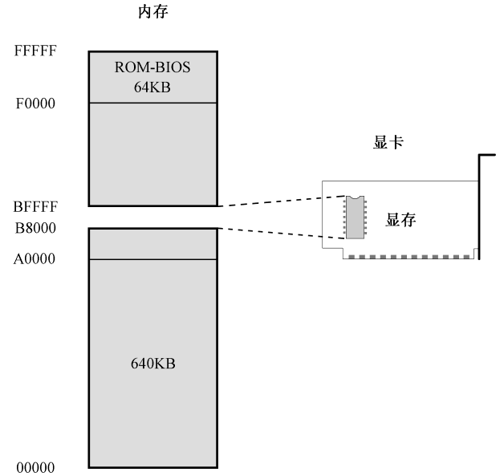
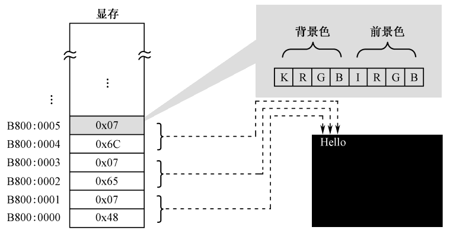
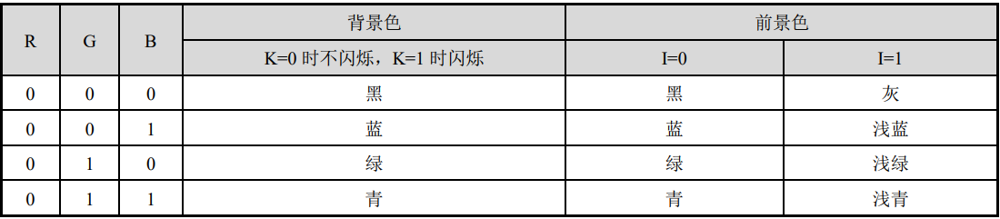
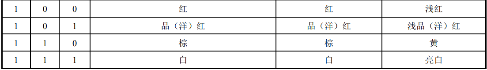
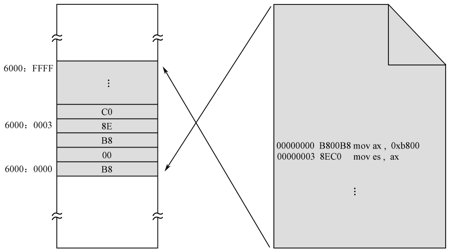
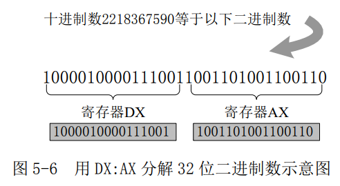
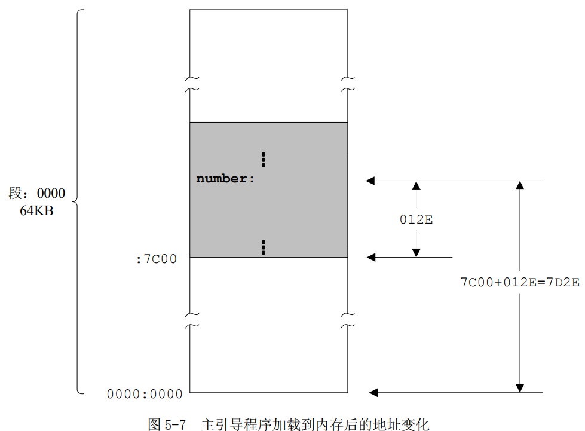

### 5.1 欢迎来到主引导扇区

处理器加电或者复位之后，如果硬盘是首选的启动设备，那么，ROM-BIOS 将试图读取硬盘的 0 面 0 道 1 扇区。传统上，这就是主引导扇区（Main Boot Sector，MBR）。

读取的主引导扇区数据有 512 字节，ROM-BIOS 程序将它加载到逻辑地址 0x0000:0x7c00处，也就是物理地址 0x07c00 处，然后判断它是否有效。

一般来说，主引导扇区是由操作系统负责的。正常情况下，一段精心编写的主引导扇区代码将检测用来启动计算机的操作系统，并计算出它所在的硬盘位置。然后，它把操作系统的自举代码加载到内存，也用 jmp 指令跳转到那里继续执行，直到操作系统完全启动。


### 5.3 在屏幕上显示文字

为了显示文字，通常需要两种硬件，一是显示器，二是显卡。显卡的职责是为显示器提供内容，并控制显示器的显示模式和状态，显示器的职责是将那些内容以视觉可见的方式呈现在屏幕上。

显卡控制显示器的最小单位是像素，显卡都有自己的存储器，称显示存储器（Video RAM：VRAM），简称显存，



​													图 5-1 显存内容和显示器内容之间的对应关系

显卡的工作是周期性地从显存中提取这些比特，并把它们按顺序显示在屏幕上。

图形模式:用 24 个比特，即 3 个字节，来对应一个像素。因为 2^24^=16777216，所以在这种模式下，同
屏可以显示 16777216 种颜色，这称为真彩色。




​																图 5-2 字符在屏幕上的显示原理

可以将字符的代码存放到显存里，第 1 个代码对应着屏幕左上角第 1 个字符，第 2 个代码对应着屏幕左上角第 2 个字符，后面的依次类推。剩下的工作是如何用代码来控制屏幕上的像素，使它们或明或暗以构成字符的轮廓，这是字符发生器和控制电路的事情。


传统上，这种专门用于显示字符的工作方式称为文本模式。文本模式和图形模式是显卡的两种基本工作模式，可以用指令访问显卡，设置它的显示模式。在不同的工作模式下，显卡对显存内容的解释是不同的。


为了给出要显示的字符，处理器需要访问显存,把字符的 ASCII 码写进去。但是，显存是位于显卡上的，访问显存需要和显卡这个外围设备打交道。

计算机系统的设计者们，这些敢想敢干的人，决定把显存映射到处理器可以直接访问的地址空间里，也就是内存空间里。

如图 5-3 所示，我们知道，8086 可以访问 1MB 内存。其中，0x00000～9FFFF 属于常规内存，由内存条提供；0xF0000～0xFFFFF 由主板上的一个芯片提供，即 ROM-BIOS。这样一来，中间还有一个 320KB 的空洞，即 0xA0000～0xEFFFF。传统上，这段地址空间由特定的外围设备来提供，其中就包括显卡。



​												图 5-3 文本模式下显存到内存的映射

由于历史的原因，所有在个人计算机上使用的显卡，在加电自检之后都会把自己初始化到80×25 的文本模式。在这种模式下，屏幕上可以显示 25 行，每行 80 个字符，每屏总共 2000 个字符。

所以，如图 5-3 所示，一直以来，0xB8000～0xBFFFF 这段物理地址空间，是留给显卡的，由显卡来提供，用来显示文本。

### 5.3.2 初始化段寄存器

Intel 的处理器不允许将一个立即数传送到段寄存器

### 5.3.3 显存的访问和 ASCII 代码

一旦将显存映射到处理器的地址空间，那么，我们就可以使用普通的传送指令（mov）来读写它，这无疑是非常方便的，但需要首先将它作为一个段来看待，并将它的基地址传送到段寄存器。

ASCII 是 7 位代码，只用了一个字节中的低 7 比特，最高位通常置 0。这意味着，ASCII 只包含 128 个字符的编码。ASCII 表中有相当一部分代码是不可打印和显示的，它们用于控制通信过程。比如，LF 是换行；CR 是回车；DEL 和 BS 分别是删除和退格，在我们平时用的键盘上也是有的；BEL 是振铃（使远方的终端响铃，以引起注意）；SOH 是文头；EOT 是文尾；ACK 是确认，等等。

显卡在任何时候都认为你发送的是 ASCII 码。


屏幕上的每个字符对应着显存中的两个连续字节，前一个是字符的 ASCII 代码，后面是字符的显示属性，包括字符颜色（**前景色**）和底色（**背景色**）。如图 5-4 所示，字符“H”的 ASCII 代码是0x48，其显示属性是 0x07；字符“e”的 ASCII 代码是 0x65，其显示属性是 0x07。



​														图 5-4 字符代码及字符属性示意图


​													表 5-2 80×25 文本模式下的颜色表





图 5-4 中的字符属性 0x07 可以解释为黑底白字，无闪烁，无加亮。

什么内容都没有的时候，显存里会是什么内容呢？实际上，这个时候，屏幕上显示的全是黑底白字的空白字符，也叫空格字符（Space），ASCII代码是 0x20，


### 5.3.4 显示字符

为了方便，多数汇编语言编译器允许在指令中直接使用字符的字面值来代替数值形式的 ASCII码，

`mov byte [es:0x00],'L'`


## 5.4 显示标号的汇编地址

### 5.4.1 标号

处理器访问内存时，采用的是“段地址：偏移地址”的模式。对于任何一个内存段来说，段地址可以开始于任何 16 字节对齐的地方，偏移地址则总是从 0x0000 开始递增。

为了支持这种内存访问模式，在源程序的编译阶段，编译器会把源程序整体上作为一个独立的段来处理，并从 0 开始计算和跟踪每一条指令的地址。因为该地址是在编译期间计算的，故称为汇编地址。汇编地址是在源程序编译期间，编译器为每条指令确定的汇编位置（Assembly Position），也就是每条指令相对于整个程序开头的偏移量，以字节计。当编译后的程序装入物理内存后，它又是该指令在内存段内的偏移地址。

在编译阶段，每条指令都被计算并赋予了一个汇编地址，就像它们已经被加载到内存中的某个段里一样。实际上，如图 5-5 所示，当编译好的程序加载到物理内存后，**它在段内的偏移地址和它在编译阶段的汇编地址是相等的**。



​																	图 5-5 汇编地址和偏移地址的关系

编译后的程序是整体加载到内存中某个段的，交叉箭头用于指示它们之间的映射关系。之所以箭头是交叉的，是因为源程序的编译是从上往下的，而内存地址的增长是从下往上的（从低地址往高地址方向增长）。


图 5-5 中假定程序是从内存物理地址 0x60000 开始加载的。因为该物理地址也对应着逻辑地址0x6000:0x0000，因此我们可以说，该程序位于段 0x6000 内。在编译阶段，源程序的第一条指令 mov ax,0xb800 的汇编地址是 0x00000000，而它在整个程序装入内存后，在段内的偏移地址是 0x0000，即逻辑地址 0x6000:0000，两者的偏移地址是一致的。再看源程序的第二条指令，是 mov es,ax，它在编译阶段的汇编地址是 0x00000003。在整个程序装入内存后，它在段内的偏移地址是 0x0003，也没有变化。		


在 NASM 汇编语言里，每条指令的前面都可以拥有一个标号，以代表和指示该指令的汇编地址。标号并不是必需的，只有在我们需要引用某条指令的汇编地址时，才使用标号。标号可以单独占用一行的位置


### 5.4.2 如何显示十进制数字

`mov ax,0x012E`

这条指令编译后，得到的机器指令为 B8[2E01]，或者 B8 2E 01。B8 是操作码，后面是字操作数 0x012E，只不过采用的是低端字节序。

十六进制数 0x012E 等于十进制数 302，但是，通过前面对字符显示原理的介绍，我们应该清楚，直接把寄存器 AX 中的内容传送到显示缓冲区，是不可能在屏幕上出现“302”的。

解决这个问题的办法是将它的每个数位单独拆分出来，这需要不停地除以 10。

考虑到寄存器AX是16位的，可以表示的数从二进制的0000000000000000到1111111111111111，也就是十进制的 0～65535，故它可以容纳最大 5 个数位的十进制数，从个位到万位，比如 61238。那么，假如你并不知道它是多少，只知道它是一个 5 位数，那么，如何通过分解得到它的每个数位呢？


首先，用 61238 除以 10，商为 6123，余 8，本次相除的余数 8 就是个位数字；

然后，把上一次的商数 6123 作为被除数，再次除以 10，商为 612，余 3，余数 3 就是十位上的数字；

略

只要把 AX 的内容不停地除以 10，只需要 5 次，把每次的余数反向组合到一起，就是原来的数字。同样，如果反向把每次的余数显示到屏幕上，应该就能看见这个十进制数是多少了

不过，即使是得到了单个的数位，也还是不能在屏幕上显示，因为它们是数字，而非 ASCII代码。比如，数字 0x05 和字符“5”是不同的，后者实际上是数字 0x35。字符“0”的 ASCII 代码是 0x30，字符“1”的 ASCII 代码是 0x31。这就是说，把每次相除得到的余数加上 0x30，在屏幕上显示就没问题了。


### 5.4.3 在程序中声明并初始化数据

可以用处理器提供的除法指令来分解一个数的各个数位，但是每次除法操作后得到的数位需要临时保存起来以备后用。使用寄存器不太现实，因为它的数量很少，且还要在后续的指令中使用。因此，最好的办法是在内存中专门留出一些空间来保存这些数位。

要放在程序中的数据是用 DB 指令来声明（Declare）的，DB 的意思是声明字节（Declare Byte），所以，跟在它后面的操作数都占一个字节的长度（位置）。注意，如果要声明超过一个以上的数据，各个操作数之间必须以逗号隔开。

DW（Declare Word）用于声明字数据，

DD（Declare Double Word）用于声明双字（两个字）数据，

DQ（Declare Quad Word）用于声明四字数据。

声明的数据可以是任何值，只要不超过伪指令所指示的大小。比如，用 DB 声明的数据，不能超过一个字节所能表示的数的大小


和指令不同，对于在程序中声明的数值，在编译阶段，编译器会在它们被声明的汇编地址处原样保留。

按照标准的做法，程序中用到的数据应当声明在一个独立的段，即数据段中。但是在这里，为方便起见，数据和指令代码是放在同一个段中的。不过，方便是方便了，但也带来了一个隐患，如果安排不当，**处理器就有可能执行到那些非指令的数据上**。尽管有些数碰巧和某些指令的机器码相同，也可以顺利执行，但毕竟不是我们想要的结果，违背了我们的初衷。好在我们很小心，**在本程序中把数据声明在所有指令之后**，在这个地方，处理器的执行流程无
法到达。

```assembly
         ;代码清单5-1 
         ;文件名：c05_mbr.asm
         ;文件说明：硬盘主引导扇区代码
         ;创建日期：2011-3-31 21:15 
         
         mov ax,0xb800                 ;指向文本模式的显示缓冲区
         mov es,ax
 
         ;以下显示字符串"Label offset:"
         mov byte [es:0x00],'L'
         mov byte [es:0x01],0x07
         mov byte [es:0x02],'a'
         mov byte [es:0x03],0x07
         mov byte [es:0x04],'b'
         mov byte [es:0x05],0x07
         mov byte [es:0x06],'e'
         mov byte [es:0x07],0x07
         mov byte [es:0x08],'l'
         mov byte [es:0x09],0x07
         mov byte [es:0x0a],' '
         mov byte [es:0x0b],0x07
         mov byte [es:0x0c],"o"
         mov byte [es:0x0d],0x07
         mov byte [es:0x0e],'f'
         mov byte [es:0x0f],0x07
         mov byte [es:0x10],'f'
         mov byte [es:0x11],0x07
         mov byte [es:0x12],'s'
         mov byte [es:0x13],0x07
         mov byte [es:0x14],'e'
         mov byte [es:0x15],0x07
         mov byte [es:0x16],'t'
         mov byte [es:0x17],0x07
         mov byte [es:0x18],':'
         mov byte [es:0x19],0x07
 
         mov ax,number                 ;取得标号number的偏移地址
         mov bx,10
 
         ;设置数据段的基地址
         mov cx,cs
         mov ds,cx
 
         ;求个位上的数字
         mov dx,0
         div bx
         mov [0x7c00+number+0x00],dl   ;保存个位上的数字
 
         ;求十位上的数字
         xor dx,dx
         div bx
         mov [0x7c00+number+0x01],dl   ;保存十位上的数字
 
         ;求百位上的数字
         xor dx,dx
         div bx
         mov [0x7c00+number+0x02],dl   ;保存百位上的数字
 
         ;求千位上的数字
         xor dx,dx
         div bx
         mov [0x7c00+number+0x03],dl   ;保存千位上的数字
 
         ;求万位上的数字 
         xor dx,dx
         div bx
         mov [0x7c00+number+0x04],dl   ;保存万位上的数字
 
         ;以下用十进制显示标号的偏移地址
         mov al,[0x7c00+number+0x04]
         add al,0x30
         mov [es:0x1a],al
         mov byte [es:0x1b],0x04
         
         mov al,[0x7c00+number+0x03]
         add al,0x30
         mov [es:0x1c],al
         mov byte [es:0x1d],0x04
         
         mov al,[0x7c00+number+0x02]
         add al,0x30
         mov [es:0x1e],al
         mov byte [es:0x1f],0x04
 
         mov al,[0x7c00+number+0x01]
         add al,0x30
         mov [es:0x20],al
         mov byte [es:0x21],0x04
 
         mov al,[0x7c00+number+0x00]
         add al,0x30
         mov [es:0x22],al
         mov byte [es:0x23],0x04
         
         mov byte [es:0x24],'D'
         mov byte [es:0x25],0x07
          
   infi: jmp near infi                 ;无限循环
      
  number db 0,0,0,0,0
  
  times 203 db 0
            db 0x55,0xaa

```


### 5.4.4 分解数的各个数位

源程序第 41、42 行，是把代码段寄存器 CS 的内容传送到通用寄存器 CX，然后再从 CX 传送到数据段寄存器DS。在此之后，数据段和代码段都指向同一个段。之所以这么做，是因为我们刚才声明的数据是和指令代码混在一起的，可以认为是位于代码段中。尽管在指令中访问这些数据可以使用段超越前缀“CS:”，但习惯上，通过数据段来访问它们更自然一些。


在看完王爽的《汇编语言》之后轻松异常啊

除法指令div

1. 用 16 位的二进制数除以 8 位的二进制数。

在这种情况下，被除数必须在寄存器AX 中，必须事先传送到 AX 寄存器里。除数可以由 8 位的通用寄存器或者内存单元提供。指令执行后，**商在寄存器 AL 中，余数在寄存器 AH 中**

在一个源程序中，通常不可能知道汇编地址的具体数值，只能使用标号。(标号可以不加冒号)

```assembly
dividnd dw 0x3f0	;声明了标号 dividnd 并初始化了一个字 0x3f0 作为被除数
divisor db 0x3f		;声明了标号 divisor 并初始化一个字节 0x3f 作为除数
……
mov ax,[dividnd]	;用标号 dividnd 和 divisor 来代替被除数和除数的汇编地址
div byte [divisor]  ;编译阶段，编译器用具体的数值取代括号中的标号 dividnd 和 divisor
```

在编译阶段，编译器在生成这两条指令的机器码之前，会先将它们转换成以下的形式：

```assembly
mov ax,[0xf000]
div byte [0xf002]
```

当第一条指令执行时，处理器用 0xf000 作为偏移地址，去访问数据段（段地址在段寄存器 DS中），来取得内存中的一个字 0x3F0，并把它传送到寄存器 AX 中。

当第二条指令执行时，处理器采用同样的方法取得内存中的一个字节 0x3F，用它来和寄存器 AX中的内容做除法


2. 用32 位的二进制数除以16 位的二进制数

在这种情况下，因为 16 位的处理器无法直接提供 32 位的被除数，故要求被除数的高 16 位在DX 中，低 16 位在 AX 中。

如图 5-6 所示，假如被除数是十进制数 2218367590，那么，它对应着一个32 位 的 二 进 制 数
10000100001110011001101001100110。在做除法之前，先要分成两段进行“切割”，以分别装入寄存器 DX 和 AX。为了方便，我们通常用“DX:AX”来描述 32 位的被除数。



同时，除数可以由 16 位的通用寄存器或者内存单元提供，指令执行后，**商在 AX 中，余数在DX 中。**


就算是复习也是有必要重新看一遍的，**没必要心急**

```assembly
div cx
div word [0x0230]
```

处理器在执行时，默认地使用段寄存器 DS 来访问内存


上面源程序第 47 行中，偏移地址并非理论上的 number+0x00，而是 0x7c00+number+0x00。这个 0x7c00 是从哪里来的呢？

标号 number 所代表的汇编地址，其数值是在源程序编译阶段确定的，而且是相对于整个程序的开头，从 0 开始计算的。


如图 5-7 所示，这里显示的是整个 0x0000 段，其中深色部分为主引导扇区所处的位置。主引导扇区代码是被加载到 0x0000:0x7C00 处的，而非 0x0000:0000。对于程序的执行来说，这不会有什么问题，因为主引导扇区的内容被加载到内存中并开始执行时，CS=0x0000，IP=0x7C00。

加载位置的改变不会对处理器执行指令造成任何困扰，但会给数据访问带来麻烦。要知道，当前数据段寄存器 DS 的内容是 0x0000，因此，number 的偏移地址实际上是 0x012E+0x7C00=0x7D2E。当正在执行的指令仍然用 0x012E 来访问数据，灾难就发生了。所以，在编写主引导扇区程序时，我们就要考虑到这一点，必须把代码写成
`mov [0x7c00+number+0x00],dl`

指令中的目的操作数是在编译阶段确定的，因此，在编译阶段，编译器同样会首先将它转换成以下的形式，再进一步生成机器码：
`mov [0x7d2e],dl`



xor，在数字逻辑里是异或（eXclusive OR）的意思，xor 指令的目的操作数可以是通用寄存器和内存单元，源操作数可以是通用寄存器、内存单元和立即数（不允许两个操作数同时为内存单元）。而且，异或操作是在两个操作数相对应的比特之间单独进行的。

指令格式总结

```assembly
xor 8 位通用寄存器,8 位立即数，例如：xor al,0x55
xor 8 位通用寄存器,指向 8 位实际操作数的内存地址，例如：xor cl,[0x2000]
xor 8 位通用寄存器,8 位通用寄存器，例如：xor bl,dl
xor 16 位通用寄存器,16 位立即数，例如：xor ax,0xf033
xor 16 位通用寄存器, 指向 16 位实际操作数的内存地址，例如：xor bx,[0x2002]
xor 16 位通用寄存器,16 位通用寄存器，例如：xor dx,bx
xor 指向 8 位实际操作数的内存地址,8 位立即数，例如：xor byte[0x3000],0xf0
xor 指向 8 位实际操作数的内存地址,8 位通用寄存器，例如：xor [0x06],al
xor 指向 16 位实际操作数的内存地址,16 位立即数，例如：xor word [0x2002],0x55aa
xor 指向 16 位实际操作数的内存地址,16 位通用寄存器，例如：xor [0x20],dx
```


### 5.4.5 显示分解出来的各个数位


## 5.5 使程序进入无限循环状态

`infi: jmp near infi`


## 5.6 完成并编译主引导扇区代码

### 5.6.1 主引导扇区有效标志

主引导扇区在系统启动过程中扮演着承上启下的角色，但并非是唯一的选择。如果硬盘的主引导扇区不可用，系统还有其他选择，比如可以从光盘和 U 盘启动。

计算机的设计者们决定，一个有效的主引导扇区，其最后两个字节的数据必须是 0x55和 0xAA。否则，这个扇区里保存的就不是一些有意而为的数据。

定义这两个字节很简单，伪指令 db 和 dw 就可以实现

在 Intel 处理器上，将一个字写入内存时，是采用低端字节序的，低字节 0x55 置入低地址端（在前），高字节 0xAA 在高地址端（在后）。

伪指令 times 可用于重复它后面的指令若干次。比如

`times 20 mov ax,bx`
将在编译时重复生成 mov ax,bx 指令 20 次，机器码（89 D8）

 

## 5.7 加载和运行主引导扇区代码

暂时没必要搞明白作者的环境，跳过就是了