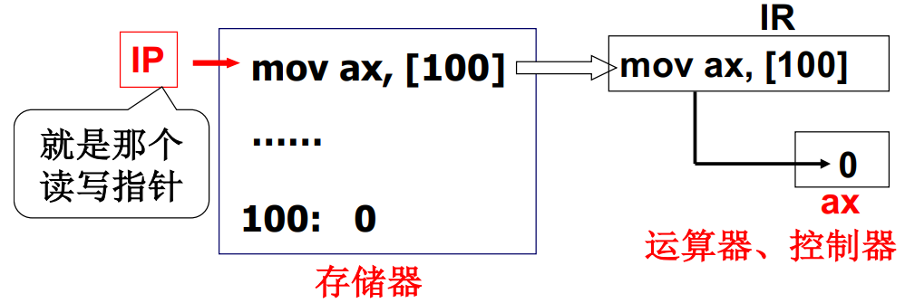
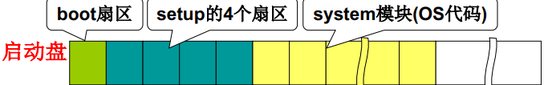

冯·诺依曼存储程序思想

存储程序的主要思想：将程序和数据存放到计算机内部的存储器中，计算机在程序的控制下一步一步进行处理

计算机由五大部件组成:输入设备、输出设备、存储器、运算器、控制器


取指执行



看看x86 PC

1. x86 PC刚开机时CPU处于实模式
2. 开机时，CS=0xFFFF; IP=0x0000
3. 寻址0xFFFF0(ROM BIOS（basic input output system）映射区)  固化
4. 检查RAM，键盘，显示器，软硬磁盘
5. 将磁盘0磁道0扇区读入0x7c00处(操作系统引导扇区)
6. 设置cs=0x07c0，ip=0x0000


0x7c00处存放的代码

就是从磁盘引导扇区读入的那512个字节

* 引导扇区就是启动设备的第一个扇区
* 启动设备信息被设置在CMOS中… （CMOS: 互补金属氧化物半导体(64B-128B)。用来存储实时钟和硬件配置信息。）
* 因此，硬盘的第一个扇区上存放着开机后执行的第一段我们可以控制的程序。


### 引导扇区代码: bootsect.s       .s汇编文件

//汇编学习任然不到位，继续先看王爽，之后再来这个

.text等是伪操作符，告诉编译器产生文本段，.text用于标识文本段的开始位置。此处的.text、.data、.bss表明这3个段重叠，不分段!

**BOOTSEG = 0x07c0**
**INITSEG = 0x9000**
**SETUPSEG = 0x9020**

```assembly
.globl begtext,begdata,begbss,endtext,enddata,endbss
.text //文本段
begtext:
.data //数据段
begdata:
.bss //未初始化数据段
begbss:
entry start //关键字entry告诉链接器“程序入口”
start:
mov ax, #BOOTSEG 
mov ds, ax		;ds=0x07c0
mov ax, #INITSEG 
mov es, ax		;es=0x9000
mov cx, #256 
sub si, si 		;si=0,与ds构成ds:si=7c0
sub di,di		;di=0,es:di =90000	
				;将0x07c0:0x0000处的256个字移动到0x9000:0x0000处
				;为的是腾出空间
rep movw 
jmpi go, INITSEG 	;jmpi 间接跳转 ，go（标号）赋予ip，INITSEG赋予cs=0x9000
```


### jmpi go, INITSEG

jmpi (jump intersegment段间跳转): cs=INITSEG, ip=go

0x13是BIOS读磁盘扇区的中断: ah=0x02-读磁盘，al=扇区数量(SETUPLEN=4)，ch=柱面号，cl=开始扇区，dh=磁头号，dl=驱动器号，es:bx=内存地址

```assembly
go: 
mov ax,cs //cs=0x9000
mov ds,ax 
mov es,ax 
mov ss,ax 		;为call做准备!
mov sp,#0xff00
load_setup: //载入setup模块
mov dx,#0x0000 
mov cx,#0x0002 	;bootsect扇区占据第一个扇区，则从第2个（cl）开始读4个扇区（al）setup
mov bx,#0x0200
mov ax,#0x0200+SETUPLEN 	;setup 放在90200
int 0x13 //BIOS中断
jnc ok_load_setup
mov dx,#0x0000
mov ax,#0x0000 //复位
int 0x13
j load_setup //重读
```



### 读入setup模块后: ok_load_setup

bootsect.s中的数据 //在文件末尾
sectors: .word 0 //磁道扇区数
msg1: .byte 13,10
			.ascii “Loading system...”
			.byte 13,10,13,10

```assembly
Ok_load_setup: //载入setup模块
mov dl,#0x00 
mov ax,#0x0800 //ah=8获得磁盘参数
int 0x13 
mov ch,#0x00 
mov sectors,cx
mov ah,#0x03 
xor bh,bh 
int 0x10 //读光标
mov cx,#24 		;输出24个字符
mov bx,#0x0007	;7是显示属性!
mov bp,#msg1 	;bp 显示的东西在内存的什么地方
mov ax,#1301 
int 0x10 //显示字符
mov ax,#SYSSEG //SYSSEG=0x1000 
mov es,ax 
call read_it //读入system模块
jmpi 0,SETUPSEG		;转入0x9020:0x0000执行setup.s

```

boot工作:读setup，读system…


### read_it //读入system模块

ENDSEG=SYSSEG+SYSSIZE
SYSSIZE=0x8000 //该变量可根据Image大小设定(编译操作系统时)

```assembly
read_it: 
mov ax,es 
cmp ax,#ENDSEG 
jb ok1_read 	;system模块可能很大，要跨越磁道
ret
ok1_read:
mov ax,sectors 
sub ax,sread //sread是当前磁道已读扇区数,ax未读扇区数
call read_track //读磁道...
```


引导扇区的末尾 //BIOS用以识别引导扇区

```assembly
.org 510
	.word 0xAA55 //扇区的最后两个字节 否则会打出非引导设备

```

可以转入setup执行了，jmpi 0, SETUPSEG			(cs=SETUPSEG=9020)

