# 1 查看CPU和内存，用机器指令和汇编指令编程

Debug是DOS、Windows都提供的实模式(8086方式)程序的调试工具。使用它，可以查看CPU各种寄存器中的内容、内存的情况和在机器码级跟踪程序的运行


我们用到的Debug功能。

* 用Debug的R命令查看、改变CPU寄存器的内容；
* 用Debug的D命令查看内存中的内容；
* 用Debug的E命令改写内存中的内容；
* 用Debug的U命令将内存中的机器指令翻译成汇编指令；
* 用Debug的T命令执行一条机器指令；
* 用Debug的A命令以汇编指令的格式在内存中写入一条机器指令。


**采用VMWare虚拟机来搭建纯DOS环境**

环境搭建教程链接：

https://www.cnblogs.com/bestsheng/p/5659932.html


以下实验结果在虚拟机中跑出来的

**用R命令查看、改变CPU寄存器的内容。**

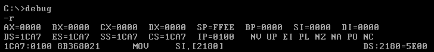

注意CS和IP的值，CS=1CA7, IP=0100,也就是说，内存1CA7:0100处的指令为CPU当前要读取、执行的指令。在所有寄存器的下方，Debug还列出了 CS:IP所指向的内存单元处所存放的机器码，并将它翻译为汇编指令。

```assembly
MOV SI,[2180]
```

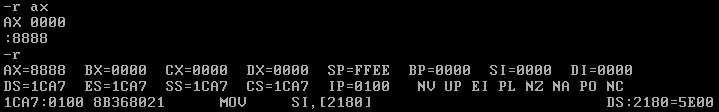

若要修改一个寄存器中的值，比如AX中的值，可用R命令后加寄存器名来进行， 输入“r ax”后按Enter键，将出现“：作为输入提示，在后面输入要写入的数据后按Enter键，即完成了对AX中内容的修改。若想看一下修改的结果，可再用R命令查看， 


**用Debug的D命令查看内存中的内容**

如果我们想知道内存10000H处的内容，可以用“d 段地址:偏移地址”的格式来查看，

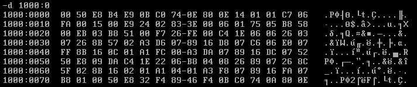

使用“d段地址:偏移地址”的格式，Debug将列出从指定内存单元开始的**128**个内存单元的内容。图中，在使用d 1000:0后，Debug列出了 1000:0〜1000:7F中的内容。

使用D命令，Debug将输出3部分内容

1. 中间是从指定地址开始的128个内存单元的内容，用十六进制的格式输出，每行的输出从16的整数倍的地址开始，最多输出16个单元的内容。从图中，我们可以知道， 内存1000:0单元中的内容是00H,内存1000:1单元中的内容是50H,内存1000:0〜1000:F中的内容都在第一行。   

   注意在每行的中间有一个**"-"**，它将每行的输出分为两部分，这样便于查看。

   

2. 左边是每行的起始地址
3. 右边是每个内存单元中的数据对应的可显示的ASCII码字符。没有对应可显示的ASCII字符，用**"."**来代替。


d 1000:9查看1000:9处的内容 ,Debug从1000:9开始显示，一直到1000:88, 一共是**128**个字节

1000:0-1000:8单元中的内容不显示

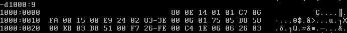

在使用“d段地址:偏移地址”之后，接着使用D命令，可列出后续的内容

也可以指定D命令的查看范围，此时采用“d段地址:起始偏移地址结尾偏移地址”


如果我们就想查看内存单元10000H中的内容，可以用下图中的任何一种方法看到，因为图中的所有“段地址:偏移地址”都表示了 10000H这一物理地址。

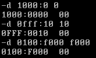


**用Debug的E命令改写内存中的内容**

要将内存1000:0-1000:9单元中的内容分别写为0、1、2、3、4、5、6、7、8、9,

可以用“e 起始地址 数据 数据 数据 ...”

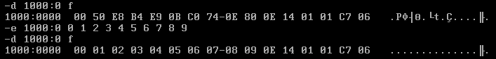


可以用E命令以提问的方式来逐个地修改从某一地址开始的内存单元中的内容，以从1000:10单元开始为例

1. 输入e 1000:10，按Enter键。
2. Debug显示起始地址1000:0010,和第一单元（即1000:0010单元）的原始内容：FA,然后光标停在的后面提示输入想要写入的数据，此时可以有两个选择：其一为输入数据（我们输入的是0）,然后按空格键，即用输入的数据改写当前的内存单元；其二为不输入数据，直接按空格键，则不对当前内存单元进行改写。
3. 当前单元处理完成后（不论是改写或没有改写，只要按了空格键，就表示处理完成），Debug将接着显示下一个内存单元的原始内容，并提示进行修改，读者可以用同样的方法处理。
4. 所有希望改写的内存单元改写完毕后，按Enter键，E命令操作结束。

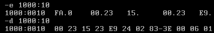


也可以用E命令向内存中写入字符串，


**用E命令向内存中写入机器码，用U命令查看内存中机器码的含义，用T命令执行内存中的机器码。**

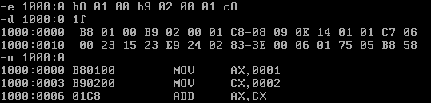

如何执行我们写入的机器指令呢？使用Debug的T命令可以执行一条或多条指令， 简单地使用T命令，可以执行CS:IP指向的指令，如图所示。（先修改CS IP 寄存器的值，使用rcs rip ）

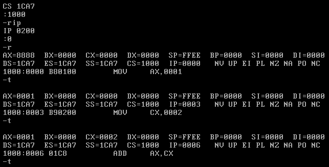


**用Debug的A命令以汇编指令的形式在内存中写入机器指令。**

前面我们使用E命令写入机器指令，这样做很不方便，最好能直接以汇编指令的形式写入指令。 A命令。

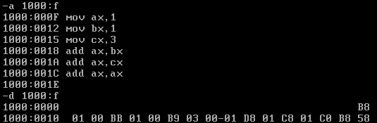


# 2.实验任务

1. 使用Debug,将下面的程序段写入内存，逐条执行，观察每条指令执行后CPU中相关寄存器中内容的变化。

```assembly
mov ax,4E20H
add ax,1416H
mov bx,2000H
add ax,bx
mov bx,ax
add ax,bx
mov ax,001AH
mov bx,0026H
add al,bl
add ah,bl
add bh,al
mov ah,0
add al,bl
add al,9CH
```

解：A命令方式将指令写入内存，并T命令执行前线修改CS:IP。

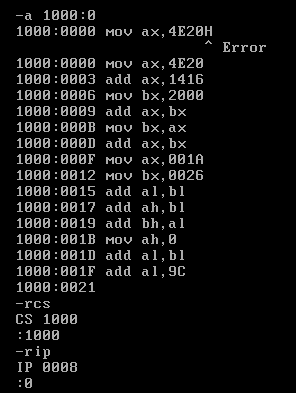

注意不用输入表示16进制的大写的H，否则会报错

执行过程略，可以想到

2. 将下面3条指令写入从2000:0开始的内存单元中，利用这3条指令计算2的8次方。

```assembly
mov ax,1
add ax,ax
jmp 2000:0003
```

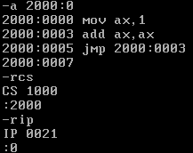

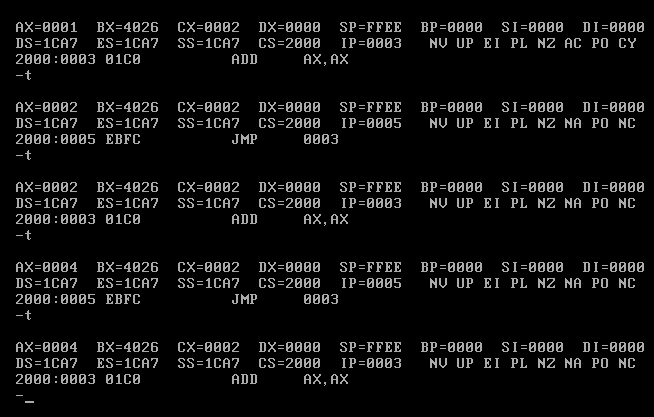

最后执行到ax=0040H（2^8） 停下来就是了


3. 查看内存中的内容。PC机主板上的ROM中写有一个生产日期，在内存FFF00H〜FFFFFH的某几个单元
   中，请找到这个生产日期并试图改变它。

注意题目中内存FFF00H〜FFFFFH是指物理地址，但是用指令时都是段地址*16+偏移，因此FFF00H= fff0:0

小心别搞混了

**基础地址（段地址xl6）+偏移地址=物理地址**

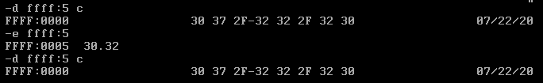

尝试把 30 37 2F（/） 32 32 2F 32 30 中第一个30 改为 32 失败，尼玛的都是ROM了改个屁。

4. 向内存从B8100H开始的单元中填写数据，如

`-e B810:0000 01 01 02 02 03 03 04 04`

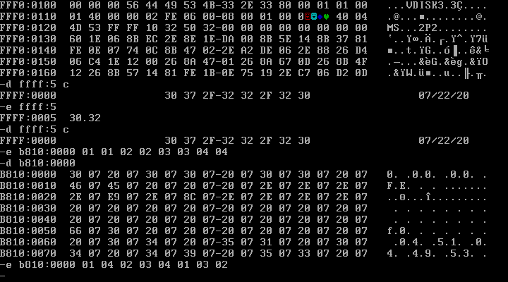

在屏幕右上方会出现图标，

几个图标的的十六进制形式正是01 02 03 04
接下来问题来了，剩下的一组01 02 03 04是干嘛的？后一组01 02 03 04 分别表示深蓝色、绿色、淡蓝色、红色

更改填写地址自然就是变化了。 **有意思**

B810:0000在8086PC的内存地址分配中是占据显存地址分配，B810:0000决定了在右上角咯

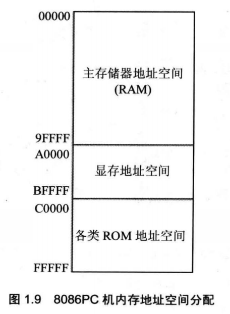

