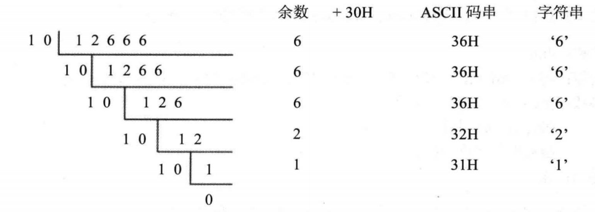

# 实验10编写子程序
## 1.显示字符串

我们应该提供灵活的调用接口，使调用者可以决定**显示的位置(行、列)、内容和颜色**。

名称：show_str
功能：在指定的位置，用指定的颜色，显示一个用0结束的字符串。
参数：(dh)=行号(取值范围0~24), (dl)=列号(取值范围0-79),
			(cl)=颜色，ds:si指向字符串的首地址
返回：无
应用举例：在屏幕的8行3列，用绿色显示data段中的字符串。

实验与之前的内容串在一起了，独立完成么，我还是太赶进度了

hit：

1. 子程序的入口参数是屏幕上的行号和列号，注意在子程序内部要将它们转化为显存中的地址，首先要分析一下屏幕上的行列位置和显存地址的对应关系；

2. 注意**保存子程序中用到的相关寄存器**

3. 这个子程序的内部处理和显存的结构密切相关，但是向外提供了与显存结构无关的接口。通过调用这个子程序，进行字符串的显示时可以不必了解显存的结构，为编程提供了方便。在实验中，注意体会这种设计思想。


```assembly
assume cs:code
data segment
        db 'welcome to masm!',0
data ends

code segment
start:  mov dh,8		; 行数
        mov dl,3		; 列数
        mov cl,2		; 绿色
        mov ax,data
        mov ds,ax
        mov si,0		; 数据
        call show_str
        mov ax,4c00h
        int 21h
show_str:   push dx
			push cx
			push si     ; 保护子程序寄存器中用到的寄存器
						; 由于主程序的限定
						; 这里由CPU自动为我们分配栈空间
						
			
			mov di,0	;显示缓存区中的偏移量
			mov bl,dh	
			dec bl		; bl-1才是真正的行，因为行号从0开始计数
			mov al,160  
			mul bl		; 每行160字节 用 行数*每行偏移量 得到目标行的偏移量
			
;1. 两个相乘的数：两个相乘的数，要么都是8位，要么都是16位。如果是8位， 一个默认放在AL中，另一个放在8位reg或内存字节单元中；如果是16位，一个默认在AX中，另一个放在16位reg或内存字单元中。
;2. 结果：如果是8位乘法，结果默认放在AX中；如果是16位乘法，结果高位默认在DX中存放，低位在AX中放。

			mov bx,ax   ; mul bl之后，乘积存储在ax中，这里要转存入bx中
			mov al,2	; 列的偏移量为2，两个字节代表一列！！！
			mul dl		; 与行偏移量同理
			add bl,al	;将列偏移量与行偏移量相加，得到指定位置的偏移量。
			
			mov ax,0b800h
			mov es,ax	;指定显示缓存区的内存位置
			
			mov al,cl	; 由于后面jcxz语句的判断要用到cx，所以我们要将
						; cl(颜色)先存下来。
	 s:     mov ch,0
			mov cl,ds:[si] ;首先将当前指向字符串的某个字符存入cx中
			jcxz ok			; 如果cx为0，则转移到ok标号执行相应代码
			mov es:[bx+di],cl	;将字符传入低地址
			mov es:[bx+di+1],al	; 将颜色传入高地址
			add di,2	; 列偏移量为2
			inc si		; 字符串的偏移量为1
			loop s		; 不为0,继续复制
	
	ok:     pop dx		
			pop cx
			pop si		; 还原寄存器变量
			ret			; 结束子程序调用
code ends
end start
```


## 2.解决除法溢出的问题

前面讲过，div指令可以做除法。当进行8位除法的时候，用al存储结果的商，ah存储结果的余数；进行16位除法的时候，用ax存储结果的商，dx存储结果的余数。可是，现在有一个问题，如果结果的商大于al或ax所能存储的最大值，那么将如何？

比如，下面的程序段：
`mov bh,1`
`mov ax,1000`
`div bh`

进行的是8位除法，结果的商为1000,而1000在al中放不下。

我们在用div指令做除法的时候，很可能发生上面的情况：结果的商过大，超出了寄存器所能存储的范围。当CPU执行div等除法指令的时候，如果发生这样的情况，将引发CPU的一个内部错误，这个错误被称为：除法溢出。

子程序描述

* 名称：divdw

* 功能：进行不会产生溢出的除法运算，被除数为dword型，除数为word型，结果为dword 型。

* 参数：

  (ax)=dword型数据的低16位
  (dx)=dword型数据的高16位
  (cx)=除数

* 返回：(dx)=结果的高16位，(ax)=结果的低16位, (cx)=余数
  应用举例：计算 1000000/10(F4240H/0AH)
  mov ax,4240H
  mov dx,000FH
  mov ex,0AH
  call divdw
  结果：(dx)=0001H, (ax)=86A0H, (cx)=0


提示
给出一个公式：
X：被除数，范围：[0, FFFFFFFF]
N：除数，范围:[0, FFFF]
H： X 高 16 位，范围：[0, FFFF]
L： X 低 16 位，范围：[0, FFFF]
int()：描述性运算符，取商，比如，int(38/10)=3
rem()：描述性运算符，取余数，比如，rem(38/10)=8

公式：`X/N = int(H/N)*65536 +[rem(H/N)*65536+L]/N`

这个公式将可能产生溢出的除法运算：X/N,转变为多个不会产生溢出的除法运算。公式中，等号右边的所有除法运算都可以用div指令来做，肯定不会导致除法溢出。

这里要注意，把一个数放在了dx，高位寄存器中，那么就相当于 *65536。
例如：`int(H/N)*65536` 就相当于把int(H/N)放在了dx中。

```assembly
divdw:
	;先计算高位，再计算低位。低位先入栈
	push ax		; 先将低位数据入栈，因为后面的div需要占用ax寄存器
	mov ax,dx	; 将被除数（X的高16位）放入被除数的低16位ax中
	mov dx,0    ; 将被除数的高十六位dx清零
				
	div cx	    ; int(H/N), 存入ax(商)中,rem(H/N)存入dx(余数)中
	mov bx,ax   ; 临时保存ax
	  
	pop ax      ; 取出先前入栈的X的低位
 
	div cx		; L\N
	mov cx,dx   ; 余数保存在cx里
	mov dx,bx   ; dx保存的是最终结果的高位
```


3.数值显示
编程，将data段中的数据以十进制的形式显示出来。
`data segment`
	`dw 123,12666,1,8,3,38`
`data ends`

正好《x86汇编语言》有讲到10进制显示的问题，巧了


提示
下面我们对这个问题进行一下简单地分析。

1. 要得到字符串“12666”，就是要得到一列表示该字符串的ASCII码：31H、32H、36 H、36H、36H。
   **十进制数码字符对应的ASCII码=十进制数码值+30H。**
   要得到表示十进制数的字符串，先求十进制数每位的值。
   例：对于12666,先求得每位的值：1、2、6、6、6。再将这些数分别加上30H,便 得到了表示 12666 的 ASCII 码串：31H、32H、36H、36H、36H。

2. 

用12666除以10,循环5次，记下每次的余数；将每次的余数分别加30H,便得表示十进制数的ASCII码串


3. 只要是除到商为0,各位的值就己经全部求出。可以使用jcxz指令来实现相关的功能。


可见，要将数据用十进制形式显示到屏幕上，要进行两步工作：
(1) 将用二进制信息存储的数据转变为十进制形式的字符串；
(2) 显示十进制形式的字符串。(lab10_1)

将二进制信息转变为十进制形式的字符串也是经常要用到的功能，我们应该为它编写一个通用的子程序。

子程序描述
名称：dtoc
功能：将word型数据转变为表示十进制数的字符串，字符串以0为结尾符。
参数：(ax)=word型数据
			ds:si指向字符串的首地址
返回：无

```assembly
assume cs:code

data segment
        db 10 dup (0)
data ends

stack segment
    dw 8 dup(0)
stack ends

code segment
start:  mov ax,12666
		mov bx,data
		mov ds,bx
		mov bx,stack
		mov ss,bx
		mov sp,10h
		mov si,0
		call dtoc

		mov dh,8
        mov dl,3
        mov cl,2
        call show_str
		
        mov ax,4c00h
        int 21h

dtoc:    push ax
		push bx
		push si
		mov bx,10
		mov si,0
    
  s0:    
		mov dx,0
		div bx		; ax/bx
		add dx,30h  ; 余数加30
		push dx		; 入栈
		mov cx,ax	; 商-->cx
		inc si		; 记录循环次数
		inc cx		; 当商为0时，也要加 1 ，方便loop判断
		loop s0  	; 首先 cx = cx -1,再判断 cx 是否为0
    
		mov cx,si	; cx 为循环次数	
		mov si,0	; si 指向 ds:[0]
  s1:    
		pop ds:[si]	; 将栈中转化好了的数据放到内存中
		inc si
		loop s1

		pop si
		pop bx
		pop ax
		ret
    

show_str:   push dx
			push cx
			push si     ; 保护子程序寄存器中用到的寄存器
						; 由于主程序的限定
						; 这里由CPU自动为我们分配栈空间
						
			
			mov di,0	;显示缓存区中的偏移量
			mov bl,dh	
			dec bl		; bl-1才是真正的行，因为行号从0开始计数
			mov al,160  
			mul bl		; 每行160字节 用 行数*每行偏移量 得到目标行的偏移量
			mov bx,ax   ; mul bl之后，乘积存储在ax中，这里要转存入bx中
			mov al,2	; 列的偏移量为2，两个字节代表一列！！！
			mul dl		; 与行偏移量同理
			add bl,al	;将列偏移量与行偏移量相加，得到指定位置的偏移量。
			
			mov ax,0b800h
			mov es,ax	;指定显示缓存区的内存位置
			
			mov al,cl	; 由于后面jcxz语句的判断要用到cx，所以我们要将
						; cl(颜色)先存下来。
	 s:     mov ch,0
			mov cl,ds:[si] ;首先将当前指向字符串的某个字符存入cx中
			jcxz ok			; 如果cx为0，则转移到ok标号执行相应代码
			mov es:[bx+di],cl	;将字符传入低地址
			mov es:[bx+di+1],al	; 将颜色传入高地址
			add di,2	; 列偏移量为2
			inc si		; 字符串的偏移量为1
			loop s		; 不为0,继续复制
	
	ok:     pop dx		
			pop cx
			pop si		; 还原寄存器变量
			ret			; 结束子程序调用
	
code ends
end start
```

