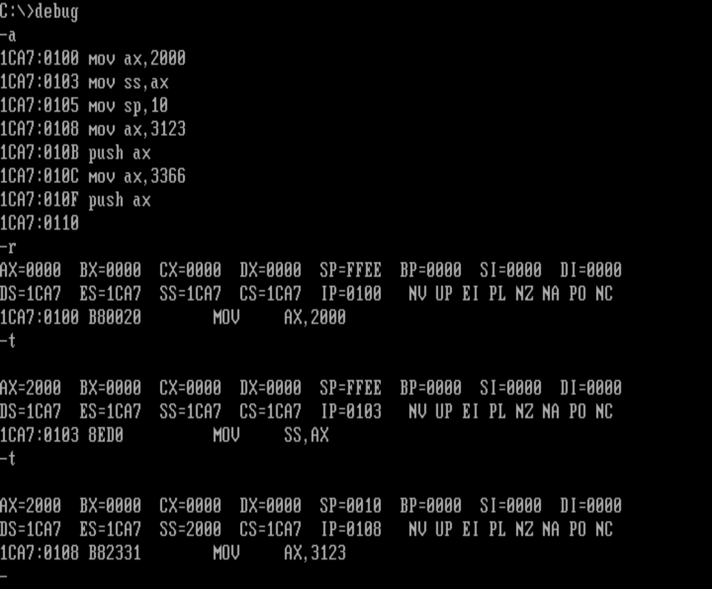
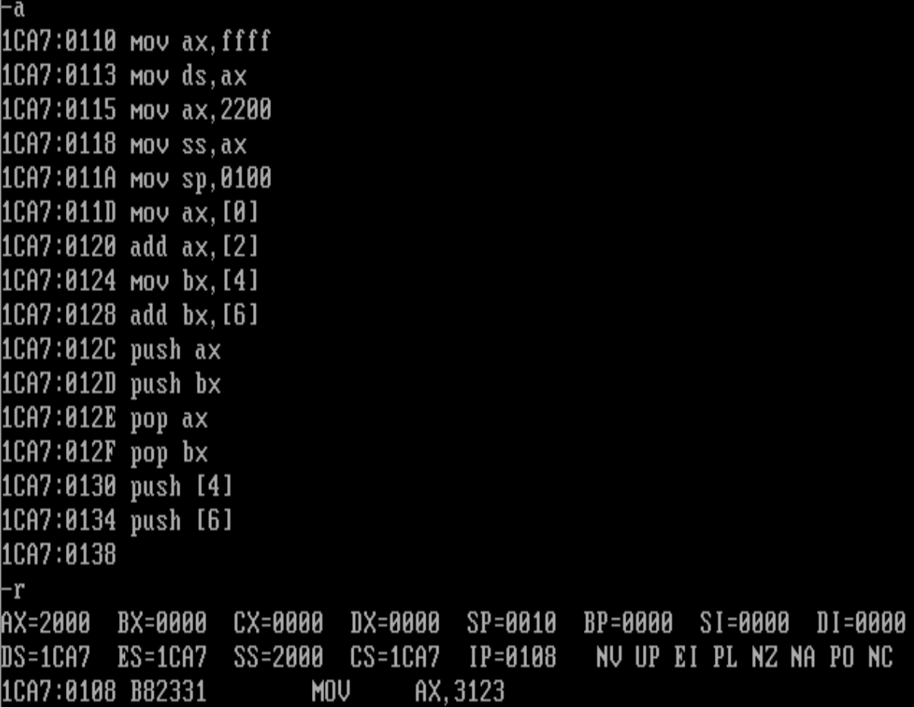
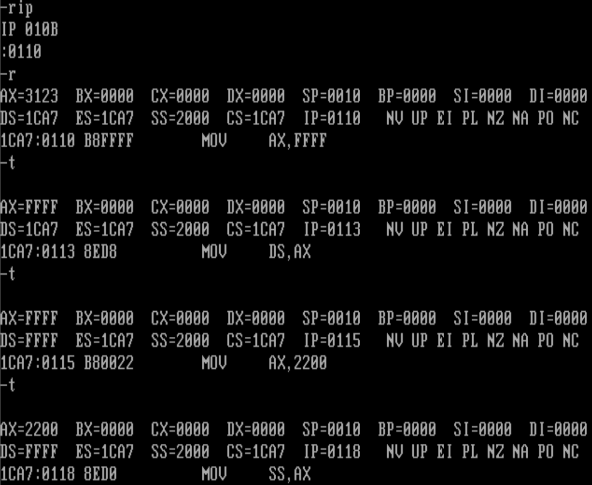
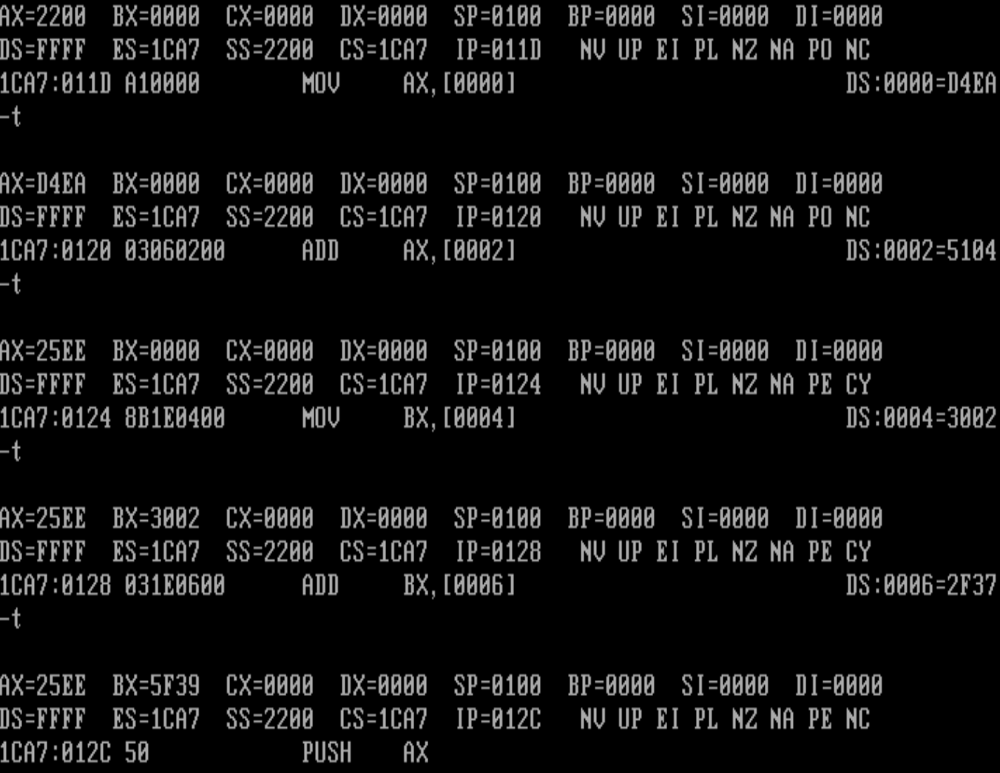
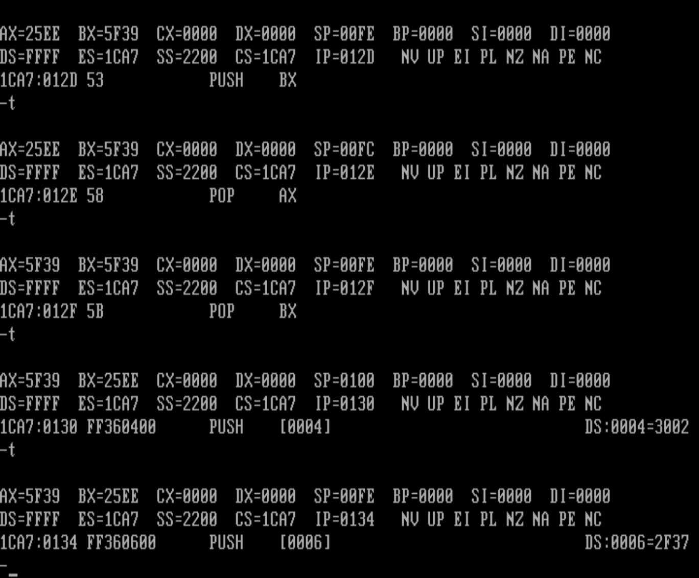
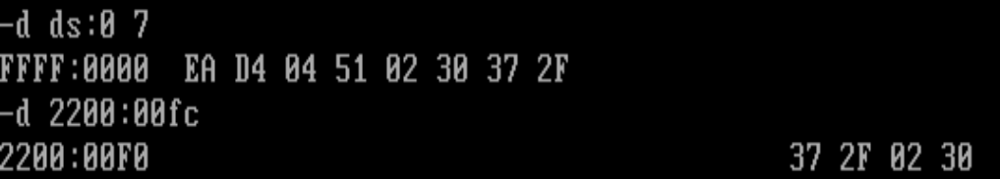
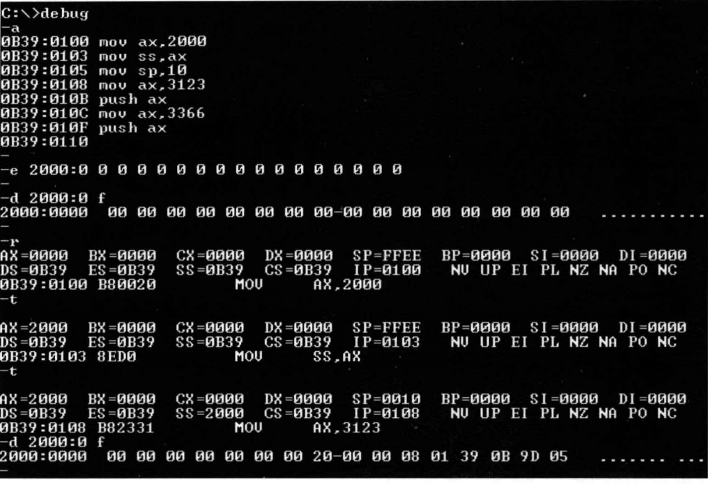

# 实验2用机器指令和汇编指令编程

1. 从上次实验中，我们知道，D命令是查看内存单元的命令

“d段地址:偏移地址”的格式查看指定的内存单元的内容，

现在，我们知道段地址是放在段寄存器中的。

在D命令后面直接给出段地址，是Debug提供的一种直观的操作方式。D命令是由Debug执行的，
 d 1000:0 这样的命令时，也会先将段地址1000H送入段寄存器中。

段寄存器有4个：CS、DS、SS、ES

首先不能是CS,因为CS:IP必须指向Debug处理D命令的代码，也不能是SS,因为SS:SP要指向栈顶。

这样只剩下了 DS和ES可以选择，放在哪里呢？我们知道，访问内存的指令如“mov ax，[0]”等一般都默认段地址在ds中，所以Debug在执行如“d段地址偏移地址”这种D命令时，将段地址送入ds中比较方便。

D命令也提供了一种符合CPU机理的格式：
**“d段寄存器:偏移地址”**

```assembly
-r ds
:1000
-d ds:0 ;查看从1000:0开始的内存区间中的内容
-r ds
:1000
-d ds:10 18 ;查看1000:10〜1000:18中的内容
-d cs:0 ;查看当前代码段中的指令代码
-d ss:0 ;查看当前栈段中的内容

```


2. 在E、A、U命令中使用段寄存器。

```assembly
-r ds
:1000
-e ds:0 11 22 33 44 55 66 ;在从1000: 0开始的内存区间中写入数据
-u cs:0 ;以汇编指令的形式， 显示当前代码段中的代码，0代码的偏移地址
-r ds
:1000
-a ds:0 ;以汇编指令的形式， 向从1000: 0开始的内存单元中写入指令
```


3. 下一条指令执行了吗？

```assembly
mov ax,2000
mov ss,ax
mov sp,10 ;安排2000:0000-2000:000F为栈空间，初始化栈顶
mov ax,3123
push ax
mov ax,3366
push ax ;在栈中压入两个数据
```




在用T命令单步执行mov ax,2000后，显示出当前CPU各个寄存器的状态和下一步要执行的指令：mov ss,ax； 

之后 mov sp,10到哪里去了？


观察，发现： 在程序执行前，ax=0000，ss=1ca7, sp=ffee
在用 T 命令单步执行 mov ax,2000 后，ax=2000； ss=1ca7； sp=ffee
在用 T 命令单步执行 mov ss,ax 后，ax=2000； ss=2000； sp=0010(mov sp，10 —定是得到了执行。)

显然，在用T命令执行mov ss,ax的时候，它的下一条指令mov sp，10也紧接着执行了。


不单是mov ss,ax,对于如mov ss,bx, mov ss,[O], pop ss等指令都会发生上面的情况，这些指令有哪些共性呢？它们都是修改栈段寄存器SS的指令。


**Debug的T命令在执行修改寄存器SS的指令时，下一条指令也紧接着被执行。**

为什么以后再说


**栈空 ，SS:SP指向栈空间最高地址单元的下一个单元。**

# 实验任务

1. 使用Debug,将下面的程序段写入内存，逐条执行，根据指令执行后的实际运行情况填空。

```assembly
mov ax,ffff
mov ds,ax

mov ax,2200
mov ss,ax

mov sp,0100

mov ax,[0] ;ax=d4ea
add ax,[2] ;ax=25ee
mov bx,[4] ;bx=3002
add bx,[6] ;bx=5f39

push ax 	;sp= 00fe;修改的内存单元的地址是2200:00fe 内容为25ee
			;栈空（SS=2200 SP=0100），则栈空间最高地址2200:00ff
push bx 	;sp= 00fc;修改的内存单元的地址是2200:00fc内容为5f39
pop ax 		;sp= 00fe;ax=5f39
pop bx 		;sp= 0100;bx=25ee
			
push [4] 	;sp= 00fe;修改的内存单元的地址是 2200:00fe 内容为 3002
push [6] 	;sp= 00fc;修改的内存单元的地址是 2200:00fc 内容为 2f37(为什么ds+6被改变了？)
```











2. 2000:0〜2000:f中的内容会发生改变？

```assembly
mov ax,2000
mov ss,ax
mov sp,10
mov ax,3123
push ax
mov ax,3366
push ax
```




没搞明白