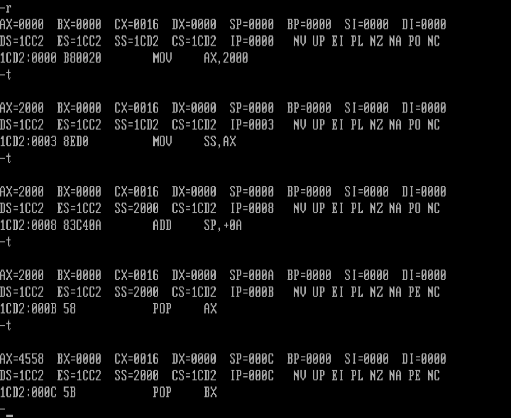
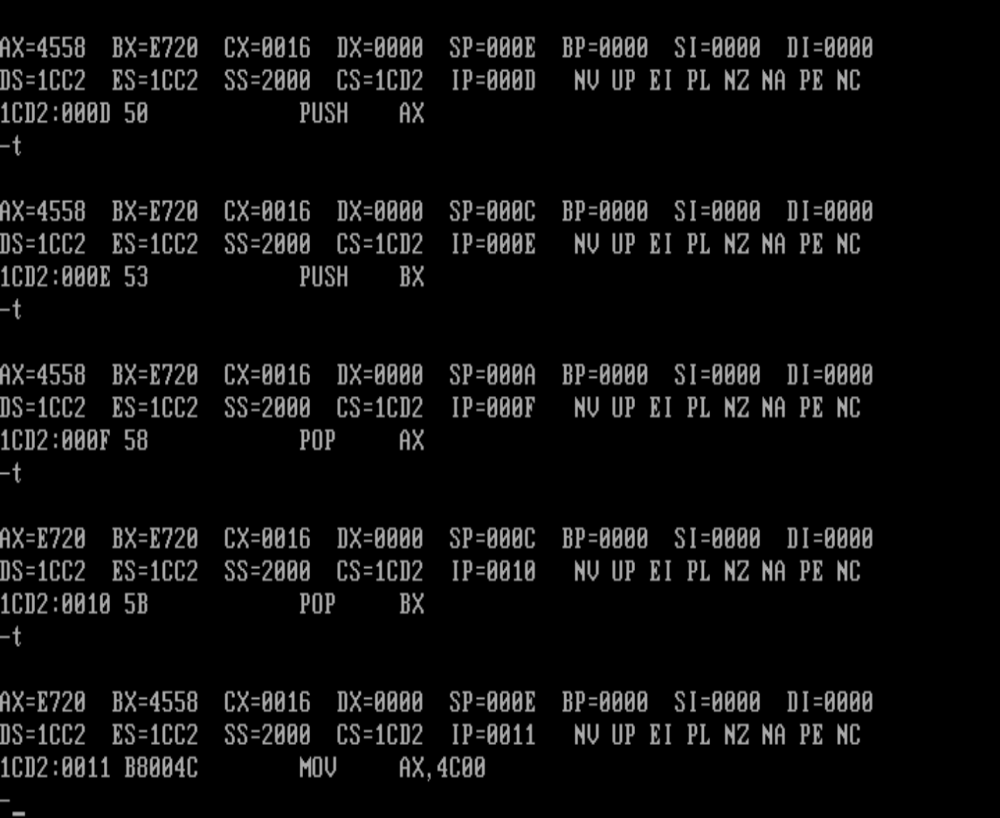
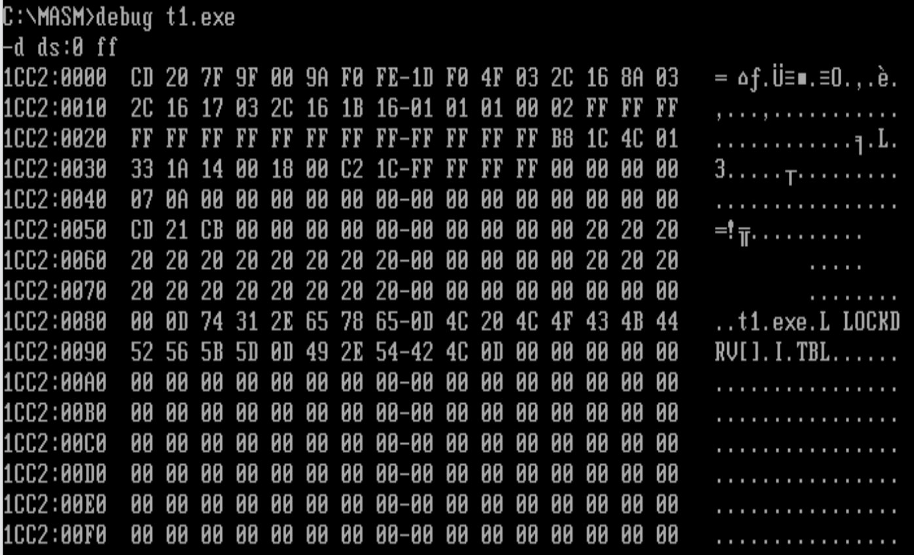

# 实验3 编程、编译、连接、跟踪

1. 将下面的程序保存为t1.asm文件，将其生成可执行文件t1.exe

```assembly
assume cs:codesg
codesg segment
	mov ax,2000H
	mov ss, ax
	mov sp, 0
	add sp, 10
	pop ax
	Pop bx
	push ax
	push bx
	pop ax
	pop bx
	
	mov ax,4c00H
	int 21H
codesg ends
end

```

2. 用Debug跟踪t1.exe的执行过程，写出每一步执行后，相关寄存器中的内容和栈顶的内容。





注意：因为POP和PUSH都用一个字节，IP每次增长1H。

3. PSP的头两个字节是CD 20,用Debug加载tl.exe,查看PSP的内容。

PSP就是DS和CS之间的0010H*16=256字节（16乘16）



**一定要做完这个实验** 心急吃不了热豆腐 一定要学习透彻

