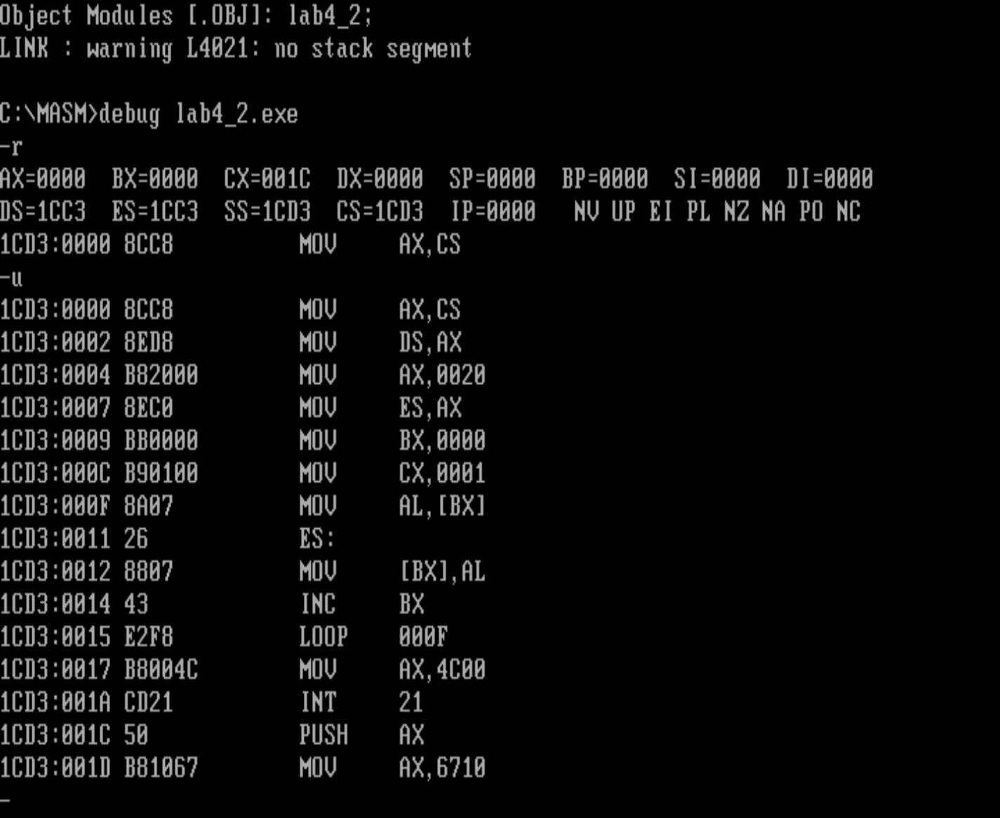
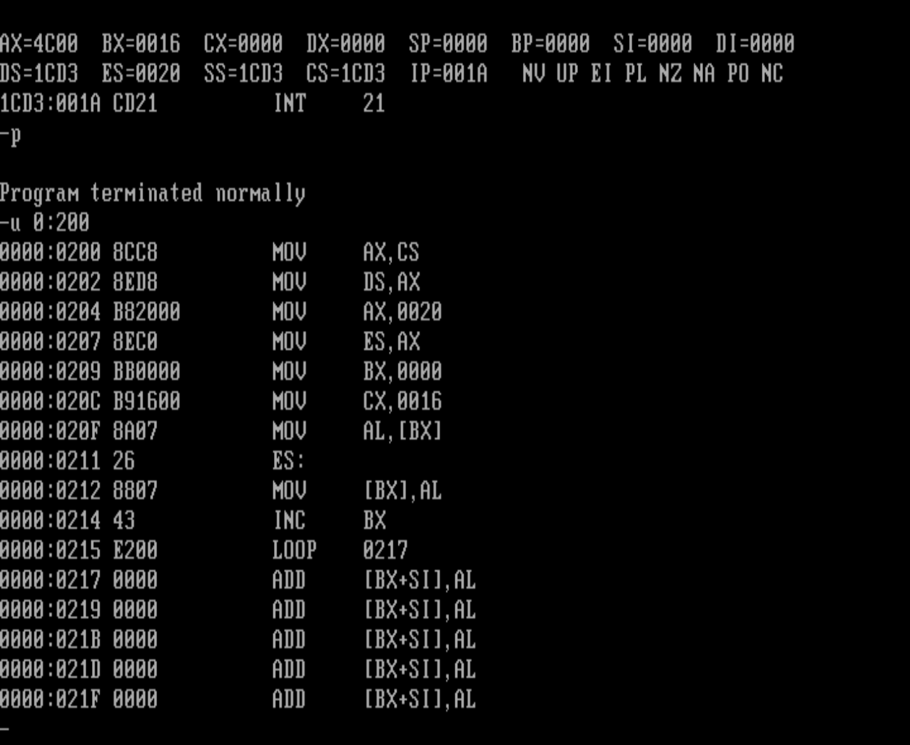

没想到需要花费的功夫比我预先估计的要多上不少，但是努力还是能够加快进度的！操作系统我来了

# 实验4 [bx]和loop的使用

1. 编程，向内存0:200〜0:23F（相当于0020:0~0020:3f）依次传送数据0〜63(3FH),程序中只能使用9条指令，9条指令中包括“mov ax，4c00h”和“ int 21 h”

```assembly
assume cs:code
code segment
	mov ax,0020h
	mov ds,ax
	mov bx,0
	
	mov cx,64
s:	mov ds:[bx],bl  ;注意这里是bl按字节，而不是bx按字
	inc bx
	loop s
	
	mov ax,4c00h
	inta 21h
code ends
end
```


2. 下面的程序的功能是将“mov ax,4c00h”之前的指令复制到内存0:200处，补全程序。调试，跟踪运行结果。

```assembly
assume cs:code
code segment
    mov ax,cs			;补全 程序入口为cs:0(ip=0),所以第一空处传递段地址为cs
    mov ds,ax
    mov ax,0020h
    mov es,ax		;es 0020
    mov bx,0
    mov cx,16			;补全循环次数mov ax,4c00h之前指令 
    					;而程序总代码长度可通过debug加载后通过u命令看出,先随便写个数比如1
    					;之后看出mov ax,4c00h 是0017h 则应是16h咯，别搞混16（十进制）了
  s:mov al,[bx]
    mov es:[bx],al
    inc bx
    loop s
    
    mov ax,4c00h
    int 21h
code ends
end

```

hit:

1. 复制的是什么？从哪里到哪里？
2. 复制的是什么？有多少个字节？你如何知道要复制的字节的数量？



