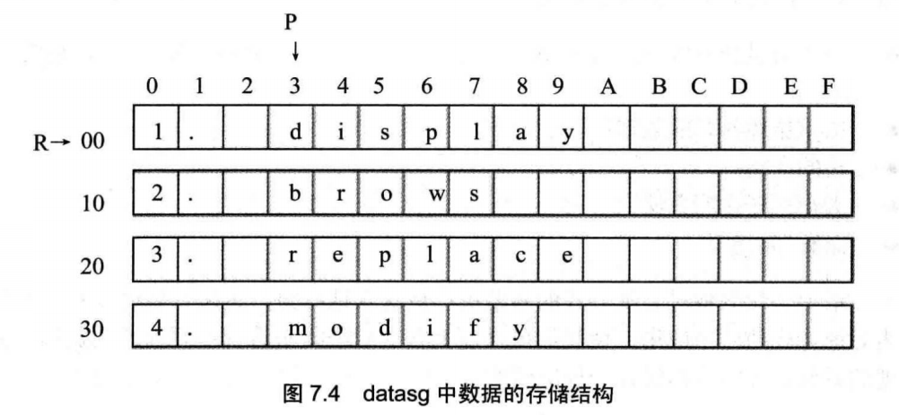
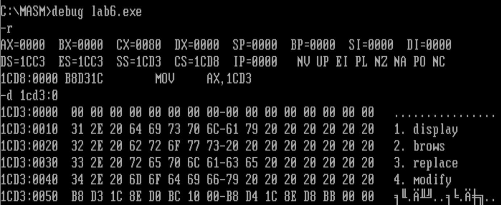
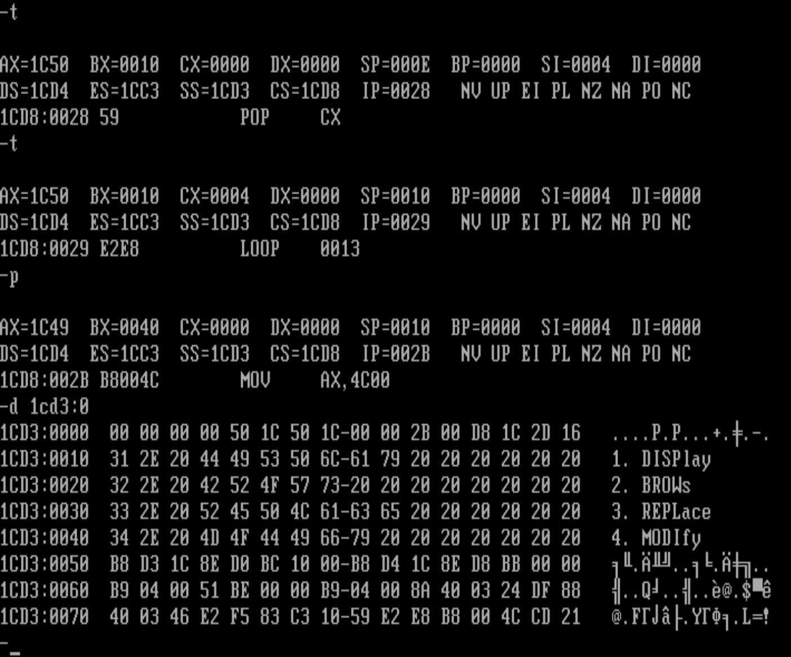

编程，将datasg段中每个单词的前4个字母改为大写字母。

```assembly
assume cs:codesg,ss:stacksg,ds:datasg
stacksg segment

	dw 0, 0 ,0,0,0,0,0,0
stacksg ends
datasg segment
db '1. display		'
db '2. brows		'
db '3. replace		'
db '4. modify		'
datasg ends
codesg segment	
start:
codesg ends
end start

```



在datasg中定义了 4个字符串，每个长度为16字节
因为它们是连续存放的，我们可以将这4个字符串看成一个4行16列的二维数组，按照要求，我们需要修改每个单词的前4个字母，即二维数组的每一行的3〜6列。我们需要进行4x4次的二重循环，用变量R定位行，常量3定位每行要修改的起始列，变量C定位相对于起始列的要修改的列。外层循环按行来进行，内层按列来进行。我们首先用R定位第1行，循环修改R行的3+C(0<=C<=3)列；然后再用R定位到下一行，再次循环修改R行的3+C(0<=C<=3)列……，如此重复直到所有的数据修改完毕。

```assembly
;伪代码如下
R=第一行的地址；
mov cx,4
s0: C=第一个要修改的列相对于起始列的地址
mov cx,4
s: 改变R行，3+C列的字母为大写
C=下一个要修改的列相对于起始列的地址
loop S
R=下一行的地址
loop s0

```

代码

```assembly
assume cs:codesg,ds:datasg,ss:stacksg
 
stacksg segment
    dw 0,0,0,0,0,0,0,0
stacksg ends
 
datasg segment
    db '1. display      '
    db '2. brows        '
    db '3. replace      '
    db '4. modify       '
datasg ends
 
codesg segment
start: mov ax,datasg
       mov ds,ax
       mov ax,stacksg
       mov ss,ax
       mov sp,10h	;最好不要用16（十进制），而是10h（16进制）
       mov bx,0
       mov cx,4
     s:push cx
       mov si,0		;这里直接 mov si,3 之后 mov al,[bx+si]应该也可以吧
       mov cx,4
    s0:mov al,3[bx+si]
       and al,11011111b
       mov 3[bx+si],al
       inc si
       loop s0
 
       add bx,16
       pop cx
       loop s
 
       mov ax,4c00h
       int 21h
codesg ends
end start
```


我们用bx来作变量，定位每行的起始地址，用si定位要修改的列，用［bx+3+si］的方式来对目标单元进行寻址。




执行程序之后

