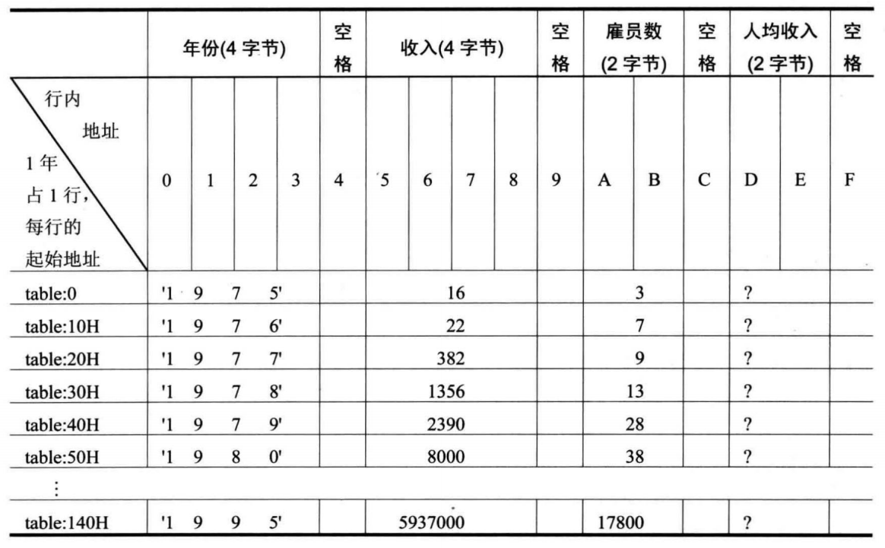

# 实验7 寻址方式在结构化数据访问中的应用

这次实验难度相当大，算是综合性的第一道坎，跨过去就是了

Power idea公司从1975年成立一直到1995年的基本情况如下。

| 年份 | 收入（千美元） | 雇员（人） | 人均收入（千美元） |
| ---- | -------------- | ---------- | ------------------ |
| 1975 | 16             | 3          | ？                 |
| 1976 | 22             | 7          | ？                 |
| 1977 | 382            | 9          | ？                 |
| 1978 | 1356           | 13         | ？                 |
| 1979 | 2390           | 28         | ？                 |
| 1980 | 8000           | 38         | ？                 |
| ...  |                |            |                    |
| 1995 | 5937000        | 17800      | ？                 |


下面的程序中，已经定义好了这些数据:

```assembly
assume cs:codesg
data segment
   db '1975','1976','1977','1978','1979','1980','1981','1982','1983'
   db '1984','1985','1986','1987','1988','1989','1990','1991','1992'
   db '1993','1994','1995'
   ; 以上是表示21年的21个字符串
   dd 16,22,382,1356,2390,8000,16000,24486,50065,97479,140417,197514
   dd 345980,590827,803530,1183000,1843000,2759000,3753000,4649000,5937000
   ; 以上是表示21年公司总收入的21个dword型数据
   dw 3,7,9,13,28,38,130,220,476,778,1001,1442,2258,2793,4037,5635,8226
   dw 11542,11430,15257,17800
   ; 以上是表示21年公司雇员人数的21个word型数据
data ends

table segment
   db 21 dup ('year summ ne ?? ')
table ends
```


编程，将data段中的数据按如下格式写入到table段中，并计算21年中的人均收入（取整），结果也按照下面的格式保存在table段中。(将一段内存里连续的数据，复制到另一段结构化了的内存里)



提示，可将data段中的数据看成是多个数组，而将table中的数据看成是一个结构型数据的数组，每个结构型数据中包含多个数据项。可用bx定位每个结构型数据，用idata定位数据项，用si定位数组项中的每个元素，对于table中的数据的访问可采用［bx].idata和[bx].idata[si]的寻址方式。


解：

原数据：

1. 年份数据4字节

2. 收入数据4
3. 雇员数据2

21年的21个字符串（第一块数据）和21年公司总收入（第二块数据）地址之间相隔４＊２１＝８４＝５４Ｈ

21年公司总收入（第二块数据）和21年公司雇员人数（第三块数据）地址之间也是相隔８４＝５４ｈ（dword）

目标table段：(注意数据间的空格)

1. 年份数据4字节，

2. 收入数据4，

3. 雇员数据2，

4. 人均收入2字节

   每一行占据16字节

   


```assembly

assume ds:data, es:table, cs:code, ss:stack

data segment
   db '1975','1976','1977','1978','1979','1980','1981','1982','1983'
   db '1984','1985','1986','1987','1988','1989','1990','1991','1992'
   db '1993','1994','1995'
   ; 以上是表示21年的21个字符串
   dd 16,22,382,1356,2390,8000,16000,24486,50065,97479,140417,197514
   dd 345980,590827,803530,1183000,1843000,2759000,3753000,4649000,5937000
   ; 以上是表示21年公司总收入的21个dword型数据
   dw 3,7,9,13,28,38,130,220,476,778,1001,1442,2258,2793,4037,5635,8226
   dw 11542,11430,15257,17800
   ; 以上是表示21年公司雇员人数的21个word型数据
data ends

table segment
   db 21 dup ('year summ ne ?? ')
table ends

stack	segment
	dw 2 dup(0)
stack	ends

code segment
start:
; 设置data段，以及ds:bx指向data段的第一个单元，即ds:[bx]的内容就是data段第一个单元的内容
mov ax, data
mov ds, ax

; 设置table段
mov ax, table
mov es, ax

; 设置堆栈段
mov ax, stack
mov ss, ax
mov sp, 16

; 初始化三个变址寄存器
mov bx, 0	
mov si, 0	
mov di, 0

; 准备复制，需要用到循环，21次
mov cx, 21

s:
	; 年4字节，分两次mov，从data 到 table
	mov ax, ds:[bx+0]	; 这里写个0是为了下面的对照，清晰点
	mov es:[si+0], ax
	mov ax, ds:[bx+2]
	mov es:[si+2], ax

	; 空格 1字节，用8位的寄存器
	mov al, 32
	mov es:[si+4], al

	; 收入4字节，同理年，但是注意data段起始地址，table可以说是连续的
	mov ax, ds:[bx+84]
	mov es:[si+5], ax
	mov ax, ds:[bx+86]
	mov es:[si+7], ax

	; 空格
	mov al, 32
	mov es:[si+9], al

	; 雇员数2字节，小心处理
	mov ax, ds:[di+168]
	mov es:[si+0ah], ax

	; 空格
	mov al, 32
	mov es:[si+0ch], al

	; 算人均收入（收入4字节（ax dx一起上）除以雇员数2字节），这里小心高低位
	;除数为16位，被除数则为32位，在DX和AX中存放，DX存放高16位，AX存放低16位。
	mov ax, ds:[bx+84] 
	mov dx, ds:[bx+86]
	
	
	;不用栈
	div word ptr ds:[di+168]
	
	;使用栈
	;push cx			; 临时用一下cx，因为不可以 div ds:[bx+168]
	;mov cx, ds:[di+168]	; mov cx, ds:[bx+168]错误了。。。
	;div word ptr cx		
	;pop cx
	
	mov es:[si+0dh], ax		;div结果存在ax，dx中余数（不用管）

	; 空格
	mov al, 32
	mov es:[si+0fh], al

	add si, 16
	add bx, 4
	add di, 2			; 这里记住要加上２
	loop s
	
	mov   ax,4c00h   
	int   21h  

code ends

end start
```