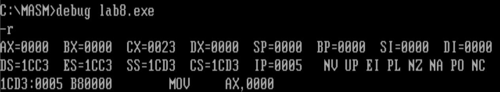

# 实验8分析一个奇怪的程序

分析下面的程序，在运行前思考：这个程序可以正确返回吗？

```assembly
assume cs:codesg
codesg segment
        mov ax,4c00h
        int 21h
start:  mov ax,0
    s:  nop
        nop

        mov di,offset s
        mov si,offset s2
        mov ax,cs:[si]
        mov cs:[di],ax

    s0: jmp short s

    s1: mov ax,0
        int 21h
        mov ax,0

    s2: jmp short s1
        nop
codesg ends
end start
```


程序执行过程分析

1. 查看寄存器



2. -u 指令查看反汇编格式的代码,需要注意的是我要从Ip为0的地方开始查看代码


mov di,offset s，s的偏移地址是8

mov si,offset s2，s2的偏移地址20

jmp short s1，s1的偏移地址18

3. 一步步调试

   

   

执行mov ax,cs:[si]后，将代码段偏移地址为20的字单元数据赋值给寄存器ax

执行完mov cs:[di]后，查看代码段的数据，偏移地址为8的字单元被修改成F6BE


执行完JMP 0008,就会跳转到机器码为F6 BE处，而就相当于 继续执行jmp 0000 

其中这里机器语言EB F6中的F6很重要，就是程序要跳转的标号，F6的补码是-0A，即相对于本指令的下一条指令的开始向上偏移10个字节，也就是代码段的开始位置，如下图所示，程序就可正常返回了。


# 实验9根据材料编程

这个实验也是必须要做的么


1. 要定义一个字符串“welcome to masm!”，很明显就想到要用到数据段，也就是ds寄存器，配套的偏移寄存器选择bx；
2. 要将字符串拷贝到显存的地址范围内，而且此时ds寄存器已经被用，所以需要另外一个段寄存器，此处选择es寄存器，配套偏移寄存器选择si；
3. 因为要将字符串输出到屏幕中间，所以需要计算屏幕中间的内存位置。显存为0xb8000h-0xbffffh处，所以显存的开始地址为0xb8000h，由于是80 * 25的显示缓冲区，所以中间位置就是80 * 13。同时要输出三行，所以第一行开始位置的坐标就是80*12。那么总共需要跳过的显示单元为80 * 11 + （（80 - 16 ）/ 2）（16是字符串长度） = 912。根据书中提示，一个显示字符在显示缓冲区中占两个位置，那么要跳过962个字符就需要跳过912 * 2 = 1824个字符，换算成16进制即为720h。由此确定开始位置为0xb8720h。所以段寄存器es的值为0xb872h。


```assembly
assume cs:codesg,ds:datasg

datasg segment
    db 'welcom to masm!'
datasg ends

codesg segment
start:
    ;move data address to ds register
    mov ax, datasg
    mov ds, ax
    
    ;display area is 0xb8000h - 0xbffffh, move data to this area
    mov ax, 0b872h ;with hex, must a 0 before b800h
    mov es, ax
    mov si, 0
    mov bx, 0
    mov cx, 16
s:
    mov al, ds:[bx]
    mov es:[si], al
    mov es:[si + 160], al ; newline
    mov es:[si + 320], al ; newline
    mov al, 02h;green property:00000010 = 2
    mov es:[si + 1], al
    mov al, 24h;backgroud green, word red, 00100100 = 36 = 24h
    mov es:[si + 161], al
    mov al, 71h;background white, word green, 01110001 = 71h
    mov es:[si + 321], al
    add bx, 1
    add si, 2
    loop s
    
    mov ax,4c00h
    int 21h
codesg ends
end start
```

