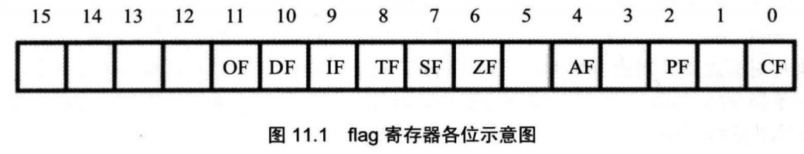
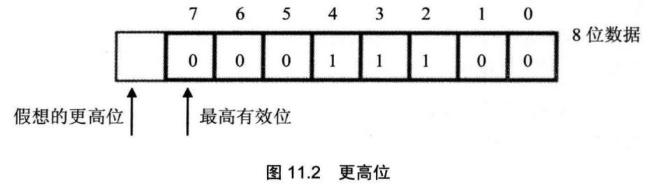
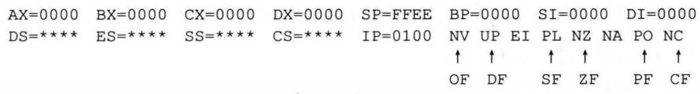

CPU内部的寄存器中，有一种特殊的寄存器(对于不同的处理机，个数和结构都可能不同)具有以下3种作用。

1. 用来存储相关指令的某些执行结果；
2. 用来为CPU执行相关指令提供行为依据；
3. 用来控制CPU的相关工作方式。

这种特殊的寄存器在8086CPU中，被称为标志寄存器。8086CPU的标志寄存器有16位，其中存储的信息通常被称为程序状态字(PSW)。

flag和其他寄存器不一样，其他寄存器是用来存放数据的，都是整个寄存器具有一个含义。而flag寄存器是按位起作用的，也就是说，它的每一位都有专门的含义，记录特定的信息。



0、2、4、6、7、8、9、10、11位都具有特殊的含义。

## 11.1 ZF标志

flag的第6位是ZF,零标志位。它记录相关指令执行后，其结果是否为0。如果结果为0，那么zf=1 ；如果结果不为0,那么zf=0

比如，指令：
`mov ax,1`
`sub ax,1`

执行后，结果为0，则zf=1。

有的指令的执行是影响标志寄存器的，比如，add、sub、 mul、div、inc、or、and等，它们大都是运算指令（进行逻辑或算术运算）；有的指令的执行对标志寄存器没有影响，比如，mov> push> pop等，它们大都是传送指令。

## 11.2 PF标志

flag的第2位是PF,奇偶标志位。它记录相关指令执行后，其结果的所有bit位中1的个数是否为偶数。如果1的个数为偶数，pf=1,如果为奇数，那么pf=0）。

比如，指令：
`mov al,1`
`add al,10`
执行后，结果为00001011B,其中有3（奇数）个1，则pf=0）;

## 11.3 SF标志

flag的第7位是SF,符号标志位。它记录相关指令执行后，其结果是否为负。如果结果为负，sf=1；如果非负，sf=0。

计算机中通常用补码来表示有符号数据。计算机中的一个数据可以看作是有符号数， 也可以看成是无符号数。比如：

00000001B,可以看作为无符号数1,或有符号数+1;
10000001B,可以看作为无符号数129,也可以看作有符号数-127。


mov al,10000001B
add al,1
结果:(al)=10000010B

可以将add指令进行的运算当作无符号数的运算，那么add指令相当于计算129+1,结果为130(10000010B)；也可以将add指令进行的运算当作有符号数的运算，那么add指令相当于计算-127+1,结果为-126(10000010B)。

SF标志，就是CPU对有符号数运算结果的一种记录，它记录数据的正负。在我们将数据当作有符号数来运算的时候，可以通过它来得知结果的正负。**如果我们将数据当作无符号数来运算，SF的值则没有意义，虽然相关的指令影响了它的值。**

某些指令将影响标志寄存器中的多个标记位，这些被影响的标记位比较全面地记录了指令的执行结果，为相关的处理提供了所需的依据。比如指令sub al,al执行后，ZF、PF、SF等标志位都要受到影响，它们分别为：1、1、0。

## 11.4 CF标志

flag的第0位是CF,进位标志位。一般情况下，在进行**无符号数**运算的时候，它记录了运算结果的最高有效位向更高位的进位值，或从更高位的借位值。

对于位数为N的无符号数来说，其对应的二进制信息的最高位，即第N-1位，就是它的最高有效位，而假想存在的第N位，就是相对于最高有效位的更高位，如图11.2所示。



我们知道，当两个数据相加的时候，有可能产生从最高有效位向更高位的进位。比如，两个8位数据：98H+98H,将产生进位。由于这个进位值在8位数中无法保存，我们在前面的课程中，就只是简单地说这个进位值丢失了。其实CPU在运算的时候，并不丢弃这个进位值，而是记录在一个特殊的寄存器的某一位上。8086CPU就用flag的CF位来记录这个进位值。比如，下面的指令：

```assembly
mov al,98H
add al, al ;执行后：（al）=30H，CF=1, CF记录了从最高有效位向更高位的进位值
add al, al ;执行后：(al)=60H，CF=0，CF记录了从最高有效位向更髙位的进位值
```

而当两个数据做减法的时候，有可能向更高位借位。比如，两个8位数据：97H-98H,将产生借位，借位后，相当于计算197H-98H。而flag的CF位也可以用来记录这个借位值。比如，下面的指令：

```assembly
mov al,97H
sub al,98H	;执行后：(al)=FFH, CF=1, CF记录了向更高位的借位值
sub al,al	;执行后：(al)=0, CF=0, CF记录了向更髙位的借位值
```


## 11.5 OF标志

在进行有符号数运算的时候，如结果超过了机器所能表示的范围称为溢出。

flag的第11位是OF，溢出标志位。一般情况下，OF记录了有符号数运算的结果是否发生了溢出。如果发生溢出，OF=1;如果没有，OF=0。

一定要注意CF和OF的区别：CF是对无符号数运算有意义的标志位，而OF是对有符号数运算有意义的标志位

CF和OF所表示的进位和溢出，是分别对无符号数和有符号数运算而言的，它们之间没有任何关系。

`mov al,0F0H`
`add al,78H`
add指令执行后：CF=1, OF=0。对于无符号运算，0F0H+78H有进位，CF=1；对于有符号数运算，0F0H+78H不发生溢出，OF=0。

## 11.6 adc 指令

adc是带进位加法指令，它利用了 CF位上记录的进位值。

指令格式：adc操作对象1,操作对象2
功能：操作对象1 =操作对象1 +操作对象2 + CF
比如指令adc ax,bx实现的功能是：（ax）=（ax）+（bx）+CF

```assembly
mov ax,2
mov bx,1
sub bx, ax
adc ax,1
```


执行后，（ax）=4。adc执行时，相当于计算：（ax）+1+CF=2+1+ 1=4。

adc指令比add指令多加了一个CF位的值。

先来看一下CF的值的含义。在执行adc指令的时候加上的CF的值的含义，是由adc指令前面的指令决定的，也就是说，关键在于所加上的CF值是被什么指令设置的。显然，如果CF的值是被sub指令设置的，那么它的含义就是借位值；如果是被add指令设置的，那么它的含义就是进位值。


编程，计算1EF000H+201000H,结果放在ax（高16位）和bx（低16位）中。
因为两个数据的位数都大于16,用add指令无法进行计算。我们将计算分两步进行，先将低16位相加，然后将高16位和进位值相加。程序如下。

```assembly
mov ax,001EH
mov bx,0F000H
add bx,1000H
adc ax,0020H
```

adc指令执行后，也可能产生进位值，所以也会对CF位进行设置。由于有这样的功能，我们就可以对任意大的数据进行加法运算。看一个例子：


编程，计算1EFOOO1000H+2010001EF0H,结果放在ax（最高16位），bx（次高16位），cx（低16位）中。

计算分3步进行：

1. 先将低16位相加，完成后，CF中记 录本次相加的进位值；
2. 再将次高16位和CF（来自低16位的进位值）相加，完成后，CF中记录本次相加的进位值；
3. 最后高16位和CF（来自次高16位的进位值）相加，完成后，CF中记录本次相加的进位值。

```assembly
mov ax,001EH
mov bx,0F000H
mov cx,1000H
add cx,1EF0H
adc bx,1000H
adc ax,0020H
```

## 11.7 sbb 指令

sbb是带借位减法指令，它利用了 CF位上记录的借位值。
指令格式：sbb操作对象1，操作对象2
功能：操作对象1=操作对象1-操作对象2-CF
比如指令sbb ax,bx实现的功能是：(ax)=(ax)-(bx)-CF

sbb指令执行后，将对CF进行设置。利用sbb指令可以对任意大的数据进行减法运算。比如，计算003E1000H-00202000H,结果放在ax，bx中，程序如下：

```assembly
mov bx,1000H
mov ax,003EH
sub bx,2000H
sbb ax,0020H
```


## 11.8 cmp 指令

cmp是比较指令，cmp的功能相当于减法指令，只是不保存结果。**cmp指令执行后， 将对标志寄存器产生影响**。其他相关指令通过识别这些被影响的标志寄存器位来得知比较结果。
cmp指令格式：cmp操作对象1，操作对象2
功能：计算操作对象1-操作对象2但并不保存结果，仅仅根据计算结果对标志寄存器进行设置。
比如，指令cmp ax,ax,做(ax)-(ax)的运算，结果为0,但并不在ax中保存，仅影响flag的相关各位。指令执行后：zf=1, pf=1, sf=0, cf=0, of=0。

CPU在执行cmp指令的时候，也包含两种含义：进行无符号数运算和进行有符号数运算。

### 无符号数比较时

其实，我们通过cmp指令执行后，相关标志位的值就可以看出比较的结果。

`cmp ax,bx`

如果(ax)=(bx)则(ax)-(bx)=0，所以：zf=1； 

如果(ax)!=(bx)则(ax)-(bx)!= 0,所以：zf=0； 

如果(ax)<(bx)则(ax)-(bx)将产生借位，所以：cf=1； 

如果(ax)>=(bx)则(ax)-(bx)不必借位，所以：cf=0； 

如果(ax)>(bx)则(ax)-(bx)既不必借位，结果又不为0，所以：cf=0并且zf=0;
如果(ax)<=(bx)则(ax)-(bx)既可能借位，结果可能为0，所以：cf=l或zf=1。


指令`cmp ax,bx`的逻辑含义是比较ax和bx中的值，如果执行后：
zf=1,说明(ax)=(bx)
zf=0,说明(ax)!=(bx)
cf=1，说明(ax)<(bx)
cf=0,说明(ax)>=(bx)
cf=0 并且 zf=0,说明(ax)>(bx)
cf=1或 zf=1，说明(ax)<=(bx)

### 有符号数比较时

`cmp ah,bh`

如果(ah)=(bh)则(ah)-(bh)=0,所以：zf=1； 

如果(ah)!=(bh)则(ah)-(bh)!=0,所以：zf=0；

所以，根据cmp指令执行后zf的值，就可以知道两个数据是否相等。


对于有符号数运算，在(ah)<(bh)情况下，(ah)-(bh)显然可能引起sf=1,即结果为负。

比如：
(ah)=1, (bh)=2；则(ah)-(bh)=0FFH, 0FFH 为-1 的补码，因为结果为负，所以 sf=1。


cmp 操作对象1,操作对象2 指令执行后，sf=1，**不能**说明操作对象1<操作对象2，比如

(ah)=22H, (bh)=0A0H；则(ah)-(bh)=34-(-96)=82H, 82H 是-126 的补码 ,所以sf=1

所得到的相应结果的正负，并不能说明，运算所应该得到的结果的正负。这是因为在运算的过程中可能发生溢出。

结果sf=1,运算实际得到的结果是(ah)=82H,但是在逻辑上，运算所应该得到的结果是：34-(-96)=130。


但是逻辑上的结果的正负，才是cmp指令所求的真正结果，因为我们就是要靠它得到两个操作对象的比较信息。所以cmp指令所作的比较结果，不是仅仅靠sf就能记录的，因为它只能记录实际结果的正负。

我们应该在考查sf(得知实际结果的正负)的同时考查of(得知有没有溢出)，


我们以cmp ah,bh为例，总结一下CPU执行cmp指令后，sf和of的值是如何
来说明比较的结果的。

1. 如果 sf=1，而 of=0
   of=0,说明没有溢出，逻辑上真正结果的正负=实际结果的正负； 因sf=1,实际结果为负，所以逻辑上真正的结果为负，所以(ah)<(bh)
2. 如果 sf=1，而 of=1:
   of=l,说明有溢出，逻辑上真正结果的正负!=实际结果的正负； 因sf=1,实际结果为负。实际结果为负，而又有溢出，这说明是由于溢出导致了实际结果为负，简单分析一下，就可以看出，如果因为溢出导致了实际结果为负，那么逻辑上真正的结果必然为正。这样，sf=l, of=l,说明(ah)>(bh)。
3. 如果 sf=0,而 of=1
   of=1,说明有溢出，逻辑上真正结果的正负!=实际结果的正负； 因sf=0,实际结果非负。而of=1说明有溢出，则结果非0,所以，实际结果为正。实际结果为正，而又有溢出，这说明是由于溢出导致了实际结果非负，简单分析一下，就可以看出，如果因为溢出导致了实际结果为正，那么逻辑上真正的结果必然为负。
   这样，sf=0, of=1,说明T(ah)<(bh)。
4. 如果 sf=0，而 of=0
   of=0,说明没有溢出，逻辑上真正结果的正负=实际结果的正负； 因sf=0，实际结果非负，所以逻辑上真正的结果非负，所以(ah)>=(bh)

## 11.9检测比较结果的条件转移指令

“转移”指的是它能够修改IP,而“条件”指的是它可以根据某种条件，决定是否修改IP

除了 jcxz之外，CPU还提供了其他条件转移指令。所有条件转移指令的转移位移都是［-128, 127］。

大多数条件转移指令都检测标志寄存器的相关**标志位**，根据检测的结果来决定是否修改IP。

下面是常用的根据无符号数的比较结果进行转移的条件转移指令。

| 指令 | 含义                      | 检测的相关标志位 |
| ---- | ------------------------- | ---------------- |
| je   | 等于则转移                | zf=1             |
| jne  | 不等于则转移（not equal） | zf=0             |
| jb   | 低于则转移(below)         | cf=1             |
| jnb  | 不低于则转移              | cf=0             |
| ja   | 高于则转移(above)         | cf=0且zf=0       |
| jna  | 不高于则转移              | cf=1或cf=1       |


注意观察一下它们所检测的标志位，都是**cmp指令**进行**无符号数比较**的时候，记录比较结果的标志位

编程实现如下功能：
如果(ah)=(bh)则(ah)=(ah)+(ah)，否则(ah)=(ah)+(bh)。

```assembly
cmp ah,bh
je s
add ah,bh
jmp short ok
s:add ah,ah
ok: ...
```


虽然je的逻辑含义是“相等则转移”，但它进行的操作是zf=1时则转移。“相等则转移”这种逻辑含义，是通过和cmp指令配合使用来体现的，因为是cmp指令为“zf=1”赋予了 “两数相等”的含义。

我们来看下面程序。
data段中的8个字节如下：
data segment
	db 8,11,8,1,8,5,63,38
data ends

编程，统计data段中数值为8的字节的个数，用ax保存统计结果。

编程思路：初始设置(ax)=0,然后用循环依次比较每个字节的值，找到一个和8相等的数就将ax的值加1 

程序如下

```assembly
mov ax,data
mov ds,ax 
mov bx,0 ;ds :bx指向第一个字节
mov ax, 0 ;初始化累加器
s:
mov cx,8
cmp byte ptr [bx],8 ;和8进行比较
je ok ;如果相等转到ok
jmp short next ;如果不相等就转next,继续循环
ok: inc ax ;如果相等就将计数值加1
next: inc bx
loop s
```

**cmp、标志寄存器的相关位、条件转移指令三者配合应用**


## 11.10 DF标志和串传送指令

flag的第10位是DF,方向标志位。在串处理指令中，控制每次操作后si、di的增减。

df=0每次操作后si、di递增；
df=1每次操作后si、di递减。


我们来看下面的一个串传送指令。
格式：movsb
功能：执行movsb指令相当于进行下面几步操作。

1. `((es)* 16+(di))=((ds)* 16+(si))`

2. 如果 df=0 则： (si)=(si)+1
                             (di)=(di)+1

   如果 df=1 则: (si)=(si)-1
   						(di)=(di)-1

movsb的功能是将ds:si指向的内存单元中的字节送入es:di中，然后根据标志寄存器df位的值，将si和di递增或递减。

当然，也可以传送一个字，指令如下。
格式：movsw
movsw的功能是将ds:si指向的内存字单元中的字送入es:di中，然后根据标志寄存器df位的值，将si和di递增2或递减2。

movsb和movsw进行的是串传送操作中的一个步骤，
一般来说，movsb和movsw都和rep配合使用，格式如下：

rep movsb
用汇编语法来描述rep movsb的功能就是：
s:movsb
loop s

可见，rep的作用是根据ex的值，重复执行后面的串传送指令。由于每执行一次movsb指令si和di都会递增或递减指向后一个单元或前一个单元，则rep movsb就可以循环实现(cx)个字符的传送。


8086CPU提供下面两条指令对df位进行设置。
**cld指令**：将标志寄存器的df位置0
**std指令**：将标志寄存器的df位置1


编程，用串传送指令，将data段中的第一个字符串复制到它后面的空间中。

```assembly
data segment
	db 'Welcome to masm!'
	db 16 dup (0)
data ends

mov ax,data
mov ds,ax
mov si,0		;ds: si 指向 data: 0
mov es,ax
mov di,16		;es :di 指向 data: 0010
mov ex,16		;(ex) =16, rep 循环 16 次
cld				;设置df=0,正向传送
rep movsb	
```


## 11.11 pushf 和 popf

pushf的功能是将标志寄存器的值压栈，而popf是从栈中弹出数据，送入标志寄存器中。
pushf和popf，为直接访问标志寄存器提供了一种方法。

## 11.12 标志寄存器在Debug中的表示

在Debug中，标志寄存器是按照有意义的各个标志位单独表示的。在Debug中，我们可以看到下面的信息。



下面列出Debug对我们已知的标志位的表示

| 标志 | 值为1的标记 | 值为0的标记 |
| ---- | ----------- | ----------- |
| of   | OV          | NV          |
| sf   | NG          | PL          |
| zf   | ZR          | NZ          |
| pf   | PE          | PO          |
| cf   | CY          | NC          |
| df   | DN          | UP          |

