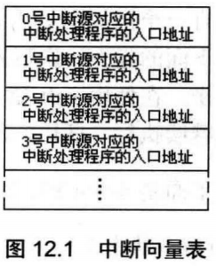
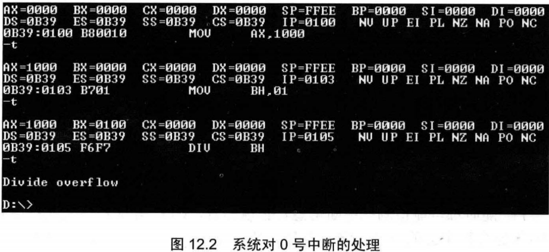

任何一个通用的CPU,都具备一种能力，可以在执行完当前正在执行的指令之后，检测到从CPU外部发送过来的或内部产生的一种特殊信息，并且可以立即对所接收到的信息进行处理。这种特殊的信息，我们可以称其为：中断信息。中断的意思是指，CPU不再接着(刚执行完的指令)向下执行，而是转去处理这个特殊信息。

中断信息可以来自CPU的内部和外部


## 12.1内中断的产生

对于8086CPU,当CPU内部有下面的情况发生的时候，将产生相应的中断信息。

1. 除法错误，比如，执行div指令产生的除法溢出；
2. 单步执行；
3. 执行into指令；
4. 执行int指令。

要进行不同的处理，CPU首先要知道，所接收到的中断信息的来源。所以中断信息中必须包含识别来源的编码。8086CPU用称为**中断类型码**的数据来标识中断信息的来源。中断类型码为一个字节型数据，可以表示256种中断信息的来源。将产生中断信息的事件，即中断信息的来源，简称为中断源，上述的4种中断源，在8086CPU中的中断类型码如下。

1. 除法错误：0
2. 单步执行：1
3. 执行into指令：4
4. 执行int指令，该指令的格式为int n,指令中的n为字节型立即数，是提供给CPU的中断类型码。


## 12.2中断处理程序

根据CPU的设计，中断类型码的作用就是用来定位中断处理程序。比如CPU根据中断类型码4,就可以找到4号中断
的处理程序

## 12.3中断向量表

CPU用8位的中断类型码通过**中断向量表**找到相应的中断处理程序的入口地址。那么什么是中断向量表呢？

展开来讲，中断向量表，就是中断处理程序入口地址的列表。

中断向量表在内存中保存，其中存放着256个中断源所对应的中断处理程序的入口，如图12.1所示。



CPU如何找到中断向量表？现在，找到中断向量表成了通过中断类型码找到中断处理程序入口地址的先决条件。

中断向量表在内存中存放，对于8086PC机，中断向量表指定放在内存地址0处。

内存0000:0000到0000:03FF的1024个单元中存放着中断向量表。

一个表项占多大的空间呢？ 一个表项存放一个中断向量，也就是一个中断处理程序的入口地址，对于8086CPU,这个入口地址包括段地址和偏移地址，所以一个表项占两个字，**高地址字存放段地址，低地址字存放偏移地址。**

## 12.4中断过程

用中断类型码找到中断向量，并用它设置CS和IP,这个工作是由CPU的硬件自动完成的。CPU硬件完成这个工作的过程被称为中断过程。

下面是8086CPU在收到中断信息后，所引发的中断过程。

1. (从中断信息中)取得中断类型码；
2.  标志寄存器的值入栈(因为在中断过程中要改变标志寄存器的值，所以先将其保存在栈中)；
3. 设置标志寄存器的第8位TF和第9位IF的值为0(这一步的目的后面将介绍)；
4. CS的内容入栈；
5. IP的内容入栈；
6. 从内存地址为中断类型码 * 4和 中断类型码 * 4+2的两个字单元中读取中断处理程序的入口地址设置IP和CS

简洁地描述中断过程：

(1) 取得中断类型码N;
(2) pushf
(3) TF=0, IF=0
(4) push CS
(5) push IP
(6) `(IP)=(N*4), (CS)=(N*4+2)`


## 12.5中断处理程序和iret指令

由于CPU随时都可能检测到中断信息，也就是说，CPU随时都可能执行中断处理程序，所以中断处理程序必须一直存储在内存某段空间之中。而中断处理程序的入口地址， 即中断向量，必须存储在对应的中断向量表表项中。

中断处理程序的编写方法和子程序的比较相似，下面是常规的步骤：
(1) 保存用到的寄存器；
(2) 处理中断；
(3) 恢复用到的寄存器；
(4) 用iret指令返回。

iret通常和硬件自动完成的中断过程配合使用。可以看到，在中断过程中，寄存器入栈的顺序是标志寄存器、CS、IP,而iret的出栈顺序是IP、CS、标志寄存器，刚好和其相对应，实现了用执行中断处理程序前的CPU现场恢复标志寄存器和CS、IP的工作。iret指令执行后，CPU回到执行中断处理程序前的执行点继续执行程序。


## 12.6除法错误中断的处理

当CPU执行div等除法指令的时候，如果发生了除法溢出错误，将产生中断类型码为0的中断信息，CPU将检测到这个信息，然后引发中断过程，转去执行0号中断所对应的中断处理程序。

```assembly
mov ax,1000h
mov bh,1
div bh
```



0号中断处理程序的功能：显示提示信息“Divide overflow”后，返回到操作系统中。

## 12.7编程处理0号中断

编程：当发生除法溢出时，在屏幕中间显示“overflow! ”，返回DOS。

前面讲到，内存0000:0000~0000:03FF,大小为1KB的空间是系统存放中断处理程序入口地址的中断向量表。8086支持256个中断，但是，实际上，系统中要处理的中断事件远没有达到256个。所以在中断向量表中，有许多单元是空的。

中断向量表是PC系统中最重要的内存区，只用来存放中断处理程序的入口地址， DOS系统和其他应用程序都不会随便使用这段空间。可以利用中断向量表中的空闲单元来存放我们的程序。一般情况下，从0000:0200至0000:02FF的256个字节的空间所对应的中断向量表项都是空的，操作系统和其他应用程序都不占用。

总结:

1. 编写可以显示"overflow!"的中断处理程序：do0；

2. 将do0送入内存0000:0200处； 

3. 将do0的入口地址0000:0200存储在中断向量表0号表项中。

程序的框架如下

```assembly
assume cs:code
code segment
start: 	
;do0安装程序
;设置中断向量表
mov ax,4c00h
int 21h
doO: 
;显示字符串'overflow!'
mov ax,4c00h
int 21h
code ends
end start


```

程序执行时，do0的代码是不执行的，它只是作为do0安装程序所要传送的数据。

首先执行do0安装程序，将doO的代码复制到内存0:200处，然后设置中断向量表，将do0的入口地址，即偏移地址200H和段地址0,保存在0号表项中。这两部分工作完成后，程序就返回了。程序的目的就是在内存0:200处安装do0的代码，将0号中断处理程序的入口地址设置为0:200. do0的代码虽然在程序中，却不在程序执行的时候执行。它是在除法溢出发生的时候才得以执行的中断处理程序。


## 12.8 安 装

可以使用movsb指令，将do0的代码送入0:200处

我们来看一下，用rep movsb指令的时候要确定的信息。
(1) 传送的原始位置，段地址：code,偏移地址：offset do0;
(2) 传送的目的位置：0:200;
(3) 传送的长度：do0部分代码的长度；
(4) 传送的方向：正向。

```assembly
assume cs:code
code segment
start: 
mov ax,cs
mov ds,ax
mov si,offset do0	;设置ds:si指向源地址
mov ax,0
mov es,ax
mov di,200h 		;设置es :di指向目的地址
mov cx,do0			;部分代码的长度 /设置cx为传输长度
cld 				;设置传输方向为正
rep movsb
			;设置中断向量表
mov ax,4c00h
int 21h
doO:
;显示字符串"overflow!"
mov ax,4c00h
int 21h
code ends
end start
```

可以利用编译器来计算do0的长度，具体做法如下。

`mov cx, offset doOend-offset do0` ;设置 cx 为传输长度

`do0end: nop`


"-" 是编译器识别的运算符号，编译器可以用它来进行两个常数的减法。

汇编编译器可以处理表达式。
比如，指令：mov ax,(5+3)*5/10,被编译器处理为指令：mov ax,4


## 12.9 do0

因为do0程序随时可能被执行，而它要用到字符串“overflow!”，所以该字符串也应该存放在一段不会被覆盖的空间中。正确的程序如下。

```assembly
assume cs:code
code segment
start: 
mov ax,cs
mov ds,ax
mov si,offset do0	;设置ds:si指向源地址
mov ax,0
mov es,ax
mov di,200h			;设置es:di指向目的地址
mov cx,offset do0end-offset do0	;设置ex为传输长度
cld					;设置传输方向为正
rep movsb

;设置中断向量表

mov ax,4c00h
int 21h
do0: 
jmp short do0start
	db "overflow!"
do0start: 
mov ax,cs
mov ds,ax
mov si,202h				;设置ds : si指向字符串
mov ax,0b800h
mov es,ax
mov di,12*160+36*2		;设置es:di指向显存空间的中间位置
mov cx,9				;设置cx为字符串长度
s: 
mov al,[si]
mov es:[di],al
inc si
add di, 2
loop s

mov ax,4c00h
int 21h
do0end:nop
code ends
end start

```

将“overflow!”放到do0程序中，程序12.3执行时，将标号do0到标号do0end之间的内容送到0000:0200处。

因为在do0程序开始处的“overflow!”不是可以执行的代码，所以在"overflow! ”之前加上一条jmp指令，转移到正式的do0程序。当除法溢出发生时， CPU执行0:200处的jmp指令，跳过后面的字符串，转到正式的do0程序执行。


## 12.10 设置中断向量

下面，将do0的入口地址0:200,写入中断向量表的0号表项中，使do0成为0号中断的中断处理程序。
0号表项的地址为0:0,其中0:0字单元存放偏移地址，0:2字单元存放段地址。程序如下。

```assembly
mov ax,0
mov es,ax
mov word ptr es:[0*4],200h
mov word ptr es:[0*4+2],0
```


## 12.11 单步中断

基本上，CPU在执行完一条指令之后，如果检测到标志寄存器的TF位为1,则产生单步中断，引发中断过程。单步中断的中断类型码为1,则它所引发的中断过程如下。

1. 取得中断类型码1
2. 标志寄存器入栈，TF、IF设置为0;
3. CS、IP 入栈；
4. (IP)=(1 * 4), (CS)=( 1*4+2) 

如上所述，如果TF=1,则执行一条指令后，CPU就要转去执行1号中断处理程序。

Debug提供了单步中断的中断处理程序，功能为显示所有寄存器中的内容后等待输入命令。然后，在使用t命令执行指令时，Debug将TF设置为1,使得CPU工作于单步中断方式下,则在CPU执行完这条指令后就引发单步中断，执行单步中断的中断处理程序，所有寄存器中的内容被显示在屏幕上，并且等待输入命令。

**在进入中断处理程序之前，设置TF=0。从而避免CPU在执行中断处理程序的时候发生单步中断。**


## 12.12响应中断的特殊情况

在有些情况下，CPU在执行完当前指令后，即便是发生中断，也不会响应。

在执行完向SS寄存器传送数据的指令后，即便是发生中断，CPU也不会响应。这样做的主要原因是，ss:sp联合指向栈顶，而对它们的设置应该连续完成。如果在执行完设置ss的指令后，CPU响应中断，引发中断过程，要在栈中压入标志寄存器、CS和IP的值。而ss改变，sp并未改变，ss:sp指向的不是正确的栈顶，将引起错误。所以CPU在执行完设置ss的指令后，不响应中断。

Debug利用单步中断来实现T命令的功能,所以之前的情况设置ss之后直接执行下一条程序然后再响应单步中断。oh！！！