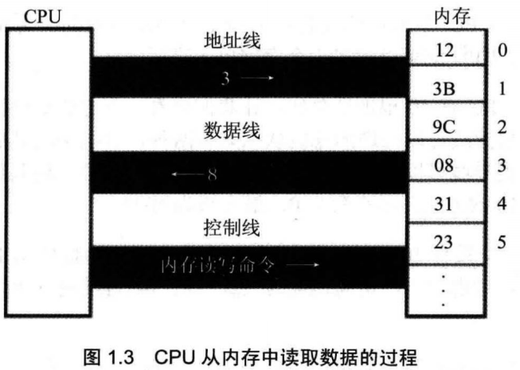
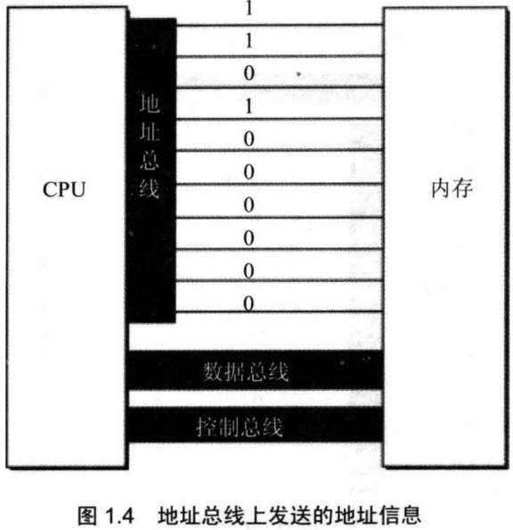
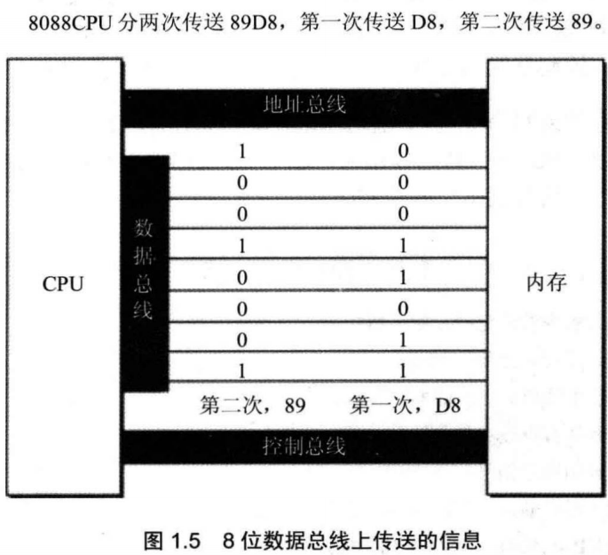
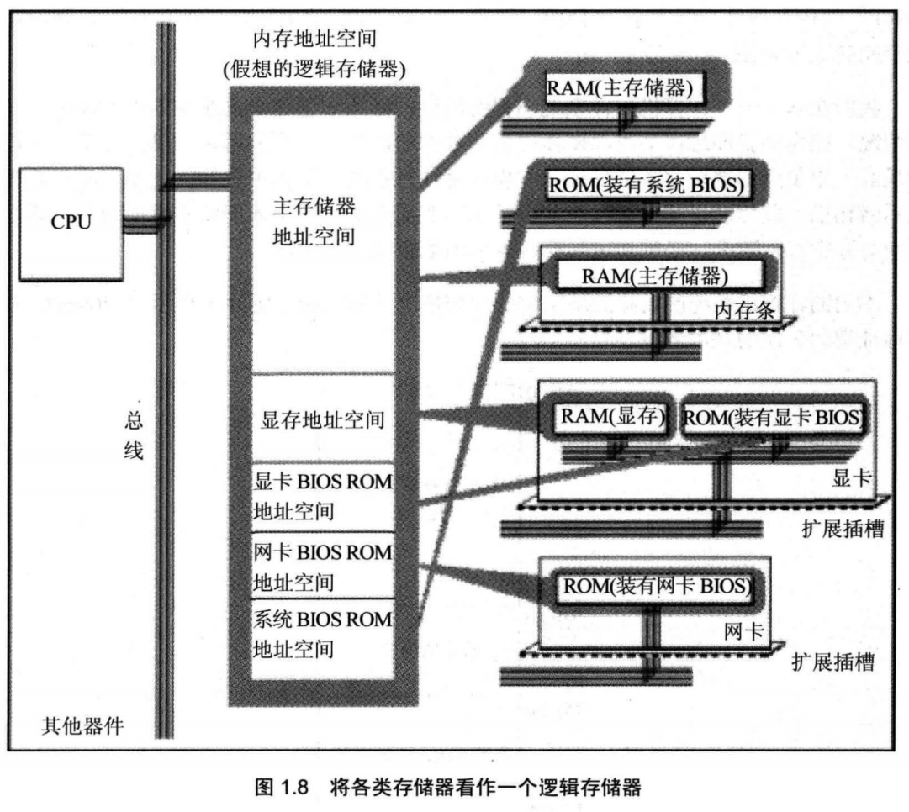

==**汇编语言的注释是每行从分号“；”开始的，分号之后的内容都属于注释。**==

汇编语言有3类指令

1. **汇编指令**：机器码的助记符，有对应的机器码
2. 伪指令：没有对应的机器码，由编译器执行，计算机并不执行
3. 其他符号：如+ - * / 等，由编译器执行，没有对应的机器码

指令和数据是应用上的概念。在内存或磁盘上，指令和数据没有任何区别，都是二进制信息。

CPU要想进行数据的读写，必须和外部器件（标准的说法是芯片）进行下面3类信息的交互。

1. 存储单元的地址（地址信息）；
2. 器件的选择，读或写的命令（控制信息）；
3. 读或写的数据（数据信息）。

计算机中专门有连接CPU和其他芯片的导线，通常称为总线。

总线从逻辑上又分为3类，地址总线、控制总线和数据总线。

CPU从3号单元中读取数据的过程

1. CPU通过地址线将地址信息3发出。
2. CPU通过控制线发出内存读命令，选中存储器芯片，并通知它，将要从中读取数据。
3. 存储器将3号单元中的数据8通过数据线送入CPU。 

机器码： 			  10100001 00000011 00000000
对应的汇编指令：MOV AX,[3]
含义： 传送3号单元的内容入AX

## 地址总线

CPU是通过地址总线来指定存储器单元的，地址总线上能传送多少个不同的信息，CPU就可以对多少个存储单元进行寻址。

## 数据总线

CPU与内存或其他器件之间的数据传送是通过数据总线来进行的。数据总线的宽度决定了 CPU和外界的数据传送速度。

## 控制总线

CPU对外部器件的控制是通过控制总线来进行的。

## 内存地址空间

存储器，在物理上是独立的器件，但是在以下两点上相同。
• 都和CPU的总线相连。
• CPU对它们进行读或写的时候都通过控制线发出内存读写命令。

CPU在操控它们的时候，把它们都当作内存来对待，把它们总的看作一个由若干存储单元组成的逻辑存储器，这个逻辑存储器就是我们所说的内存地址空间。

不同的计算机系统的内存地址空间的分配情况是不同的

