前一章所说的总线，相对于CPU内部来说是外部总线。内部总线实现CPU内部各个器件之间的联系，外部总线实现CPU和主板上其他器件的联系

CPU中：

* 运算器进行信息处理；
* 寄存器进行信息存储；
*  控制器控制各种器件进行工作；
*  内部总线连接各种器件，在它们之间进行数据的传送。

8086CPU有14个寄存器，每个寄存器有一个名称。

这些寄存器是：AX、BX、CX、DX、SI、DI、SP、BP、IP、CS、SS、DS、ES、PSW。

## 2.1通用寄存器

8086CPU的所有寄存器都是16位的，可以存放两个字节。

**AX、BX、CX、DX**这4 个寄存器通常用来存放一般性的数据，被称为通用寄存器。

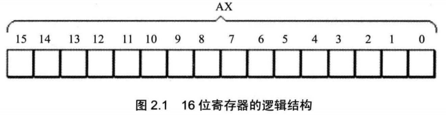

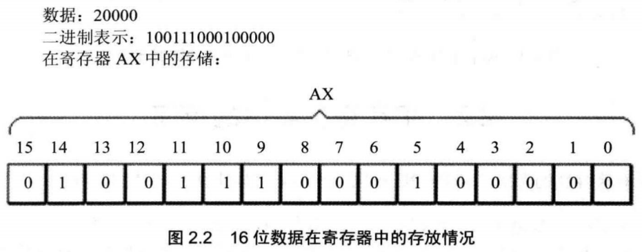

8086CPU的上一代CPU中的寄存器都是8位的，为了保证兼容，使原来基于上代CPU编写的程序稍加修改就可以运行在8086之上，8086CPU的AX、BX、CX、DX这4 个寄存器都可分为两个可独立使用的8位寄存器来用：

*  AX可分为AH和AL;
*  BX可分为BH和BL;
*  CX可分为CH和CL;
*  DX可分为DH和DL。


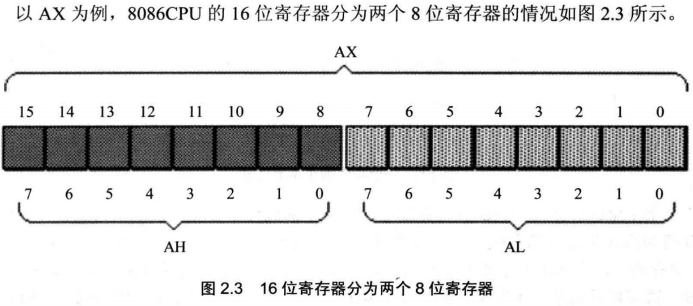

AX的低8位（0位〜7位）构成了 AL（LOW）寄存器，高8位（8位〜15位）构成了 AH（HIGH）寄存器


## 汇编指令例子

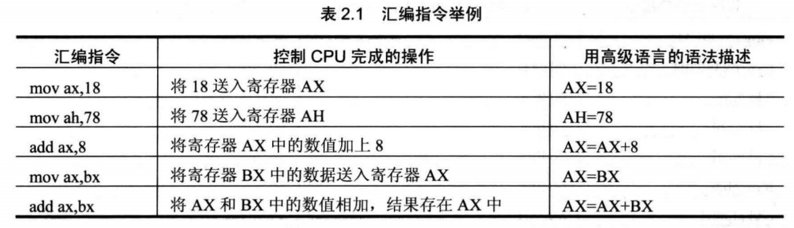

在进行数据传送或运算时，要注意指令的两个**操作对象的位数应当是一致的**


mov ax,bl（在8位寄存器和16位寄存器之间传送数据） 是**错误**的


## 2.5 16位结构的CPU

16位结构(16位机、字长为16位等与16位结构的含义相同)描述了一个CPU具有下面几方面的结构特性。

* 运算器一次最多可以处理16位的数据；
* 寄存器的最大宽度为16位；
* 寄存器和运算器之间的通路为16位。


## 2.6 8086CPU给出物理地址的方法

8086CPU有20位地址总线，可以传送20位地址，达到1MB寻址能力。8086CPU又是16位结构，在内部一次性处理、传输、暂时存储的地址为16位。从8086CPU的内部结构来看，如果将地址从内部简单地发出，那么它只能送出16位的地址，表现出的寻址能力只有64KB。


8086CPU采用一种在内部用两个16位地址合成的方法来形成一个20位的物理地址。

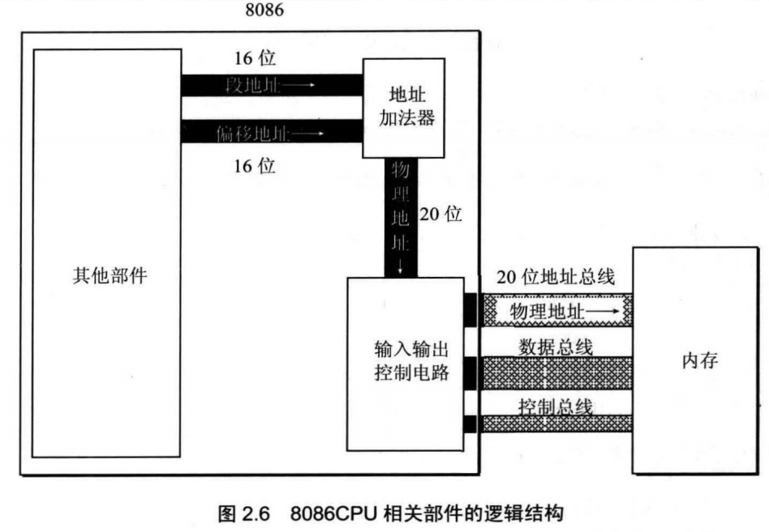

当8086CPU要读写内存时:
(1) CPU中的相关部件提供两个16位的地址，一个称为段地址，另一个称为偏移地址;
(2) 段地址和偏移地址通过内部总线送入一个称为地址加法器的部件；
(3) 地址加法器将两个16位地址合成为一个20位的物理地址；
(4) 地址加法器通过内部总线将20位物理地址送入输入输出控制电路；
(5) 输入输出控制电路将20位物理地址送上地址总线；
(6) 20位物理地址被地址总线传送到存储器。

地址加法器采用**物理地址=段地址X16+偏移地址**的方法用段地址和偏移地址合成物理地址。

含义：CPU在访问内存时，用一个基础地址（段地址X16）和一个相对于基础地址的偏移地址相加，给出内存单元的物理地址。

例如，8086CPU要访问地址为123C8H的内存单元，此时，地址加法器的工作过程如图2.7所示(十六进制表示)。

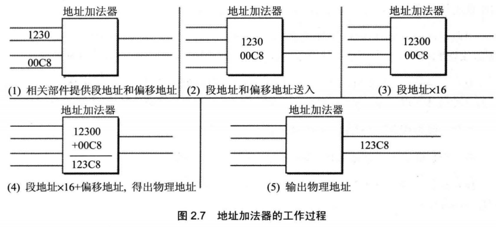

（1） 一个数据的二进制形式左移1位，相当于该数据乘以2;
（2） 一个数据的二进制形式左移N位，相当于该数据乘以2的N次方；
（3） 地址加法器如何完成段地址X16的运算？就是将以二进制形式存放的段地址左移4位。

一个数据的十六进制形式左移1位，相当于乘以16；  X进制的数据左移1位，相当于乘以X。


## 2.8段的概念

“段地址”这个名称中包含着“段”的概念。

其实，内存并没有分段，段的划分来自于CPU

**基础地址（段地址xl6）+偏移地址=物理地址**

(注意是16进制，用最后的H表示)

地址10000H〜100FFH的内存单元组成一个段，该段的起始地址（基础地址）为10000H,段地址为1000H（10000H/16=1000H，右移1位），大小为100H;我们也可以认为地址10000H〜1007FH、10080H〜100FFH的内存单元组成两个段，它们的起始地址（基础地址）为：10000H和10080H，段地址为：1000H和1008H，大小都为80H。

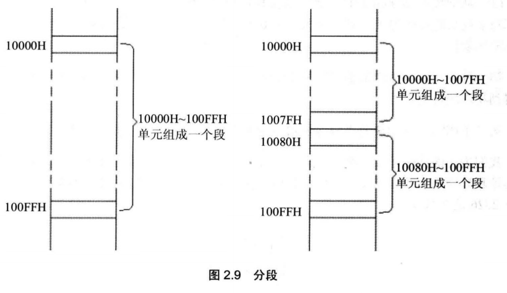

**段地址X16必然是16的倍数，所以一个段的起始地址也一定是16的倍数；**

**偏移地址为16位，16位地址的寻址能力为64KB,所以一个段的长度最大为64KB。**


## 2.9段寄存器

8086CPU有4个段寄存器：**CS、DS、SS、ES。**

当8086CPU要访问内存时由这4个段寄存器提供内存单元的段地址。


## 2.10 CS 和 IP

CS为代码段寄存器，IP为指令指针寄存器

在8086PC机中，任意时刻，设CS中的内容为M, IP中的内容为N, 8086CPU将从内存M*16+N单元开始，读取一条指令并执行。

也可以这样表述：8086机中，任意时刻，CPU将CS:1P指向的内容当作指令执行。

（注意都是16进制数）

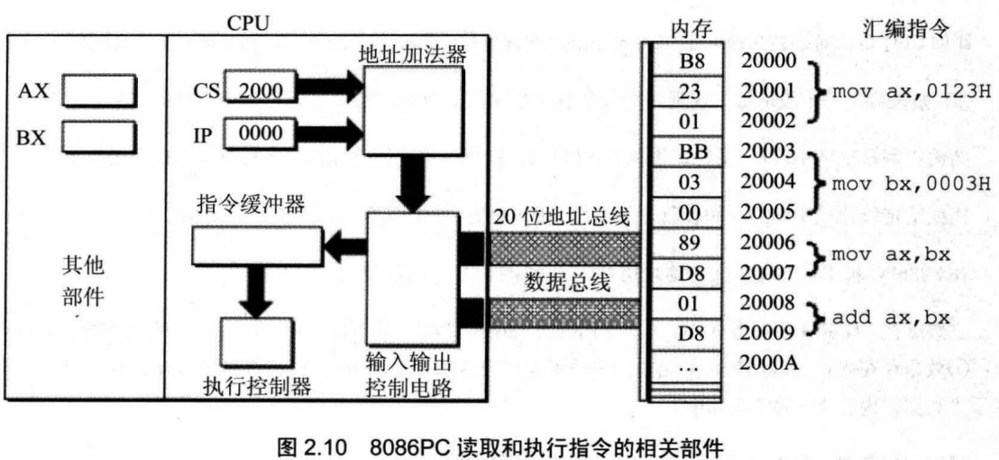

8086CPU读取、执行一条指令的过程。

初始状态（CS:2000H, IP:0000H, CPU将从内存2000H*16+0000H处读取指令执行）

CS、IP中的内容送入地址加法器（地址加法器完成：物理地址=段地址X16+偏移地址）

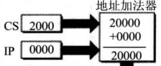

地址加法器将物理地址送入输入输出控制电路


输入输出控制电路将物理地址20000H送上地址总线

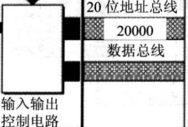

从内存20000H单元开始存放的机器指令B8 23 01通过数据总线被送入CPU

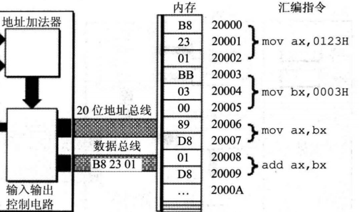

输入输出控制电路将机器指令B8 23 01送入指令缓冲器

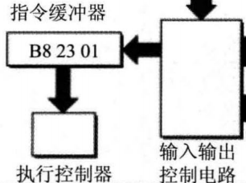

IP中的值自动増加

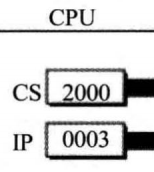

读取一条指令后，IP中的值自动増加，以使CPU可以读取下一条指令。因当前读入的指令B82301长度为3个字节，所以IP中的值加3。此时，CS： IP指向内存单元2000:0003。）

执行控制器执行指令B8 23 01（即mov ax,0123H）

指令B8 23 01被执行后AX中的内容为0123H

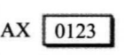


8086CPU的工作过程

1. 从CS:IP指向的内存单元读取指令，读取的指令进入指令缓冲器；
2. IP=IP+所读取指令的长度，从而指向下一条指令；
3. 执行指令。转到步骤(1),重复这个过程。


在8086CPU加电启动或复位后(CPU刚开始工作时)CS和IP被设置为CS=FFFFH, IP=0000H,即在8086PC机刚启动时，CPU从内存FFFFOH单元中读取指令执行，FFFFOH单元中的指令是8086PC机开机后执行的第一条指令。


在内存中，指令和数据没有任何区别，都是二进制信息.那CPU根据什么将内存中的信息看作指令？

**CPU将CS:IP指向的内存单元中的内容看作指令**


## 2.11修改CS、IP的指令

程序员可以通过改变寄存器中的内容实现对CPU的控制。

8086CPU大部分寄存器的值，都可以用mov指令来改变，mov指令被称为**传送指令**。

但是，mov指令**不能**用于设置CS、IP的值

能够改变CS、IP的内容的指令被统称为**转移指令**，比如**jmp**指令

jmp 2AE3:3,执行后：CS=2AE3H, IP=0003H, CPU 将从 2AE33H 处读取指令。

“jmp段地址：偏移地址”指令的功能为：用指令中给出的段地址修改CS,偏移地址修改IP。


若想仅修改IP的内容，可用形如“jmp某一合法寄存器”的指令完成

jmp ax

指令执行前：ax=1000H, CS=2000H, IP=0003H
指令执行后：ax=1000H, CS=2000H, 1P=1000H

“jmp某一合法寄存器”指令的功能为：用寄存器中的值修改IP。

jmp ax,在含义上好似：mov IP,ax。


## 2.12代码段

对于8086PC机，在编程时，可以根据需要，将一组内存单元定义为一个段。我们可以将长度为N(N^64KB)的一组代码，存在一组地址连续、起始地址为16的倍数的内存单元中

```assembly
mov ax,0000 (B8 00 00)
add ax,0123H (05 23 01)
mov bx, ax (8B D8)
jmp bx (FF E3)
```

这段长度为10个字节的指令，存放在123B0H〜123B9H的一组内存单元中，我们就可以认为，123B0H〜123B9H这段内存是用来存放代码的，是一个代码段，它的段地址为123BH,长度为10个字节。


如何使得代码段中的指令被执行呢？将一段内存当作代码段，仅仅是我们在编程时的一种安排，CPU并不会由于这种安排，就自动地将我们定义的代码段中的指令当作指令来执行。CPU只认被CS:IP指向的内存单元中的内容为指令。所以，要让CPU执行我们放在代码段中的指令，必须要将CS:IP指向所定义的代码段中的第一条指令的首地址。对于上面的例子，如果要让这段代码得到执行，可设CS=123BH、1P=0000H。