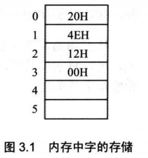
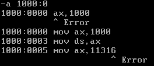
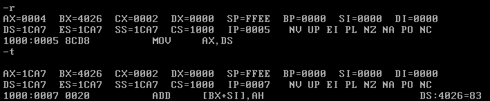
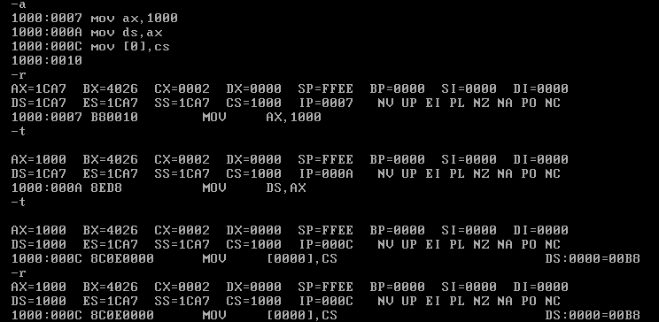
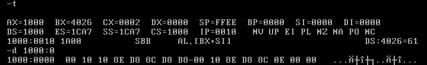
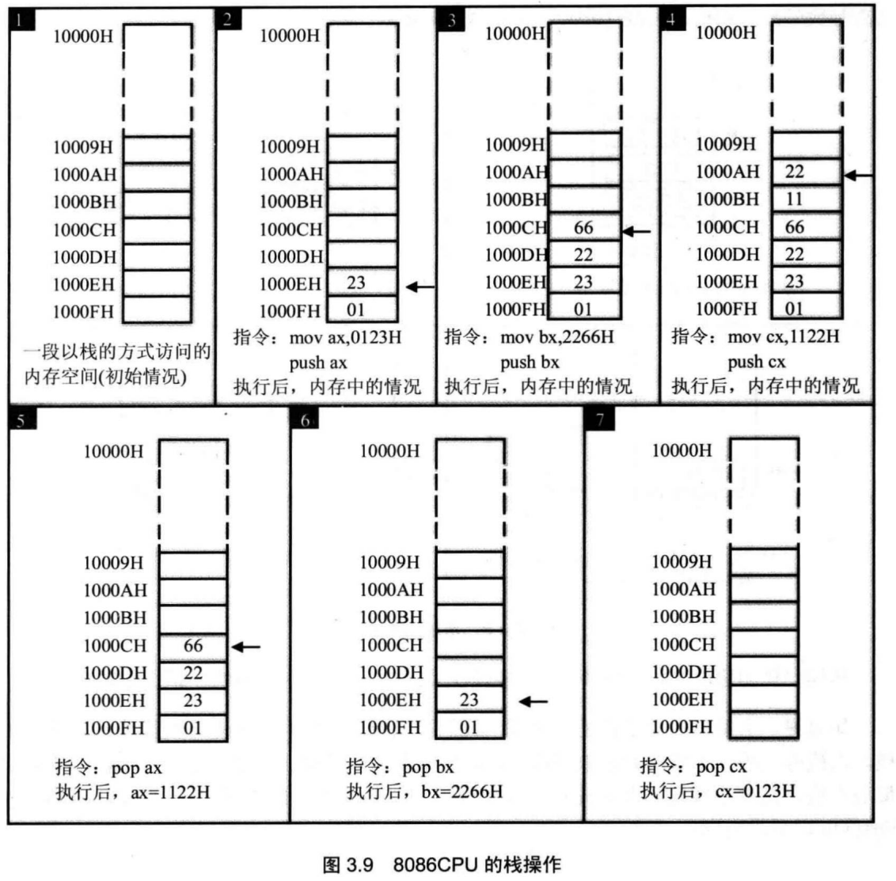
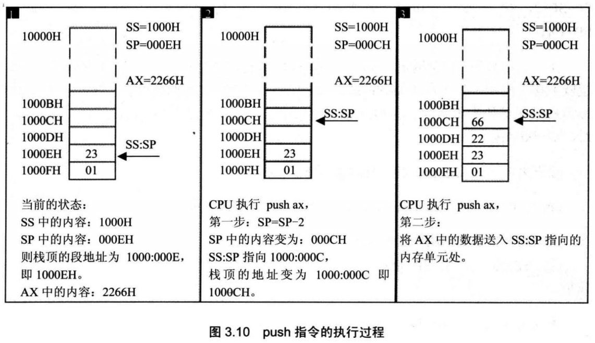
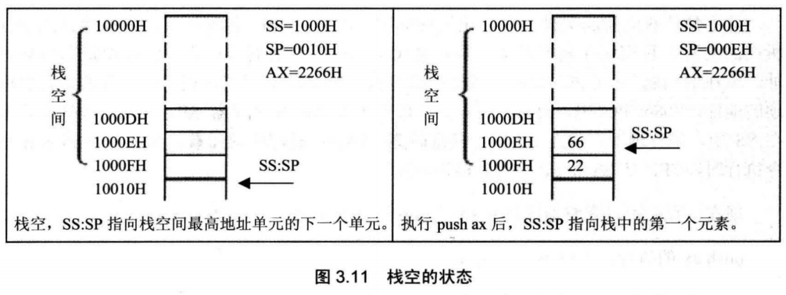
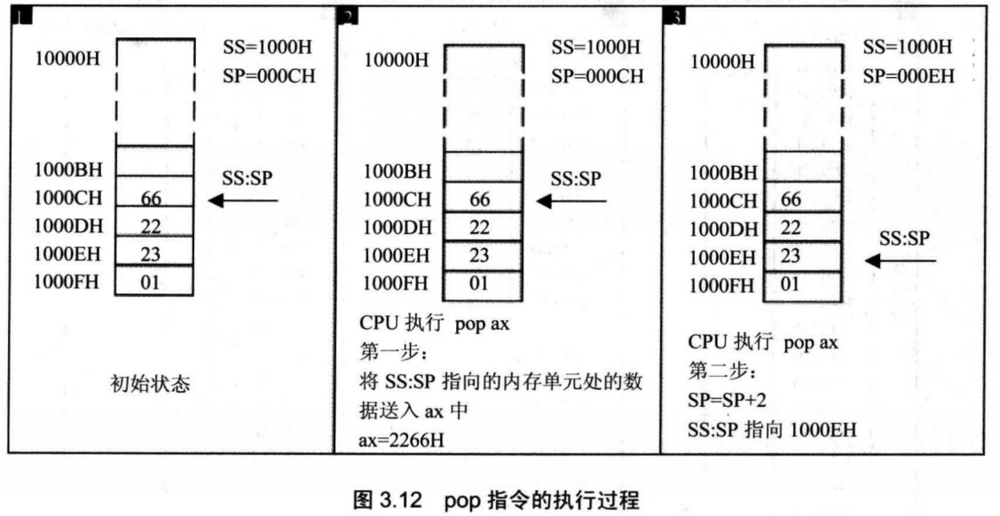
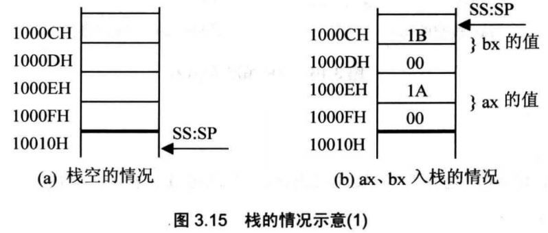

## 3.1内存中字的存储

**CPU中**，用16位**寄存器**来存储一个字。高8位存放高位字节，低8位存放低位字节。在**内存**中存储时，由于内存单元是字节单元(一个单元存放一个字节)，则一个字要用两个地址连续的内存单元来存放，

我们提出字单元的概念：字单元，即存放一个字型数据(16位)的内存单元，由两个地址连续的内存单元组成。高地址内存单元中存放字型数据的高位字节，低地址内存单元中存放字型数据的低位字节。



我们用0、1两个内存单元存放数据20000(4E20H)

将起始地址为N的字单元简称为N地址字单元

## 3.2 DS 和[address]

CPU要读写一个内存单元的时候，必须先给出这个内存单元的地址，在8086PC中， 内存地址由段地址和偏移地址组成。8086CPU中有一个**DS**寄存器，通常用来存放要访问数据的段地址。比如我们要读取10000H单元的内容，可以用如下的程序段进行。

```assembly
mov bx,1000H
mov ds,bx
mov al,[0]
//上面的3条指令将10000H(1000:0)中的数据读到al中。
```

`mov al,[0]`

前面我们使用mov指令，可完成两种传送：

①将数据直接送入寄存器；

②将一个寄存器中的内容送入另一个寄存器。


也可以使用mov指令将一个内存单元中的内容送入一个寄存器中。从哪一个内存单元送到哪一个寄存器中呢？在指令中必须指明。寄存器用寄存器名来指明，内存单元则需用内存单元的地址来指明。显然，此时mov指令的格式应该是：mov 寄存器名，内存单元地址。

**“[…]”表示一个内存单元，**
**“[0]”中的0表示内存单元的偏移地址**

只有偏移地址是不能定位一个内存单元的，那么内存单元的段地址是多少呢？

**指令执行时，8086CPU自动取ds中的数据为内存单元的段地址。**


如何把一个数据送入寄存器呢？我们以前用类似“mov ax，1”这样的指令来完成，从 理论上讲，我们可以用相似的方式：mov ds,1000H,来将1000H送入ds。可是，现实并非如此，8086CPU不支持将数据直接送入**段寄存器**的操作，ds是一个段寄存器，所以mov ds,1000H这条指令是非法的。那么如何将1000H送入ds呢？**只好用一个寄存器来进行中转**，即先将1000H送入一个一般的寄存器，如bx,再将bx中的内容送入ds。

这是硬件设计的问题咯


将al中的数据送入内存单元10000H中

```assembly
mov bx,1000H
mov ds,bx
mov [0],al
```


## 3.3字的传送

因为8086CPU是16位结构，有16根数据线，所以，可以一次性传送16位的数据

```assembly
mov bxz1000H
mov ds,bx
mov ax,[0]
mov [0],cx
;1000 : 0处的字型数据送入ax
;cx中的16位数据送到1000:0处
```


#### 问题3.4

```assembly
mov ax,1000H
mov ds,ax
mov ax,11316 ;注意虚拟机上装的dos 都是用16进制数来写汇编的，11316 报错了直接
mov [0],ax
mov bx,[0]
sub bx,[2]
mov [2],bx
```





## 3.4 mov、add、sub 指令

到现在，我们知道，mov指令可以有以下几种形式。
mov 寄存器，数据 比如：mov ax,8
mov 寄存器，寄存器 比如：mov ax,bx
mov 寄存器，内存单元 比如：mov ax,[0]
mov 内存单元，寄存器 比如：mov [0],ax
mov 段寄存器，寄存器 比如:mov ds,ax


1. 既然有“mov 段寄存器，寄存器”，那么也应该有“mov寄存器，段寄存器”



验证成功

2. 既然有“mov 内存单元，寄存器” 也应该有“mov 内存单元，段寄存器”

```assembly
mov ax,1000H
mov ds,ax
mov [0],cs
```






可以看出ds=1000H ,1000+0处写入了cs中的1000，1000:1和1000:2中存储高位10H，低位00H，如图


3. “mov段寄存器，内存单元“应该也行

```assembly
mov ax,1000H
mov ds,ax
mov ds,[0]
```

add和sub指令同mov —样，都有两个操作对象。它们也可以有以下几种形式。
add 寄存器，数据 比如：add ax,8
add 寄存器，寄存器 比如：add ax,bx
add 寄存器，内存单元 比如:add ax,[0]
add 内存单元，寄存器 比如：add [0],ax
sub 寄存器，数据 比如：sub ax,9
sub 寄存器，寄存器 比如：sub ax,bx
sub 寄存器，内存单元 比如：sub ax,[0]
sub 内存单元，寄存器 比如：sub [0],ax


## 3.5数据段

比如，将123B0H〜123B9H的内存单元定义为数据段。现在要累加这个数据段中的前3个单元中的数据，

```assembly
mov ax,123BH
mov ds,ax		;将123BH送入ds中，作为数据段的段地址
mov al,0		;用al存放累加结果
add al,[0]		;将数据段第一个单元（偏移地址为0）中的数值加到al中
add al,[1]		;将数据段第二个单元（偏移地址为1）中的数值加到al中
add al,[2]		;将数据段第三个单元（偏移地址为2）中的数值加到al中
```


## 3.6栈

栈的操作规则被称为：LIFO（Last In First Out,后进先出）。


## 3.7 CPU提供的栈机制

在基于8086CPU编程的时候，可以将一段内存当作栈来使用。

8086CPU提供入栈和出栈指令，最基本的两个是PUSH（入栈）和POP（出栈）。比如，push ax表示将寄存器ax中的数据送入栈中，pop ax表示从栈顶取出数据送入ax。8086CPU的入栈和出栈操作都是**以字为单位**进行的。

下面举例说明，将10000H-1000FH这段内存当作栈来使用。




CPU如何知道栈顶的位置？显然，也应该有相应的寄存器来存放栈顶的地址，8086CPU中，有两个寄存器，段**寄存器SS和寄存器SP**,栈顶的段地址存放在SS中，偏移地址存放在SP中。任意时刻，SS:SP指向栈顶元素。push指令和pop指令执行时，CPU从SS和SP中得到栈顶的地址。

**push ax的执行，由以下两步完成。**
(1) SP=SP-2, SS:SP指向当前栈顶前面的单元，以当前栈顶前面的单元为新的栈顶；
(2) 将ax中的内容送入SS:SP指向的内存单元处，SS:SP此时指向新栈顶。



**入栈时，栈顶从高地址向低地址方向增长**。


#### 问题3.6
如果将10000H〜1000FH这段空间当作栈，初始状态栈是空的，此时，SS=1000H,SP=?

SP=0010H,如图 3.11 所示。



将10000H〜1000FH这段空间当作栈段，SS=1000H,栈空间大小为16字节，栈最底
部的字单元地址为1000:000E.

任意时刻，SS:SP指向栈顶，当栈中只有一个元素的时候，SS=1000H, SP=000EH。

栈为空就相当于栈中唯一的元素出栈，出栈后，SP=SP+2, SP原来为000EH,+2后SP=10H,所以，当栈为空的时候，SS=1000H,SP=10H


**pop ax的执行过程和push ax刚好相反，由以下两步完成。**
(1) 将SS:SP指向的内存单元处的数据送入ax中；
(2) SP=SP+2, SS:SP指向当前栈顶下面的单元，以当前栈顶下面的单元为新的栈顶。



pop操作前的栈顶元素，1000CH处的2266H依然存在，但是，它己不在栈中。当再次执行push等入栈指令后，
SS:SP移至1000CH,并在里面写入新的数据，它将被覆盖。


## 3.8栈顶超界的问题

当栈满的时候再使用push指令入栈，或栈空的时候再使用pop指令出栈，都将发生栈顶超界问题。

8086CPU不保证我们对栈的操作不会超界。这也就是说，8086CPU只知道栈顶在何处（由SS:SP指示），而不知道我们安排的栈空间有多大。

需要自己小心越界问题


## 3.9 push、 pop指令

push和pop指令的格式可以是如下形式：

```assembly
push 寄存器 ;将一个寄存器中的数据入栈
pop 寄存器  ;出栈，用一个寄存器接收出栈的数据

push 段寄存器 ;将一个段寄存器中的数据入栈
pop 段寄存器 ;出栈，用一个段寄存器接收出栈的数据

;push和pop也可以在内存单元和内存单元之间传送数据，我们可以:
push 内存单元 ;将一个内存字单元处的字入栈（注意：栈操作都是以字为单位）
pop 内存单元 ;出栈，用一个内存字单元接收出栈的数据
mov ax,1000H
mov ds,ax	;内存单元的段地址要放在ds中
push [0]	;将1000:0处的字压入栈中
pop [2]		;出栈，出栈的数据送入1000:2处

```

#### 问题3.8

编程：

1. 将10000H〜1000FH这段空间当作栈，初始状态栈是空的;
2. 设置 AX=001AH, BX=001BH； 
3. 将AX、BX中的数据入栈；
4. 然后将AX、BX清零；
5. 从栈中恢复AX、BX原来的内容

```assembly
mov ax,1000H
mov ss,ax
mov sp,0010H ;初始化栈顶，栈的情况如图3.15(a)所示
mov ax,001AH
mov bx,001BH
push ax
push bx		;ax、bx A栈，栈的情况如图3.15 (b)所示
sub ax,ax	;将ax清零，也可以用mov ax,0，
			;sub ax, ax的机器码为2个字节，
			;mov ax, 0的机器码为3个字节。

sub bx,bx
pop bx		;从栈中恢复ax、bx原来的数据，当前栈顶的内容是bx
			;中原来的内容：001BH, ax中原来的内容001AH在栈顶
			;的下面，所以要先pop bx,然后再pop ax

pop ax

```



#### 问题3.10

如果要在10000H处写入字型数据2266H

```assembly
mov ax,1000H
mov ss,ax
mov sp,2
mov ax,2266H
push ax
```

push、pop实质上就是一种内存传送指令，可以在寄存器和内存之间传送数据，

push, pop等栈操作指令，修改的只是SP 也就是说，栈顶的变化范围最大为:0〜FFFFH。

## 3.10栈 段

将一段内存当作栈段，仅仅是我们在编程时的一种安排，CPU并不会由于这种安排。如何使得如push、pop等栈操作指令访问我们定义的栈段呢？就是要将SS:SP指向我们定义的栈段。

#### 问题3.11

如果将10000H〜1FFFFH这段空间当作栈段，初始状态栈是空的，此时，SS=1000H, SP=?

**SP=0000H**


分析： 如果将10000H〜1FFFFH这段空间当作栈段，SS=1000H,栈空间为64KB,栈最底的字单元地址为1000:FFFE。任意时刻，SS:SP指向栈顶单元，当栈中只有一个元素的时候，SS=1000H , SP=FFFEH。栈为空，就相当于栈中唯一的元素出栈，出栈后，SP=SP+2。SP原来为FFFEH,加2后SP=0,所以，当栈为空的时候，SS=1000H, SP=0。


一个栈段最大可以设为多少？为什么？

分析： 首先从栈操作指令所完成的功能的角度上来看，push、pop等指令在执行的时候只修改SP,所以栈顶的
变化范围是0-FFFFH,从栈空时候的SP=0,一直压栈，直到栈满时SP=0；如果再次压栈，栈顶将环绕，覆盖了原来栈中的内容。所以一个栈段的容量最大为64KB。