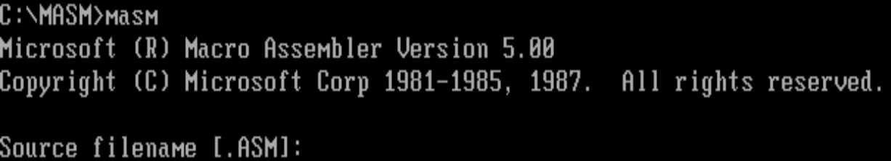
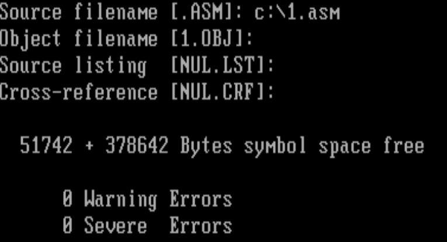
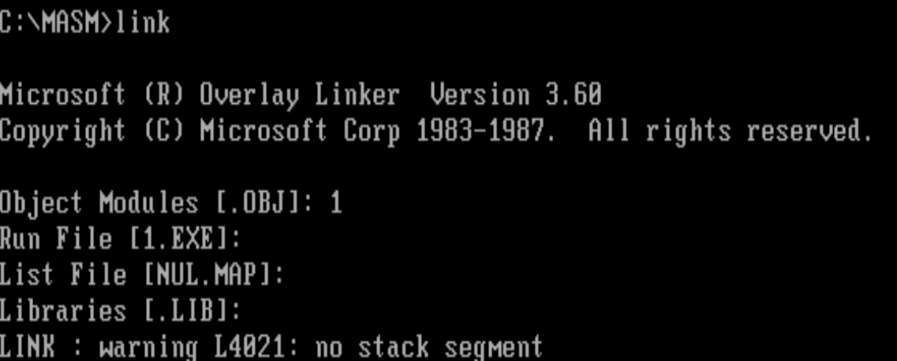
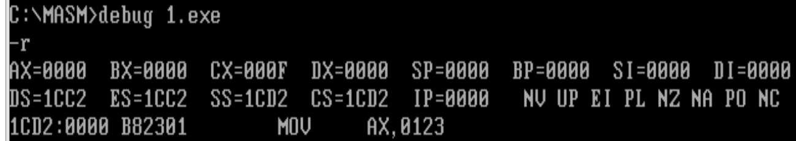
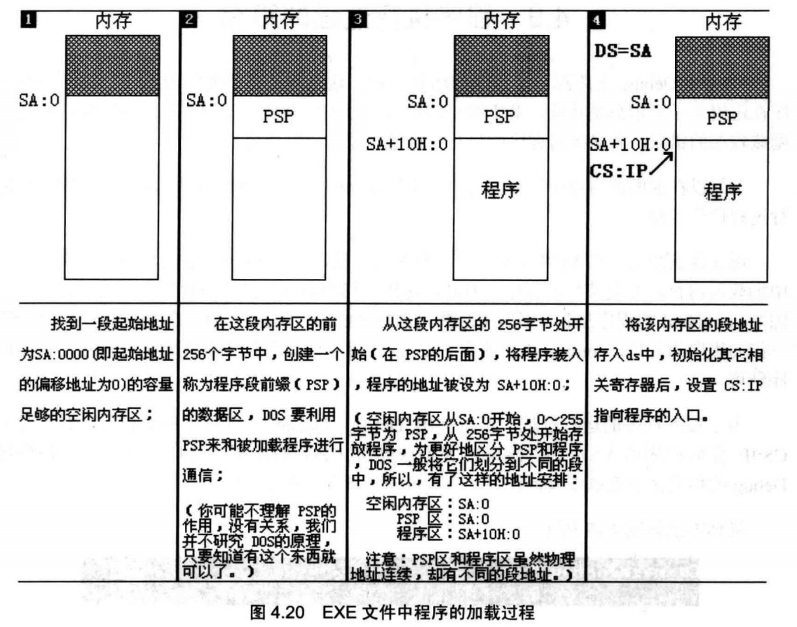
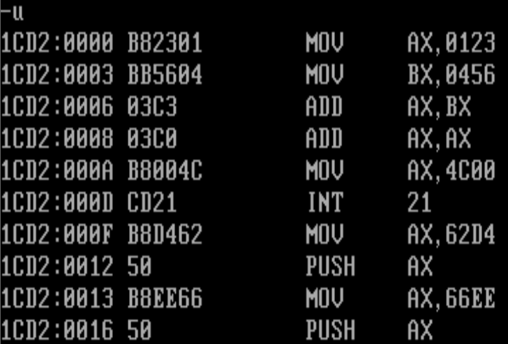
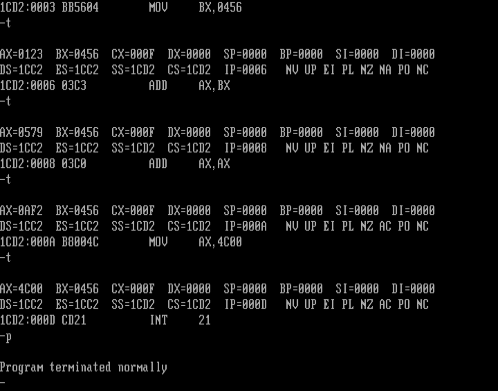

第一步：编写汇编源程序。

第二步：对源程序进行编译连接

使用汇编语言编译程序对源程序文件中的源程序进行编译，产生目标文件；再用连接程序对目标文件进行连接，生成可在操作系统中直接运行的可执行文件。

可执行文件包含两部分内容。
• 程序（从源程序中的汇编指令翻译过来的机器码）和数据（源程序中定义的数据）
• 相关的描述信息（比如，程序有多大、要占用多少内存空间等）

## 程序4.1

```assembly
assume cs:codesg
codesg segment

	mov axz 0123H
	mov bx,0456H
	add ax,bx
	add ax,ax
	mov ax,4c00H
	int 21H
codesg ends
end
```


1.伪指令
在汇编语言源程序中，包含两种指令，

1. 汇编指令，
2. 伪指令。

汇编指令是有对应的机器码的指令，可以被编译为机器指令，最终为CPU所执行。而伪指令没有对
应的机器指令,由编译器来执执行。


程序4.1中出现了 3种伪指令。

1. segment ... end**s**

```assembly
XXX segment

;......

XXX ends
```


一个源程序中所有将被计算机所处理的信息：指令、数据、栈，被划分到了不同的段中。

在codesg segment和codesg ends之间写的汇编指令是这个段中存放的内容，这是一个代码段

2. **end**

end是一个汇编程序的结束标记，编译器在编译汇编程序的过程中，如果碰到了伪指令end,就结束对源程序的编译。

3. assume

这条伪指令的含义为“假设”。它假设某一段寄存器和程序中的某一个用segment...ends定义的段相关联。通过assume说明这种关联，在需要的情况下，编译程序可以将段寄存器和某一个具体的段相联系


在程序4.1中，我们用codesg segment ... codesg ends定义了一个名为codseg的段，在这个段中存放代码，所以这个段是一个代码段。在程序的开头，用assumecs:codesg将用作代码段的段codesg和CPU中的段寄存器cs联系起来。

#### 2.源程序中的“程序”

可以将源程序文件中的所有内容称为源程序，将源程序中最终由计算机执行、处理的指令或数据，称为程序。

#### 3. 标号
汇编源程序中，除了汇编指令和伪指令外，还有一些标号，比如“codesg”。一个标号指代了一个地址。比如codesg在segment的前面，作为一个段的名称，这个段的名称最终将被编译、连接程序处理为一个段的段地址。

#### 4. 程序的结构

任务：编程运算2^3。源程序应该怎样来写呢？

1. 我们要定义一个段，名称为abc。

```assembly
abc segment

	 ;...
	 
abc ends
```

2. 在这个段中写入汇编指令，来实现我们的任务。

```assembly
abc segment
	mov ax,2
	add ax,ax
	add ax,ax
abc ends
```

3. 然后，要指出程序在何处结束

```assembly
abc segment
	mov ax,2
	add ax,ax
	add ax,ax
abc ends
end
```

4. abc被当作代码段来用，所以，应该将abc和cs联系起来。(当然，对于这个程序，也不是非这样做不可。)

```assembly
assume cs: abc
abc segment
	mov ax,2
	add ax,ax
	add ax,ax
	abc ends
end
```

#### 5.程序返回

一个程序P2在可执行文件中，则必须有一个正在运行的程序P1,将P2从可执行文件中加载入内存后，将CPU的控制权交给P2, P2才能得以运行。P2开始运行后，P1暂停运行。而当P2运行完毕后，应该将CPU的控制权交还给使它得以运行的程序P1,此后，P1继续运行。

一个程序结束后，将CPU的控制权交还给使它得以运行的程序， 我们称这个过程为：程序返回。

两条指令：

```assembly
mov ax,4c00H
int 21H
```

先记住这就是程序返回就是了

#### 6.语法错误和逻辑错误

一般，程序在编译时被编译器发现的错误是语法错误，在源程序编译后，在运行时发生的错误是逻辑错误。


## 4.3编辑源程序

使用DOS下的Edit，有些操作需要启用鼠标咯


## 4.4编 译 

完成对源程序的编辑后，得到一个源程序文件c:\1.asm。

在编译一个源程序之前首先要找到一个相应的编译器。采用微软的masm5.0汇编编译器，文件名为masm.exe

“[.ASM]”提示我们，默认的文件扩展名是asm,比如，要编译的源程序文件名是“pl.asm”，只要在这里输入“pl”即可。可如果源程序文件不是以asm为扩展名，就要输入它的全名。比如源程序文件名为“pl.txt”，就要输入全名。



在输入源程序文件名的时候一定要指明它所在的路径。如果文件就在当前路径下，只输入文件名就可以，可如果文件在其他的目录中，则要输入路径，比如，要编译的文件pl.txt 在 “c:\windows\desktop” 下，则要输入 “c:\windows\desktop\pl.txt”

Object filename :可以指定生成的目标文件所在的目录，比如，想让编译程序在“c:\windows\desktop” 下生成目标文件 1.obj，则可输入 c:\windows\desktop\l 。

Source listing:编译程序提示输入列表文件的名称，这个文件是编译器将源程序编译为目标文件的过程中产生的中间结果。可以让编译器不生成这个文件，直接按Enter键即可。

Cross-reference:编译程序提示输入交叉引用文件的名称，这个文件同列表文件一样，是编译器将源程序编译为目标文件过程中产生的中间结果。可以让编译器不生成这个文件，直接按Enter键即可。



一般有两类错误：:

1. 程序中有 Severe Errors ；

2. 找不到所给出的源程序文件。


## 4.5连 接

己经对c:\1.asm进行编译得到c:\masm\1.obj,现在再将c:\masm\1.obj 连接为 c:\masm\1.exe。

我们使用微软的Overlay Linker3.60连接器，文件名为Iink.exe

进入c:\masm 目录，运行link.exe

各项跟编译时差不多



对目标文件的连接结束，连接程序输出的最后一行，这个程序中有一个警告错误：“没有栈段”，这里不理会。

连接的作用

1. 当源程序很大时，可以将它分为多个源程序文件来编译，每个源程序编译成为目标文件后，再用连接程序将它们连接到一起，生成一个可执行文件；
2. 程序中调用了某个库文件中的子程序，需要将这个库文件和该程序生成的目标文件连接到一起，生成一个可执行文件；
3. 一个源程序编译后，得到了存有机器码的目标文件，目标文件中的有些内容还不能直接用来生成可执行文件，连接程序将这些内容处理为最终的可执行信息。所以在只有一个源程序文件，而又不需要调用某个库中的子程序的情况下，也必须用连接程序对目标文件进行处理，生成可执行文件。


## 4.6以简化的方式进行编译和连接

`masm c:\1;`

 在命令行的结尾再加上分号，按Enter键后，编译器就对c:\1.asm进行编译，在当前路径下生成目标文件1.obj,并在编译的过程中自动忽略中间文件的生成。

`link 1;`  同理

## 4.7 1.exe的执行

C:\masm>1


## 谁将可执行文件中的程序装载进入内存并使它运行？

任何通用的操作系统，都要提供一个称为shell(外壳)的程序，用户(操作人员)使用这个程序来操作计算机系统进行工作。

DOS中有一个程序command.com,这个程序在DOS中称为命令解释器，也就是DOS系统的shell。

如果用户要执行一个程序，则输入该程序的可执行文件的名称，command首先根据文件名找到可执行文件，然后将这个可执行文件中的程序加载入内存，设置CS:IP指向程序的入口。此后，command暂停运行，CPU运行程序。程序运行结束后，返回到command中，command再次显示由当前盘符和当前路径组成的提示符，等待用户的输入。


## 4.9程序执行过程的跟踪

可以用Debug来跟踪一个程序的运行过程

为了观察程序的运行过程，可以使用Debug。Debug可以将程序加载入内存，设置CS:IP指向程序的入口，但Debug并不放弃对CPU的控制，


在提示符后输入“debug 1.exe”



可以看到，Debug将程序从可执行文件加载入内存后，cx中存放的是程序的长度。1.exe中程序的机器码共有15个字节。则1.exe加载后，ex中的内容为000FH。


**DOS系统中.EXE文件中的程序的加载过程**




1. 程序加载后，ds中存放着程序内存区的段地址，这个内存区的偏移地址为0,程序所在的内存区的地址为ds:0；
2. 这个内存区的前256个字节中存放的是PSP来和程序进行通信。从256字节处向后的空间存放的是程序。 


所以，从ds中可以得到PSP的段地址SA, PSP的偏移地址为0,则物理地址为SA*16+0

因为PSP占256（ 100H）字节，所以程序的物理地址是:SA*16+0+256 = SAx16+16x16+0 = （SA+16）x16+0
可用段地址和偏移地址表示为：SA+10H:0。


现在，我们看一下图中DS的值，DS=1CC2,则 PSP的地址为1CC2:0,程序的地址为 1CD2:0(即 1CC2+10:0)。


图4中，CS=1CD2, IP=0000, CS:IP指向程序的第一条指令。注意，源程序中的指令是mov ax,0123H,在Debug中记为mov ax,0123,这是因为Debug默认所有数据都用十六进制表示。


可以用U命令看一下其他指令，



可以看到，从1CD2:0000~1CD2:000E都是程序的机器码

现在，我们可以开始跟踪了，用T命令单步执行程序中的每一条指令，并观察每条指令的执行结果，到了 int21,我们要用P命令执行，



int 21 执行后，显示出 “Program terminated normally” 注意，要使用P命令执行int 21(记住就是了)

注意这里是Debug将程序加载入内存，所以程序运行结束后要返回到Debug中。使用Q命令退出Debu