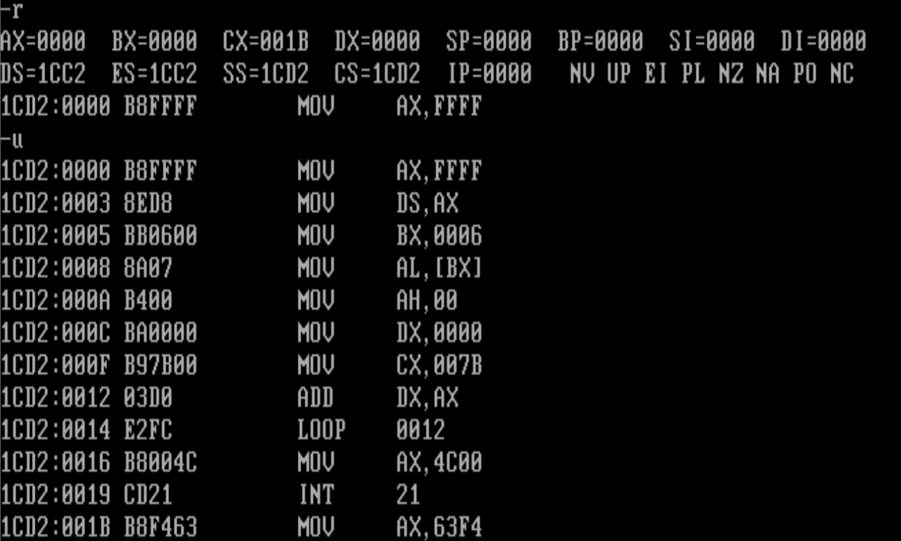

## 5.1 [bx］和内存单元的描述

要完整地描述一个内存单元，需要两种信息：①内存单元的地址；②内存单元的长度（类型）。

和[0]类似，［bx］表示内存单元，它的偏移地址在bx中


`mov ax,［bx］`

将一个内存单元的内容送入ax,这个内存单元的长度为2字节（字单元），存放一个字，偏移地址在bx中，段地址在ds中。


`mov al,［bx］`
将一个内存单元的内容送入al,这个内存单元的长度为1字节（字节单元），存放一个字节，偏移地址在bx中，段地址在ds中。


#### 定义的描述性的符号

为了看得懂书上简洁的表达

**在王爽的书**中（ax）表示ax中的内容、（al）表示al中的内容;

(20000H)表示内存20000H单元的内容  ()中的内存单元的地址为物理地址

((ds)* 16+(bx))表示:
ds中的内容为ADR1, bx中的内容为ADR2,内存ADR1 X 16+ADR2单元的内容。

同理：ds中的ADR1作为段地址，bx中的ADR2作为偏移地址，内存ADR1:ADR2单元的内容。

“()"中的元素可以有3种类型：①寄存器名；②段寄存器名；③内存单元的物理地址


对于add ax,bx的功能，可以这样来描述：(ax)=(ax)+(bx)；

对于push ax的功能，可以这样来描述：
(sp)=(sp)-2
((ss)* 16+(sp))=(ax)
对于pop ax的功能，可以这样来描述：
(ax)=((ss)* 16+(sp))
(sp)=(sp)+2


“(X)”所表示的数据有两种类型：①字节；②字。是哪种类型由寄存器名或具体的运算决定，比如：
(al)、(bl)、(cl)等得到的数据为字节型；(ds)、(ax)、(bx)等得到的数据为字型。
(al)=(20000H),则(20000H)得到的数据为字节型；(ax)=(20000H),则(20000H)得到的数据为字型。

**idata表示常量**

`inc bx` 的含义是bx中的内容加1


## 5.2 Loop 指令


loop指令的格式是：loop标号，CPU执行loop指令的时候，要进行两步操作，

 ①(cx)=(cx)-1；②判断CX中的值，不为零则转至标号处执行程序，**如果为零则向下执行**。

**CX中存放循环次数**。CX中的值影响着loop指令的执行结果

编程计算2^2^,结果存在ax中。那如果计算2^12^那该怎么办？

```assembly
assume cs:code
code segment
	mov ax,2
	add ax,ax 
	
	mov ax,4c00h
	int 21h
code ends
end
```


用ex和loop指令相配合实现循环功能的程序框架如下。

```assembly
	mov cx,循环次数
s:
	循环执行的程序段
	loop S
```

编程，用加法计算123*236,结果存在ax中。

```assembly
assume cs:code
code segment
	mov ax,0
	mov cx,123
  s:add ax,236
	loop s
	
	mov ax,4c00h
	int 21h
code ends
end
```


## 5.3在Debug中跟踪用loop指令实现的循环程序

计算ffff:0006单元中的数乘以123，结果存储在dx中。

```assembly
assume cs:code
code segment
	mov ax,0ffffh
	mov ds,ax 
	mov bx,6		;以上，设置ds:bx指向ffff: 6
	
	mov al,[bx]
	mov ah,0		;以上，设置(al) = ( (ds*16) + (bx) )，(ah) =0
	
	mov dx,0		;累加寄存器清0
	mov cx,123		;循环123次
	s : add dx,ax
	loop s			;以上累加计算(ax) *123
	
	mov ax,4c00h
	int 21h
code ends
end

```

注意程序中的第一条指令mov ax,0ffffh。我们知道，大于9FFFh的十六进制数据A000H、A001H...C000H、c001H...FFFEH、FFFFH等，在书写的时候都是以字母开头的。**而在汇编源程序中，数据不能以字母开头**，所以要在前面加0

**而在汇编源程序中，数据不能以字母开头**

**而在汇编源程序中，数据不能以字母开头**(重要的事情说三遍，否则忘了)



不想再一步步地跟踪，希望能够一次执行完，然后从CS:0012处开始跟踪。

可以这样来使用g命令，“g 0012”，它表示执行程序到当前代码段（段地址在CS中）的0012h处


希望将循环一次执行完。可以使用p命令来达到目的。再次遇到loop指令时，使用p命令来执行，Debug就会自动重复执行循环中的指令，直到(cx)=0为止。

也可以用g命令来达到目的，可以用“g 0016”直接执行到CS:0016处


## 5.4 Debug和汇编编译器masm对指令的不同处理

我们在Debug中写过类似的指令：
mov ax,[0]
表示将ds:0处的数据送入ax中。
但是在汇编源程序中，指令“mov ax,[0]”被编译器当作指令“mov ax,0”处理：

idata本书表示常数

Debug解释为“[idata]”是一个内存单元，“idata”是内存单元的偏移地址；而编译器将“[idata]”解释为“idata”

因此在编译器中：可将偏移地址送入bx寄存器中，用[bx]的方式来访问内存单元


如果嫌麻烦，还有法子

在汇编源程序中，如果用指令访问一个内存单元，则在指令中必须用来表示内存单元，如果在“[]”里用一个常量idata直接给出内存单元的偏移地址，就要在“[]”的前面显式地给出段地址所在的段寄存器。比如

`mov al,ds:[0]`


## 5.5 loop和[bx]的联合应用

计算ffff:0~ffff:b单元中的数据的和，结果存储在dx中。

太长了

```assembly
assume cs:code
code segment
    mov ax,0ffffh
    mov ds, ax ;设置(ds)=ffffh
    mov dx, 0 ;初始化累加寄存器，(dx)=0
    mov al,ds:[0]
    mov ah, 0 ;(ax)=((ds)*16+0)=(ffff0h)
    add dx, ax ;向dx中加上ffff: 0单元的数值
    mov al,ds:[1]
    mov ah, 0 ;(ax)=((ds)*16+l)=(fffflh)
    add dx, ax ;向dx中加上ffff :1单元的数值
    mov al,ds:[2]
    mov ah, 0 ;(ax)=((ds)*16+2)=(ffff2h)
    add dx, ax ;向dx中加上ffff :2单元的数值
    mov al,ds:[3]
    mov ahz 0 ;(ax)=((ds)*16+3)=(ffff3h)
    add dx, ax ;向dx中加上ffff :3单元的数值
    mov al,ds:[4]
    mov ah, 0 ;(ax)=((ds)*16+4)=(ffff4h)
    add dx, ax ;向dx中加上ffff :4单元的数值
    mov al,ds:[5]
    mov ah, 0 ;(ax)=((ds)*16+5)=(ffff5h)
    add dx, ax ;向dx中加上ffff :5单元的数值
    mov al,ds:[6]
    mov ah, 0 ;(ax)=((ds)*16+6)=(ffff6h)
    add dx, ax ;向dx中加上ffff: 6单元的数值
    mov al,ds:[7]
    mov ah, 0 ;(ax)=((ds)*16+7)=(ffff7h)
    add dx, ax ;向dx中加上ffff :7单元的数值
    mov al,ds: [8]
    mov ah, 0 ;(ax)=((ds)*16+8)=(ffff8h)
    add dx, ax ;向dx中加上ffff: 8单元的数值
    mov al,ds:[9]
    mov ah, 0 ;(ax)=((ds)*16+9)=(ffff9h)
    add dx, ax ;向dx中加上ffff: 9单元的数值
    mov al,ds:[Oah]
    mov ah, 0 ;(ax)=((ds)*16+0ah)=(ffffah)
    add dx, ax ;向dx中加上ffff :a单元的数值
    mov al,ds:[Obh]
    mov ah, 0 ;(ax)=((ds)*16+0bh)=(ffffbh)
    add dx, ax ;向dx中加上ffff :b单元的数值
    mov ax,4c00h ;程序返回
    int 21h
code ends
end

```

使用loop

```assembly
assume cs:code
code segment
    mov ax,0ffffh
    mov ds, ax
    mov bx, 0 ;初始化ds:bx指向ffff :0

    mov dx, 0 ;初始化累加寄存器dx，(dx) =0
    mov cx, 12 ;初始化循环计数寄存器cx，(cx)=12
 s: mov al,[bx]
    mov ah, 0
    add dx, ax ;间接向dx中加上((ds) *16+ (bx))单元的数值
    inc bx ;ds :bx指向下一个单元
    loop s
    
    mov ax,4c00h
    int 21h
code ends
end

```


## 5.6段前缀

指令“mov ax,[bx］”中，内存单元的偏移地址由bx给出，而段地址默认在ds中。我们可以在访问内存单元的指令中显式地给出内存单元的段地址所在的段寄存器。

mov ax,ds:[bx]
将一个内存单元的内容送入ax,这个内存单元的长度为 2 字节（字单元）， 存放一个字，偏移地址在bx中，段地址在ds中。

mov ax,ss:[0]
将一个内存单元的内容送入ax,这个内存单元的长度为2字节（字单元），存放一个字，偏移地址为0，段地址在ss中。


这些出现在访问内存单元的指令中，用于显式地指明内存单元的段地址的“ds:” “cs:” “ss:” “es:”，在汇编语言中称为**段前缀**。

## 5.7 一段安全的空间

在8086模式中，随意向一段内存空间写入内容是很危险的,0:200~0:2ff 这256个字节的空间是安全的，直接写

使用操作系统给我们分配的空间


我们在纯DOS方式(实模式)下，可以不理会DOS,直接用汇编语言去操作真实的硬件，因为运行在CPU实模式下的DOS,没有能力对硬件系统进行全面、严格地管理。但在Windows 2000> Unix这些运行于CPU保护模式下的操作系统中，不理会操作系统，用汇编语言去操作真实的硬件，是根本不可能的。硬件己被这些操作系统利用CPU保护模式所提供的功能全面而严格地管理了。


## 5.8段前缀的使用

将内存ffff:0〜ffff:b单元中的数据复制到0:200〜0:20b(0020:0~0020:b)单元中。

```assembly
assume cs:code
code segment
    
   
    mov bx, 0 	;(bx) =0,偏移地址从0开始
    mov cx, 12  ;(cx)=12,循环 12 次
    
    s: mov ax,0ffffh
    mov ds, ax 	;(ds)=0ffffh
    mov dl,[bx] ;(dl)=((ds)*16+(bx))， 将ffff :bx中的数据送入dl
    mov ax,0020h
    mov ds, ax 	;(ds)=0020h
    mov [bx],dl ;((ds)*16+(bx))=(dl), 将中dl的数据送入0020:bx
    inc bx 		;(bx)=(bx)+1
    loop s
    
    mov ax,4c00h
    int 21h
code ends
end
```

因源始单元ffff:X和目标单元0020:X相距大于64KB,在不同的64KB段里，程序中，每次循环要设置两次ds。这样做是正确的，但是效率不高。我们可以使用两个段寄存器分别存放源始单元ffffX和目标单元0020:X的段地址，这样就可以省略循环中需要重复做12次的设置ds的程序段。


```assembly
assume cs:code
   
    code segment
    mov ax,0ffffh
    mov ds, ax ;(ds)=0ffffh
    
    
    mov ax,0020h
    mov es, ax ;(es)=0020h
   
    mov bx, 0 ;(bx) =0,此时 ds:bx 指向 ffff :0, es:bx 指向 0020:0
    mov cx, 12 ;(cx)=12,循环 12 次
    
 s: mov dl,[bx] ;(dl) = ((ds)*164- (bx)), 将ffff :bx中的数据送入dl
    mov es:[bx], dl ;((es)*16+(bx))=(dl), 将dl中的数据送入0020:bx
    inc bx ;(bx)=(bx)+1
    loop s
    mov ax,4c00h
    int 21h
code ends
end

```

