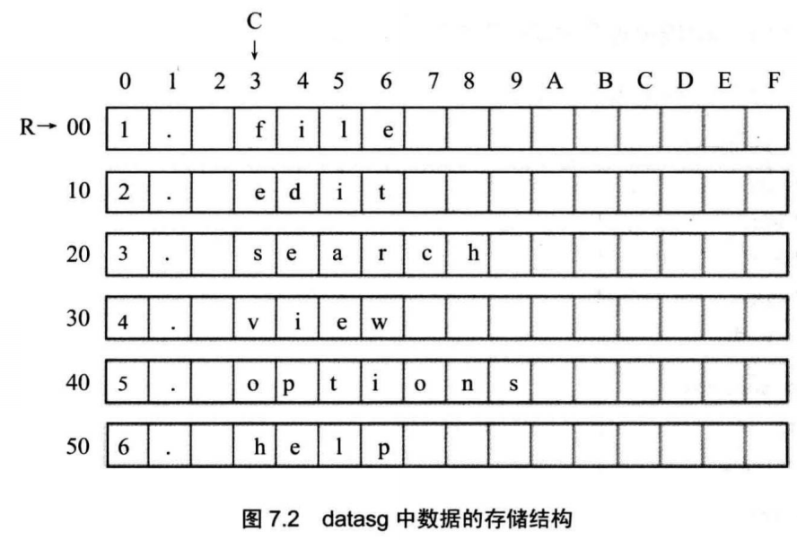
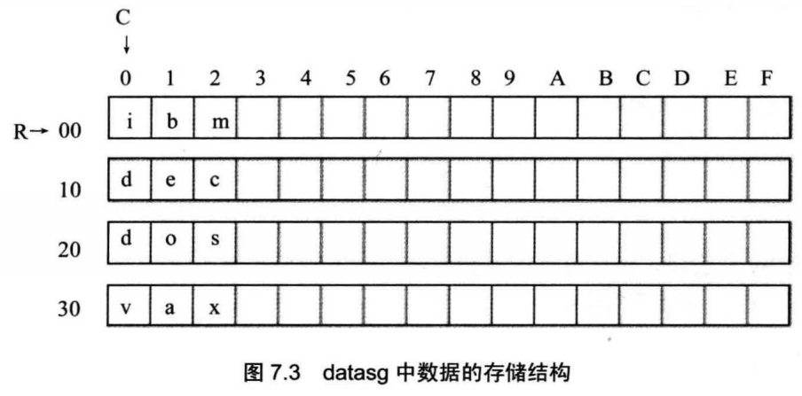

前面，我们用［0］、［bx］的方法，在访问内存的指令中，定位内存单元的地址。MORE!

## 7.1 and和or指令

1. and指令：逻辑与指令，按位进行与运算。

2. or指令：逻辑或指令，按位进行或运算


## 7.2ASCII码

我们按下键盘的a键，这个按键的信息被送入计算机，计算机用ASCII码的规则对其进行编码，将其转化为61H存储在内存的指定空间中；文本编辑软件从内存中取出61H,将其送到显卡上的显存中；工作在文本模式下的显卡，用ASCII码的规则解释显存中的内容，61H被当作字符“a”，显卡驱动显示器，将字符“a”的图像画在屏幕上。


## 7.3以字符形式给出的数据

我们可以在汇编程序中，用'X'的方式指明数据是以字符的形式给出的

```assembly
assume cs:code, ds:data
data segment
	db 'unIX1'  ;db 'unIX' ” 相当于 “db 75H，6EH，49H，58H”
	db 'foRK1'
data ends
code segment
start: 	mov al,'a'	;相当于 “mov al，61H”
        mov bl,'b'
        mov ax,4c00h
        int 21h
code ends
end start

```


## 7.4大小写转换的问题

小写字母的ASCII码值比大写字母的ASCII码值大20H

程序要能够判断一个字母是大写还是小写

**一个字母，不管它原来是大写还是小写，将它的第5位置0,它就必将变为大写字母；将它的第5位置1, 它就必将变为小写字母**

这。。。。。。。


```assembly
assume cs:codesg,ds:datasg
datasg segment
	db 'BaSiC'
	db 'iNfOrMaTiOn'
datasg ends
codesg segment
	start: 	mov ax,datasg
			mov ds,ax		;设置ds指向datasg段
            mov bx,0		;设置(bx) =0, ds :bx指向'BaSiC'的第一个字母
            mov cx,5		;设置循环次数5,因为，BaSiC *有5个字母
            s:mov al,[bx]	;将ASCII码从ds:bx所指向的单元中取出
            and al,11011111B;将al中的ASCII码的第5位置为0,变为大写字母
            mov [bx],al		;将转变后的ASCII码写回原单元
            inc bx
            loop s
            mov bx,5		;设置(bx) =5, ds :bx指向'iNfOrMaTiOn '的第一个字母
            mov cx,11		;设置循环次数11，因为'iNfOrMaTiOn'有11个字母
            sO:mov al,[bx]
            or al, 00100000B;将31中的ASCII码的第5位置为1,变为小写字母
            mov [bx],al
            inc bx
            loop sO
            mov ax,4c00h
            int 21h
codesg ends
end start

```


## 7.5 [bx+idata]

在前面，我们用［bx］的方式来指明一个内存单元，还可以用一种更为灵活的方式来指明内存单元：［bx+idata］表示一个内存单元，它的偏移地址为(bx)+idata(bx中的数值加上idata)

指令mov ax，［bx+200］的含义：

 将一个内存单元的内容送入ax,这个内存单元的长度为2个字节(字单元)，存放一个字，偏移地址为bx中的数值加上200,段地址在ds中。

数学化的描述为：(ax)=((ds)*16+(bx)+200)

```assembly
;同样的表示
mov ax,[200+bx]
mov ax,200[bx]
mov ax,[bx].200
```


## 7.6用[bx+idata]的方式进行数组的处理

用更高级的结构来看待所要处理的数据。

例：在codesg中填写代码，将datasg中定义的第一个字符串转化为大写，第二个字符串转化为小写。

```assembly
assume cs:codesg,ds:datasg
datasg segment
    db 'BaSiC'
    db 'MinlX'
datasg ends
codesg segment
start:
codesg ends
end start

```

观察datasg段中的两个字符串，一个的起始地址为0,另一个的起始地址为5。我们可以将这两个字符串看作两个数组，那么我们可以用［0+bx］和［5+bx］的方式在同一个循环中定位这两个字符串中的字符。


```assembly
mov ax,datasg
mov ds,ax
mov bx,0
mov cx, 5
s: 
mov al,[bx]	;定位第一个字符串中的字符
and al,11011111b
mov [bx],al
mov al,[5+bx];定位第二个字符串中的字符
or al,00100000b
mov [5+bx],al
inc bx
loop s

```

[bx+idata]的方式为高级语言实现数组提供了便利机制。

C 语言：a[i], b[i]
汇编语言：0[bx], 5[bx]

## 7.7 SI 和 DI

si和di是8086CPU中和bx功能相近的寄存器，si和di不能够分成两个8位寄存器来使用

用si和di实现将字符串'welcome to masm!*复制到它后面的数据区中。

```assembly
assume cs:codesg,ds:datasg
datasg segment
db  'welcome to masm!''
db  '................. '
datasg ends
```

datasg:0,这是要进行复制的数据的地址。那么复制到哪里去呢？它后面的数据区。“welcome to masm!”从偏移地
址0开始存放，长度为16个字节，所以，它后面的数据区的偏移地址为16

用ds:si指向要复制的源始字符串，用ds:di指向复制的目的空间，

```assembly
codesg segment
start: 
mov ax,datasg
mov ds,ax
mov si,0
mov di,16
mov cx,8
s: 
mov ax,[si]
mov [di],ax
add si, 2
add di,2
loop s

mov ax,4c00h
int 21h
codesg ends
end start

```

用16位寄存器进行内存单元之间的数据传送，一次复制2个字节，一共循环8次。

可以利用［bx（si或di）+idata］的方式，来使程序变得简洁

```assembly
mov ax,datasg
mov ds,ax
mov si,0
mov cx,8
s: mov ax,0[si]
mov 16[si], ax
add si,2
loop s
```

## 7.8 ［bx+si］和［bx+di］

［bx+si］表示一个内存单元，它的偏移地址为(bx)+(si)(即bx中的数值加上si中的数值);

指令mov ax,［bx+si］的含义如下： 将一个内存单元的内容送入ax,这个内存单元的长度为2字节(字单元)，存放一个字，偏移地址为bx中的数值加上si中的数值，段地址在ds中。

数学化的描述为：(ax)=((ds)*16+(bx)+(si))

## 7.9 [bx+si+idata]和[bx+di+idata]

mov ax,［bx+si+idata］

数学化的描述为：(ax)=((ds)* 16+(bx)+(si)+idata)

## 7.10不同的寻址方式的灵活应用

编程，将datasg段中每个单词的头一个字母改为大写字母。

```assembly
assume cs:codesg,ds:datasg
datasg segment
db '1. file    ';假设长度都是16字节，每个字符串的后面都加上了空格符，以使它们的长度刚好为16个字节
db '2. edit    '
db '3. search  '
db '4. view    '
db '5. options '
db '6. help    '
datasg ends
codesg segment
start:
codesg ends
end start
```

可以将这6个字符串看成一个6行16列的二维数组



```assembly
mov ax,datasg
mov ds,ax
mov bx,0
mov cx,6
s: 
mov al, [bx+3]
and al,11011111b
mov [bx+3],al
add bx,16
loop s
```

我们用bx作变量，定位每行的起始地址，用3定位要修改的列，用[bx+idata]的方式来对目标单元进行寻址


**循环嵌套**

编程，将datasg段中每个单词改为大写字母。

```assembly
assume cs:codesg,ds:datasg
datasg segment
db 'ibm 	'
db 'dec 	'
db 'dos 	'
db 'vax 	'
datasg ends
codesg segment
start:
codesg ends
end start

```



需要进行4x3次的二重循环，用变量R定位行，变量C定位列

下面的程序有问题

```assembly
mov ax,datasg
mov ds,ax
mov bx,0
mov cx,4
sO: 
mov si, 0
mov cx, 3
s: 
mov al,[bx+si]
and al,11011111b
mov [bx+si],al
inc si
loop s
add bx,16
loop sO

```

分析： 问题在于ex的使用，我们进行二重循环，却只用了一个循环计数器，造成在进行内层循环的时候，覆盖了外层循环的循环计数值。

应该在每次开始内层循环的时候，将外层循环的CX中的数值保存起来，在执行外层循环的loop指令前，再恢复外层循环的CX数值。可以用寄存器dx来临时保存CX中的数值，

```assembly
s0: 
mov dx, ex
mov si,0
mov cx,3
s: 
mov al, [bx+si]
and al,11011111b
mov [bx+si],al
inc si
loop s
add bx,16
mov cx,dx
loop s0

```

上面的程序用dx来暂时存放CX中的值，如果在内层循环中，dx寄存器也被使用,寄存器总是不够用的。那么可以使用的就是内存了。可以考虑将需要暂存的数据放到内存单元中，需要使用的时候，再从内存单元中恢复


改进后程序

```assembly
assume cs:codesg,ds:datasg
datasg segment
    db 'ibm 	'
    db 'dec 	'
    db 'dos 	'
    db 'vax 	'
    dw 0			;定义一个字，用来暂存ex
datasg ends
codesg segment
start:
mov ds,ax
mov bx,0
mov cx,4
sO: 
mov ds:[40H],ex	 	;将外层循环的ex值保存在datasg:40H单元中
mov si,0
mov cx,3			;cx设置为内层循环的次数
s: 
mov al, [bx+si]
and al,11011111b
mov [bx+si],al
inc si
loop s

add bx,16
mov cx,ds:[40H]		;用datasg: 40H单元中的值恢复ex
loop sO				;外层循环的loop指令将ex中的计数值减1

mov ax,4c00H
int 21H
codesg ends
end start
```

**一般来说，在需要暂存数据的时候，都应该使用栈**

所以还需要进行进一步改进，shit！

```assembly
assume cs:codesg,ds:datasg
datasg segment
    db 'ibm 	'
    db 'dec 	'
    db 'dos 	'
    db 'vax 	'
datasg ends
stacksg segment
	dw 0,0,0,0,0,0,0,0
stacksg ends

codesg segment
start:
mov ax,stacksg
mov ss, ax
mov sp, 16
mov ax,datasg
mov ds, ax
mov bx, 0
mov cx, 4
s0: 
push cx			;将外层循环的cx值压栈
mov si, 0
mov cx, 3		;cx设置为内层循环的次数
s: 
mov al,[bx+si]
and al,11011111b
mov [bx+si],al
inc si
loop s

add bx, 16
pop cx			;从栈顶弹出原cx的值，恢复cx
loop sO		;外层循环的loop指令将CX中的计数值减1
mov ax,4c00H
int 21H

codesg ends
end start

```

