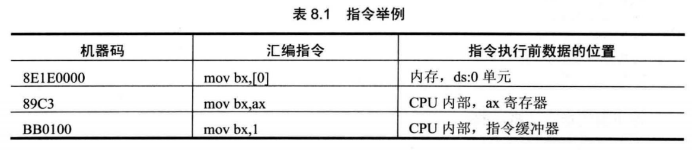
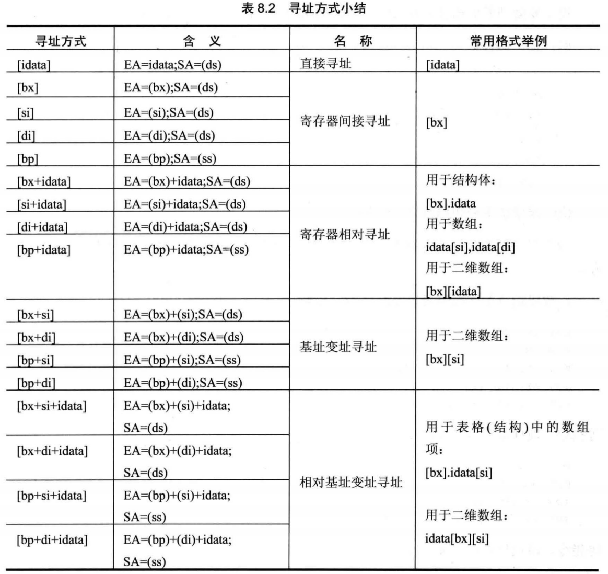

# 数据处理的两个基本问题

1. 处理的数据在什么地方？
2. 要处理的数据有多长？

## 定义的描述性符号：reg和sreg。
为了描述上的简洁，在以后的课程中，我们将使用两个描述性的符号reg来表示一个寄存器，用sreg表示一个段寄存器。
reg 的集合包括：ax、bx、cx、 dx、ah、al、 bh、bl、ch、cl、dh、dl、 sp、bp、si、di；
sreg 的集合包括：ds、ss、cs、es。


## 8.1 bx、si、 di 和 bp

在[...]中，这4个寄存器可以单个出现，或只能以4种组合出现：bx和si、bx和di、bp和si、bp和di。

下面的指令是错误的：
mov ax,[bx+bp]
mov ax,[si+di]

只要在[...]中使用寄存器bp,而指令中没有显性地给出段地址，段地址就默认在ss中。比如下面的指令。

mov ax,[bp+si+idata]  		含义：(ax)=((ss)*16+(bp)+(si)+idata)


## 8.2机器指令处理的数据在什么地方

绝大部分机器指令都是进行数据处理的指令，处理大致可分为3类：读取、写入、运算。在机器指令这一层来讲，并不关心数据的值是多少，而关心指令执行前一刻，它将要处理的数据所在的位置。指令在执行前，所要处理的数据可以在3个地方：**CPU内部、内存、端口**



## 8.3汇编语言中数据位置的表达

汇编语言中用3个概念来表达数据的位置。

1. 立即数(idata)
   对于直接包含在机器指令中的数据(执行前在CPU的指令缓冲器中)，在汇编语言中称为：立即数(idata),在汇编指令中直接给出。

2. 寄存器
   指令要处理的数据在寄存器中，在汇编指令中给出相应的寄存器名。

3. 段地址(SA)和偏移地址(EA)

   指令要处理的数据在内存中，在汇编指令中可用[X]的格式给出EA, SA在某个段寄存器中。

## 8.4寻址方式



## 8.5指令要处理的数据有多长

8086CPU的指令，可以处理两种尺寸的数据，byte和word-所以在机器指令中要指明，指令进行的是字操作还是字节操作。对于这个问题，汇编语言中用以下方法处理。

1. 通过寄存器名指明要处理的数据的尺寸。

   寄存器指明了指令进行的是字操作。

   mov bx,ds:[0]

2. 在没有寄存器名存在的情况下，用操作符Xptr指明内存单元的长度，X在汇编指令中可以为word或byte。

```assembly
;用wordptr指明了指令访问的内存单元是一个字单元。
mov word ptr ds:[0],1 
inc word ptr [bx]
inc word ptr ds:[0]
add word ptr [bx],2
;用byte ptr指明了指令访问的内存单元是一个字节单元。
mov byte ptr ds:[0],1
inc byte ptr [bx]
inc byte ptr ds:[0]
add byte ptr [bx],2

```

3. 有些指令默认了访问的是字单元还是字节单元，比如，push [1000H]就不用指明访问的是字单元还是字节单元，因为**push指令只进行字操作**。

## 8.6寻址方式的综合应用

8086CPU提供的如[bx+si+idata]的寻址方式为结构化数据的处理提供了方便。使得我们可以在编程的时候，从结构化的角度去看待所要处理的数据。

一般来说，我们可以用[bx+idata+si]的方式来访问结构体中的数据。**用bx定位整个结构体**，**用idata定位结构体中的某一个数据项**， **用si定位数组项中的每个元素**。为此，汇编语言提供了更为贴切的书写方式，

如：[bx].idata、[bx].idata[si] 


## 8.7 div指令

div是除法指令，使用div做除法的时候应注意以下问题

1. 除数：有8位和16位两种，在一个reg或内存单元中。

2. 被除数：**默认放在AX或DX和AX中**，如果除数为8位，被除数则为16位， 默认在AX中存放；如**果除数为16位，被除数则为32位，在DX和AX中存放，DX存放高16位，AX存放低16位。**

3. 结果：如果除数为8位，则AL存储除法操作的商，AH存储除法操作的余数； 如果除数为16位，则AX存储除法操作的商，DX存储除法操作的余数。
   格式如下：

   div reg
   div 内存单元

```assembly
div byte ptr ds:[0]
;含义：(al) = (ax)/((ds)*16+0)的商
;(ah) = (ax) / ((ds) *16+0)的余数

div word ptr [bx+si+8]
;含义：(ax) = [ (dx) *10000H+(ax) ]/( (ds) *16+(bx) + (si)+8)的商
;(dx) = [ (dx) *10000H+(ax) ]/( (ds) *16+(bx) + (si)+8)的余数

```

编程，利用除法指令计算100001/100。

分析：被除数100001大于65535,不能用ax寄存器存放，所以只能用dx和ax两个寄存器联合存放100001,也就是说要进行16位的除法。除数100小于255,可以在一个8位寄存器中存放，但是，因为被除数是32位的，除数应为16位，所以要用一个16位寄存器来存放除数100

因为要分别为dx和ax赋100001的高16位值和低16位值，所以应先将100001表示为16进制形式：186A1H

程序如下：

```assembly
mov dx,1
mov ax,86A1H ;(dx)*10000H+(ax)=100001
mov bx,100
div bx
```

程序执行后，(ax)=03E8H(即1000), (dx)=1(余数为1)。

## 8.8伪指令dd

前面我们用db和dw定义字节型数据和字型数据。dd是用来定义dword(doubleword,双字)型数据的。

`dd 1`

 数据为00000001H,占2个字。

## 8.9 dup

它是和db、dw、dd等数据定义伪指令配合使用的，用来进行数据的重复。

`db 3 dup (0)`
定义了 3个字节，它们的值都是0,相当于db 0,0,0o

可见，dup的使用格式如下。
db重复的次数dup （重复的字节型数据）
dw重复的次数dup （重复的字型数据）
dd重复的次数dup （重复的双字型数据）