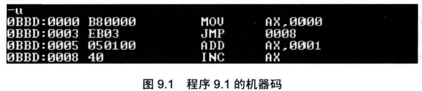
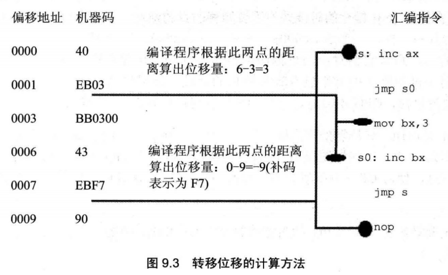

清楚学习路线之后应该就是付出努力，别总想着进度有多快，一口吃不成胖子

**可以修改IP,或同时修改CS和IP的指令统称为转移指令**。概括地讲，转移指令就是可以控制CPU执行内存中某处代码的指令。

8086CPU的转移行为有以下几类。

* 只修改IP时，称为段内转移，比如：jmp ax。
* 同时修改CS和IP时，称为段间转移，比如：jmp 1000:0

由于转移指令对IP的修改范围不同，段内转移又分为：短转移和近转移。

* 短转移IP的修改范围为-128〜127。
* 近转移IP的修改范围为-32768〜32767。

8086CPU的转移指令分为以下几类。

* 无条件转移指令（如：jmp）
* 条件转移指令
* 循环指令（如：loop）
* 过程
* 中断

## 9.1 操作符offset

操作符offset在汇编语言中是由编译器处理的符号，它的功能是取得标号的偏移地址。

```assembly
assume cs:codesg
codesg segment
	start: mov ax, offset start ;相当于 mov ax,0
		s: mov ax, offset s 	;相当于 mov ax, 3
codesg ends
end start

```

因为start是代码段中的标号，它所标记的指令是代码段中的第一条指令，偏移地址为0; 

nop的机器码占一个字节


## 9.2 jmp指令

jmp为无条件转移指令，可以只修改IP,也可以同时修改CS和IP。

jmp指令要给出两种信息:

（1） 转移的目的地址
（2） 转移的距离（段间转移、段内短转移，段内近转移）


## 9.3依据位移进行转移的jmp指令

jmp short标号（转到标号处执行指令）

这种格式的jmp指令实现的是段内短转移，它对IP的修改范围为-128〜127

```assembly
assume cs:codesg
codesg segment
	start:mov ax,0
		  jmp short s
		  add ax,1
		s:inc ax
codesg ends
end start

```



Debug中将程序9.1翻译成为机器码

jmp 0008（Debug中的表示）所对应的机器码为EB 03

这个机器码中竟不包含转移的目的地址，这意味着，CPU在执行EB 03的时，并不知道转移的目的地址

CPU如何知道转移到哪里呢？

**CPU在执行jmp指令的时候并不需要转移的目的地址**,

向后3个字节，所以机器码都是EB 03。

在“jmp short标号”指令所对应的机器码中，并不包含转移的目的地址，**而包含的是转移的位移**。这个位移，是编译器根据汇编指令中的“标号”计算出来的，具体的计算方法如图9.3所示。



实际上，
“jmp short标号”的功能为：(IP)=(IP)+8位位移。
(1) 8位位移=标号处的地址-jmp指令后的第一个字节的地址；
(2) short指明此处的位移为8位位移；
(3) 8位位移的范围为-128〜127,用补码表示
(4) 8位位移由编译程序在编译时算出。


还有一种和“jmp short标号”功能相近的指令格式，jmp near ptr标号，它实现的是
段内近转移。
jmp near ptr 标号 的功能为: (IP)=(IP)+16 位位移。
(1) 16位位移=标号处的地址-jmp指令后的第一个字节的地址；
(2) near ptr指明此处的位移为16位位移，进行的是段内近转移;
(3) 16位位移的范围为-32768〜32767,用补码表示；
(4) 16位位移由编译程序在编译时算出。


## 9.4转移的目的地址在指令中的jmp指令

“jmp far ptr 标号”实现的是段间转移，又称为远转移。功能如下:

（CS）=标号所在段的段地址；

（IP）=标号在段中的偏移地址。


```assembly
assume cs:codesg
codesg segment
start:
mov ax,0
mov bx,0
jmp far ptr s
db 256 dup (0)
s:
add ax,1
inc ax
codesg ends
end start

```

jmp far ptr 标号机器码包含转移的目的地址


## 9.5转移地址在寄存器中的jmp指令

指令格式：jmp 16位 reg
功能：（IP）=（16 位 reg）

## 9.6转移地址在内存中的jmp指令

转移地址在内存中的jmp指令有两种格式：

1. jmp word ptr 内存单元地址(段内转移)

功能：从内存单元地址处开始存放着一个字，是转移的目的偏移地址。

2. jmp dword ptr内存单元地址(段间转移)

功能：从内存单元地址处开始存放着两个字，高地址处的字是转移的目的段地址，低 地址处是转移的目的偏移地址。

(CS)=(内存单元地址+2)
(IP)=(内存单元地址)


## 9.7 jcxz 指令

jcxz指令为**有条件**转移指令，所有的有条件转移指令都是短转移，在对应的机器码中包含转移的位移，而不是目的地址。对IP的修改范围都为：-128〜127。

指令格式：jcxz 标号(如果(cx)=0,转移到标号处执行。)
操作：

当(cx)=0时，(IP)=(IP)+8位位移； 

8位位移=标号处的地址-jcxz指令后的第一个字节的地址； 

8位位移的范围为-128〜127,用补码表示； 

8位位移由编译程序在编译时算出。

当(cx)!=0时，什么也不做(程序向下执行)。

“jcxz标号”的功能相当于： if ( (cx) ==0) jmp short 标号；


## 9.8 Ioop指令

loop指令为循环指令，所有的循环指令都是短转移，在对应的机器码中包含转移的位移，而不是目的地址

指令格式：loop标号((CX)=(CX)-1，如果(CX)!=0，转移到标号处执行。)
操作：

1. (cx)=(cx)-l；
2. 如果(cx)!=0, (IP)=(IP)+8 位位移。

8位位移=标号处的地址-loop指令后的第一个字节的地址；后同

“loop标号”的功能相当于：

(cx)--;
if ( (cx) !=0) jmp short 标号；


## 9.9根据位移进行转移的意义

它们对IP的修改是根据转移目的地址和转移起始地址之间的位移来进行的。在它们对应的机器码中不包含转移的目的地址，而包含的是到目的地址的位移。这种设计，方便了程序段在内存中的浮动装配。

## 9.10编译器对转移位移超界的检测

注意，根据位移进行转移的指令，它们的转移范围受到转移位移的限制，如果在源程序中出现了转移范围超界的问题，在编译的时候，编译器将报错。